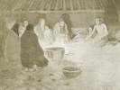

  
[Intangible Textual Heritage](../../../index.md)  [Native
American](../../index)  [Native California](../index)  [Index](index.md) 
[Previous](dow36)  [Next](dow38.md) 

------------------------------------------------------------------------

[Buy this Book at
Amazon.com](https://www.amazon.com/exec/obidos/ASIN/B002DPTXIK/internetsacredte.md)

------------------------------------------------------------------------

  
*The Dawn of the World*, by C. Hart Merriam, \[1910\], at Intangible
Textual Heritage

------------------------------------------------------------------------

p. 198

# TAH'-LOW THE THUNDER AND TAH'-KIP' THE LIGHTNING

FRAGMENT OF A STORM MYTH OF THE HOO'-KOO-E'-KO OF NICASIO AND TOMALES
BAY

PERSONAGES

*Tah'-low* the Thunder

*Tah'-kip'* the Lightning

*Koo-lā'-is* *kā'-sum* the Mother Deer

*O'-ye* the Coyote-man

*Koo'-le* the Bear

*Oo'-pah* the Rain

p. 199

### TAH'-LOW THE THUNDER AND TAH'-KIP' THE LIGHTNING

KOO-LA'-IS KA'-SUM the mother Deer died, leaving two boy fawns. Their
uncle, *O'-ye* the Coyote-man, sent them away to the east, where they
still live.

Once when the country was very dry an old woman who wanted water, but
could not find any, went and looked at the boy fawns, and they tore her
eyes out. That made *Tah'-kip'* the Lightning. Then they took the dry
skin of *Koo'-le* the Bear, and shook it. That made *Tah'-low* the
Thunder. Then *Oo'-pah* the Rain came.

------------------------------------------------------------------------

[Next: *He'-koo-lās* The Sun-Woman](dow38.md)
