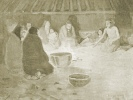

  
[Intangible Textual Heritage](../../../index)  [Native
American](../../index)  [Native California](../index)  [Index](index) 
[Previous](dow43)  [Next](dow45) 

------------------------------------------------------------------------

[Buy this Book at
Amazon.com](https://www.amazon.com/exec/obidos/ASIN/B002DPTXIK/internetsacredte)

------------------------------------------------------------------------

  
*The Dawn of the World*, by C. Hart Merriam, \[1910\], at Intangible
Textual Heritage

------------------------------------------------------------------------

### TOO'-CHA-MO, THE STUMP, AND CHOO'-KOO HENG-IL'-NAH-AS'-SE, THE LOST DOG

*The Northern Mewuk say*:

*Too'-cha-mo* the stump and *Choo'-koo* the dog are friends. When
*Choo'-koo* is lost and does not know where his man has gone he goes to
*Too'-cha-mo* and asks. *Too'-cha-mo* tells him which way to go to
strike his man's trail; *Choo'-koo* goes and finds it, and no matter how
far away his man is, he follows the trail right to him.

------------------------------------------------------------------------

[Next: The First Teeth go to *Soo-wah-tah*, the Gopher](dow45)
