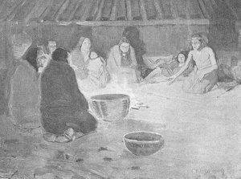

  
[Intangible Textual Heritage](../../../index)  [Native
American](../../index)  [Native California](../index) 

------------------------------------------------------------------------

[Buy this Book at
Amazon.com](https://www.amazon.com/exec/obidos/ASIN/B002DPTXIK/internetsacredte)

------------------------------------------------------------------------

<table width="75%">
<colgroup>
<col style="width: 50%" />
<col style="width: 50%" />
</colgroup>
<tbody>
<tr class="odd">
<td width="50%" data-valign="TOP"> 
Recital of the Ancient Myths in the Roundhouse at Night [Public Domain Image]</td>
<td width="50%" data-valign="CENTER"><h1 id="the-dawn-of-the-world" data-align="CENTER">The Dawn of the World</h1>
<h5 id="myths-and-weird-tales-told-by-the-mewan-miwok-indians-of-california" data-align="CENTER">Myths and Weird Tales Told by the Mewan [Miwok] Indians of California</h5>
<h2 id="by-c.-hart-merriam" data-align="CENTER">by C. Hart Merriam</h2>
<h4 id="section" data-align="CENTER">[1910]</h4></td>
</tr>
</tbody>
</table>

------------------------------------------------------------------------

[Contents](#contents)    [Start Reading](dow00)    [Page
Index](pageidx)    [Text \[Zipped\]](dow.txt.gz)

------------------------------------------------------------------------

|                                                                                                                           |
|---------------------------------------------------------------------------------------------------------------------------|
|  |

------------------------------------------------------------------------

 [Title Page](dow00)  
[Contents](dow01)  
[Illustrations](dow02)  
[Preface](dow03)  
[Introduction](dow04)  
[Note](dow05)  

### Part I: Ancient Myths

[Stories of the First People--People Who Lived Before Real People Were
Created](dow06)  
[How *Wit'-tab-bah* the Robin Got His Red Breast](dow07)  
[How *Ah-ha'-le* Stole the Sun For the Valley People](dow08)  
[How *Ah-ha'-le* Stole The Morning](dow09)  
[How *Tol'-le-loo* got the Fire for the Mountain People](dow10)  
[Why the Lizard Man did not Restore Dead People to Life](dow11)  
[The Coyote and the Lizard](dow12)  
[How the People Got Five Fingers; How they Obtained Fire; and How They
Broke up into Tribes](dow13)  
[The Birth of *Wek'-wek* and the Creation of Man](dow14)  
[*Ke'-lok* and his *Han-na'-boo*](dow15)  
[The Creation of Man](dow16)  
[How they got the Fire](dow17)  
[How *Kah'-kool* the Raven Became a Great Hunter](dow18)  
[How *Kah'-kah-loo* The Ravens Became People](dow19)  
[The Bear and the Fawns](dow20)  
[The Bear and the Fawns](dow21)  
[How the Children of *He-le'-jah* Became People](dow22)  
[The Greed of *His'-sik* the Skunk](dow23)  
[*Nek'-na-ka'-tah* The Rock Maiden](dow24)  
[The Jealousy of *Wek'-wek* and the Death of *Lo'-wut*](dow25)  
[The Defeat of *O-la'-nah* the Coyote-Man](dow26)  
[How *Sah'-te* Set The World On Fire](dow27)  
[How *Cha'-ka* the Tule-wren Shot out the Sun](dow28)  
[How *Wek'-wek* Was Saved From the Flood](dow29)  
[Why the Bodega Bay Indians can not Stand Cold](dow30)  

### Hoi-ah'-ko Tales of the Southern Mewuk

[*Yel'-lo-kin* And *Oo-wel'-lin*, The Man-eating Giants](dow31)  
[*O-wel'-lin* the Rock Giant](dow32)  
[*Tim-me-la'-le* the Thunder](dow33)  
[*Wek'-wek's* Search for his Father](dow34)  
[*Wek-wek's* Search for his Sister](dow35)  
[*Wek'-wek's* Visit to the Underworld People](dow36)  

 

[*Tah'-low* The Thunder And *Tah'-kip'* The Lightning](dow37)  
[*He'-koo-lās* The Sun-Woman](dow38)  
[How *O'-ye* The Coyote-Man Discovered His Wife](dow39)  

### Part 2: Present Day Myths

[Part 2: Present Day Myths](dow40)  

### Beliefs Concerning Animals

[Bears Resemble People and Like to Dance](dow41)  
[How *He-le'-jah* the Cougar Hunts Deer](dow42)  
[How *Too-le'-ze*, The Timber-Wolf Hunts Deer](dow43)  
[*Too'-cha-mo*, The Stump, And *Choo'-koo Heng-il'-nah-as'-se*, The Lost
Dog](dow44)  
[The First Teeth go to *Soo-wah-tah*, the Gopher](dow45)  
[*O-lel'-le* the Mysterious Bird of the Cold Springs](dow46)  
[*Soo-koo'-me* The Great Horned Owl](dow47)  
[The Meadowlark, a Gossip and Troublemaker](dow48)  
[*Ki'-ki'-ah* The Mountain Bluejay](dow49)  
[Where the Ducks and Geese go to Breed](dow50)  
[*Po'-ko-moo* The Poison Spider](dow51)  
[Where *Koo'-tah* the Money-clam Came From](dow52)  

### Beliefs concerning Ghosts and the Sign of Death

[Ghosts Follow the Pathway of the Wind](dow53)  
[Three Birds Scream to Frighten the Ghosts](dow54)  
[Ghosts May Come Back in *Soo-koo'-me* the Owl](dow55)  
[A Hole in the Nose Saves Turning into a Fish](dow56)  
[What Good and Bad Ghosts Turn into](dow57)  
[Ghosts Hide in Stumps and Whirlwinds](dow58)  
[Ghosts Hunt for a Big Animal in the Ocean](dow59)  
[*Wah-tib'-sah* the Sign of Death](dow60)  

### Beliefs Concerning Natural Phenomena

[Thunder](dow61)  
[The Rainbow](dow62)  
[The Earthquake](dow63)  
[Noise](dow64)  
[The Echo](dow65)  
[How the World Grew](dow66)  

### Beliefs Concerning Witches, Pigmies, Giants, and other Fabulous Beings

[How Witches Kill People](dow67)  
[Pigmies and Water People](dow68)  
[The Devil of San Rafael](dow69)  
[*Ho-hā'-pe* the River Mermaid](dow70)  

### The Rock Giants

[*Che-ha-lum'-che* The Rock Giant Of Calaveras County](dow71)  
[*Oo'-le* The Rock Giant of the Chowchilla Foothills](dow72)  
[*Loo'-poo-oi'-yes* The Rock Giant of Tamalpais](dow73)  
[*Kā'-lum-me* the Rock Giant of Wennok Valley](dow74)  

 

[Scientific Names of the Animals](dow75)  
[Scientific Names of the Trees and other Plants](dow76)  
[Bibliography of California Mythology](dow77)  
