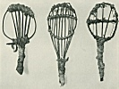

  
[Intangible Textual Heritage](../../../index)  [Native
American](../../index)  [California](../index)  [Index](index) 
[Next](eci01) 

------------------------------------------------------------------------

  
*Ethnography of the Cahuilla Indians*, by A. L. Kroeber, \[1908\], at
Intangible Textual Heritage

------------------------------------------------------------------------

#### UNIVERSITY OF CALIFORNIA PUBLICATIONS

###### IN

##### AMERICAN ARCHAEOLOGY AND ETHNOLOGY

|                          |               |
|--------------------------|---------------|
| Vol. 8, No. 2, pp. 29-68 | June 20, 1908 |

# ETHNOGRAPHY OF THE CAHUILLA INDIANS

###### BY

## A. L. KROEBER.

Scanned, proofed and formatted at Intangible Textual Heritage by John
Bruno Hare, April 2008. This text is in the public domain in the US
because it was published prior to 1923.

------------------------------------------------------------------------

[Next: Contents](eci01)
