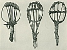

  
[Intangible Textual Heritage](../../../index.md)  [Native
American](../../index)  [California](../index)  [Index](index.md) 
[Previous](eci08)  [Next](eci10.md) 

------------------------------------------------------------------------

  
*Ethnography of the Cahuilla Indians*, by A. L. Kroeber, \[1908\], at
Intangible Textual Heritage

------------------------------------------------------------------------

### HOUSES.

The houses of the desert Cahuilla remain very much as described by Dr.
Barrows. [24](#fn_25.md) Their appearance and
construction

p. 64

is shown in [plate 14](eci12.htm#img_pl14.md). These houses bear some
resemblance to the houses of the Colorado river tribes, especially in
the upright forked posts supporting the roof beams, and in the character
of the thatching. They differ, however, in being but slightly or
partially covered with sand or earth. In fact many houses are without
any covering other than the brush thatching. In the Mohave house the
sides are quite low, and both sides and roof are pretty thoroughly
covered with a layer of sticks. The outside layer of brush serves the
purpose rather of preventing the thick covering of sand from shifting
through the spaces between the wooden framework, than of being a
covering in itself. The Cahuilla house is distinctively an airy
brush-house, the Mohave structure a heavy close earth-house. The Mohave
and Cahuilla resemble each other much more closely in the character and
use of their shades or ramadas and wind-breaks, which are usually
constructed in front of the entrance to the house.

At the Banning reservation a sweathouse is still in use ([Pl.
15](eci12.htm#img_pl15).md). From the outside its appearance is that of a
small mound. The ground has been excavated to the depth of a foot or a
foot and a half, over a space of about twelve by seven or eight feet. In
the center of this area two heavy posts are set up three or four feet
apart. These are connected at the top by a log laid in their forks. Upon
this log, and in the two forks, are laid some fifty or more logs and
sticks of various dimensions, their ends sloping down to the edge of the
excavation. It is probable that brush covers these timbers. The whole is
thoroughly covered with earth. There is no smoke hole. The entrance is
on one of the long sides, directly facing the space between the two
center posts and only a few feet from them. The fireplace is between the
entrance and the posts. It is just possible to stand upright in the
center of the house. This building was said by the old man who owned it
to be used only for sweating. Its size, which would prevent any
considerable gathering for ceremonial purposes or dances, corroborates
his statement. Throughout Southern California, as well as the southern
portion of the central region of the state, the use of the sweathouse
was confined strictly to this purpose, ceremonies being held either
under a simple shade or in a brush enclosure. In most of northern
California the so-called

p. 65

sweathouse is of larger dimensions and was preëminently a ceremonial or
assembly chamber.

------------------------------------------------------------------------

### Footnotes

[63:24](eci09.htm#fr_26.md) Barrows, 35.

------------------------------------------------------------------------

[Next: Social and Religious Life](eci10.md)
