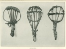
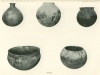

  
[Intangible Textual Heritage](../../../index)  [Native
American](../../index)  [California](../index)  [Index](index) 
[Previous](eci11) 

------------------------------------------------------------------------

  
*Ethnography of the Cahuilla Indians*, by A. L. Kroeber, \[1908\], at
Intangible Textual Heritage

------------------------------------------------------------------------

### PLATES

  [  
Click to enlarge](img/pl01.jpg)  
CHEMEHUEVI CARRYING BASKET.  
CAHUILLA OPEN-WORK BASKET. LUISEÑO OPEN-WORK BASKET.  

  [  
Click to enlarge](img/pl02.jpg)  
STORAGE BASKETS FOR MESQUITE.  

 
[  
Click to enlarge](img/pl03.jpg)  
SEED-BEATERS.  

  [  
Click to enlarge](img/pl04.jpg)  
FLAT BASKETS.  

  [  
Click to enlarge](img/pl05.jpg)  
SHALLOW BASKETS.  

  [  
Click to enlarge](img/pl06.jpg)  
DEEP BASKETS.  

  [  
Click to enlarge](img/pl07.jpg)  
BASKETRY CAPS AND GLOBULAR BASKETS.  

  [  
Click to enlarge](img/pl08.jpg)  
PESTLES FROM SAN GORGONIO PASS AND THE DESERT.  

 
[  
Click to enlarge](img/pl09.jpg)  
POTTERY.  

  [  
Click to enlarge](img/pl10.jpg)  
PAINTED JAR AND FIBRE SANDALS.  

  [  
Click to enlarge](img/pl11.jpg)  
CARRYING NET.  

  [  
Click to enlarge](img/pl12.jpg)  
SANDALS FROM UTAH AND COLORADO CLIFF DWELLINGS.  

  [  
Click to enlarge](img/pl13.jpg)  
DISK-SHAPED SHELL BEADS FROM CALIFORNIA.  

  [  
Click to enlarge](img/pl14.jpg)  
MODERN HOUSES IN THE DESERT.  

  [  
Click to enlarge](img/pl15.jpg)  
BASKET MORTAR AND SWEAT-HOUSE.  

 

 

 

 

 
