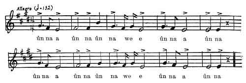

  
[Intangible Textual Heritage](../../../index.md)  [Native
American](../../index)  [California](../index)  [Index](index.md) 
[Previous](hut11)  [Next](hut13.md) 

------------------------------------------------------------------------

p. 185

# IX.

### Mīmedakût Kyūwintsit. [1](#fn_36.md)--At Mīmedakût She Pounded Acorns.

p. 186

 

  [1](#fn_37.md)

 

p. 187

A woman was pounding acorns at Mīmedakût. Her baby while playing near
her became hungry and tried to crawl up on her. She pushed it off. Again
it crawled on her and again she

p. 188

pushed it off. All was quiet. After pounding a while she looked around.
The baby was gone. She ran out. She ran around the house and looked in
different places. It was gone. When her husband came home at night, she
said, "I have lost the baby."

He threw the deer which he had brought on the bank back of the fire and
went out again. He ran around outside aimlessly until morning. Then he
found where the baby had crawled out under the house. Following its
trail he saw where it had crawled along. After a while he saw its
foot-print and knew that it had begun to walk. He saw where it had spent
the night. He could see that it had played along as it travelled. The
father journeyed without food. Soon he saw the boy had succeeded in
making a bow. Then he found he had built a fire. Still further on there
were birds already cooked lying on something beside the trail. He ate
these. As the father went along he wept. Every now and then he found
something left for him, cooked squirrels and small game. After a time he
saw the boy had become quite large. Finally he found where he had killed
a deer. He ate some of that which had been left for him. The father
always cried as he travelled.

After a time he saw by the appearance of the trail that his son had gone
along only a little ahead of him. When he came closer he heard him
singing. Woodpecker heads had been left for him on sticks by the trail.
Then right across from him [he heard his son singing](#img_18600.md). Then
the son thought, "Poor man, never mind, let him catch up with me." He
waited for him. When the father came along the son said, "I just thought
you would turn back from here." "No," said the father, "I will go with
you." He was surprised to see that the son's eyebrows had become
woodpecker color. "Well," said the son, "go back after your things and
then you may go with me."

When he got back to the house he found his wife lying dead by the
fire-pit covered with ashes. Groping about he found his own things and
went back. The son pounded up incense root and bathed him with it. Both
of them became Kīxûnai. They are still living in the world to the
southeast.

------------------------------------------------------------------------

### Footnotes

[185:1](hut12.htm#fr_36.md) Told at Hupa, July
1901, by Mary Marshall.

[186:1](hut12.htm#fr_37.md) NOTE.--This song was
taken down from a phonograph cylinder and the voice of a Hupa, by Miss
Edith May Lee, class of 103, University of California.

A mechanical record, made on the Rousselot apparatus, has been compared
with this. The results as regards both time and pitch agree almost
exactly.

------------------------------------------------------------------------

[Next: X. Tōdiñ KeïtLō.--By the River She Made Baskets](hut13.md)
