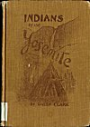
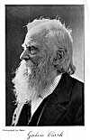

  
[Intangible Textual Heritage](../../../index.md)  [Native
American](../../index)  [California](../index)  [Index](index.md) 
[Next](ioy01.md) 

------------------------------------------------------------------------

p. title

# INDIANS

###### OF

## THE YOSEMITE VALLEY AND VICINITY

#### Their History, Customs and Traditions

###### BY

## GALEN CLARK

###### Discoverer of the Mariposa Grove of Big Trees and for many years Guardian of the Yosemite Valley

##### With an Appendix of Useful Information for Yosemite Visitors

###### ILLUSTRATED BY

###### CHRIS JORGENSEN

###### AND FROM PHOTOGRAPHS

#### YOSEMITE VALLEY, CALIFORNIA

#### GALEN CLARK

#### \[1904\]

###### Scanned at Intangible Textual Heritage, December 2003. J. Lelievre, redactor. This text is in the public domain. These files may be used for any non-commercial purpose, provided this notice of attribution is left intact.

[  
Click to enlarge](img/fcover.jpg.md)  
Front Cover  

[  
Click to enlarge](img/front.jpg.md)  
Galen Clark  

p. verso

Copyright 1904, by Galen Clark.

ALL RIGHTS RESERVED.

ELECTROTYPED AND PRINTED

BY THE

H. S. CROCKER CO., SAN FRANCISCO.

p. dedication

TO MY FRIEND

CHARLES HOWARD BURNETT

 

------------------------------------------------------------------------

[Next: Contents](ioy01.md)
