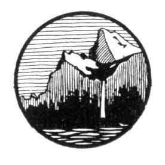

  
[Intangible Textual Heritage](../../../index.md)  [Native
American](../../index)  [California](../index)  [Index](index.md) 
[Next](lly01.md) 

------------------------------------------------------------------------

# THE LORE AND THE LURE OF THE YOSEMITE

##### THE INDIANS, THEIR CUSTOMS, LEGENDS AND BELIEFS, AND THE STORY OF YOSEMITE

###### BY

## HERBERT EARL WILSON

 

#### San Francisco, Calif., A. M. Robertson

#### \[1922\]

###### Scanned at Intangible Textual Heritage, November, 2003. J. B. Hare, redactor. This text is in the public domain. These files may be used for any non-commercial purpose, provided this notice of attribution is left intact.

 

 [  
Click to enlarge](img/front.jpg.md)  
THE GATEWAY (*Photo A. C. Pillsbury*)  

 

------------------------------------------------------------------------

[Next: Contents](lly01.md)
