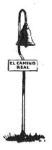
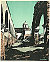
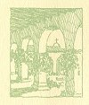
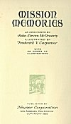

  
[Intangible Textual Heritage](../../../index.md)  [Native
American](../../index)  [California](../index)  [Index](index.md) 
[Next](mm01.md) 

------------------------------------------------------------------------

 

[  
Click to enlarge](img/front.jpg.md)  
A GLIMPSE OF OLD CALIFORNIA  

# MISSION MEMORIES

##### AS DESCRIBED BY

## John Steven McGroarty

##### ILLUSTRATED BY

## Frederick V. Carpenter

##### WITH

##### 22 PAGES OF

##### ILLUSTRATIONS

 

##### PUBLISHED BY

#### Neuner Corporation

#### LOS ANGELES, CALIFORNIA

#### \[1929\]

[  
Click to enlarge](img/fcover.jpg.md)  
Front Cover  

[  
Click to enlarge](img/title.jpg.md)  
Title Page  

**NOTICE OF ATTRIBUTION**  
Scanned at Intangible Textual Heritage, May 2005. John Bruno Hare,
redactor. This text is in the public domain in the United States because
its copyright was not renewed in a timely fashion as required by law at
the time. These files may be used for any non-commercial purpose
provided this notice of attribution is left intact in all copies.

 

------------------------------------------------------------------------

[Next: The Old Missions of California](mm01.md)
