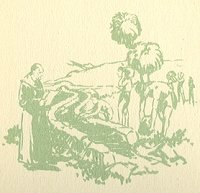
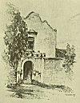

  
[Intangible Textual Heritage](../../../index.md)  [Native
American](../../index)  [California](../index)  [Index](index.md) 
[Previous](mm01)  [Next](mm03.md) 

------------------------------------------------------------------------

p. 16

 

### Mission San Diego de Alcala

|                     |
|---------------------|
|  |

HIS was the first of the Missions.

It was founded in the year 1769 upon the arrival of the expedition
headed by Don Gaspar de Portola by land up the peninsula of Lower
California and the expedition that came by sea. Fray Junipero Serra,
first Father President of the Missions, was with Portola. The ruins of
the Mission may still be seen. It was here that the first irrigation dam
and ditches in California were builded, and that the first palm and
olive trees were planted.

p. 17

 

[  
Click to enlarge](img/01700.jpg.md)  
Mission San Diego de Alcala  

 

------------------------------------------------------------------------

[Next: Mission San Carlos de Carmelo](mm03.md)
