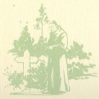
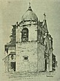

  
[Intangible Textual Heritage](../../../index.md)  [Native
American](../../index)  [California](../index)  [Index](index.md) 
[Previous](mm02)  [Next](mm04.md) 

------------------------------------------------------------------------

p. 18

 

### Mission San Carlos de Carmelo

|                     |
|---------------------|
|  |

HIS, the second of the Mission establishments, was founded in 1770 by
Father Serra and became his headquarters during his life in California.
His body was buried within the sanctuary of the church that was erected
there during the last year of his life. Annual pilgrimages by devout and
patriotic Californians are made to it. The Mission is popularly known as
"Carmel" and is situated on the little bay of that name six miles
distant from the city of Monterey.

 

p. 19

 

[  
Click to enlarge](img/01900.jpg.md)  
Mission San Carlos de Carmelo  

 

------------------------------------------------------------------------

[Next: Mission San Antonio de Padua](mm04.md)
