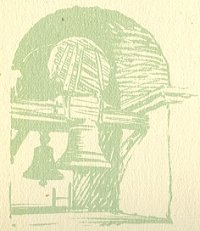
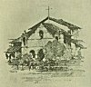

  
[Intangible Textual Heritage](../../../index)  [Native
American](../../index)  [California](../index)  [Index](index) 
[Previous](mm03)  [Next](mm05) 

------------------------------------------------------------------------

p. 20

 

### Mission San Antonio de Padua

|                     |
|---------------------|
|  |

HIS was in the days of its glory one of the most beautiful and most
important of the Mission establishments. Perhaps because of the fact
that it is away from the trend of travel, situated in a lonely but
lovely valley in a circle of the Santa Lucia Mountains, it has been
sadly neglected and is only infrequently visited. In order to reach it a
detour of twenty miles from King City on the main California State
High-way is necessary. The trouble taken to find it is well worth the
effort.

p. 21

 

[  
Click to enlarge](img/02100.jpg)  
Mission San Antonio de Padua  

 

------------------------------------------------------------------------

[Next: Mission San Gabriel Arcangel](mm05)
