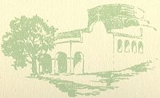
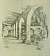

  
[Intangible Textual Heritage](../../../index.md)  [Native
American](../../index)  [California](../index)  [Index](index.md) 
[Previous](mm07)  [Next](mm09.md) 

------------------------------------------------------------------------

p. 28

 

### Mission of San Juan Capistrano

|                     |
|---------------------|
|  |

HE seventh link in the great chain, was founded in 1776 and became in
its time a mighty establishment. An eminent architect, the late Arthur
B. Benton, who made a careful survey of San Juan Capistrano with a view
to its possible full restoration estimated that the work could not be
done at a less cost than $200,000. It is here that the only remaining
church in which Father Serra celebrated Mass is to be seen, and which
has been completely restored by Father St. John O'Sullivan. But the
great main church which was wrecked by the earthquake of 1812 still
remains in ruins.

p. 29

 

[  
Click to enlarge](img/02900.jpg.md)  
Mission San Juan Capistrano  

 

------------------------------------------------------------------------

[Next: Mission Santa Clara de Assisi](mm09.md)
