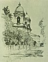

  
[Intangible Textual Heritage](../../../index.md)  [Native
American](../../index)  [California](../index)  [Index](index.md) 
[Previous](mm08)  [Next](mm10.md) 

------------------------------------------------------------------------

p. 30

 

### Mission Santa Clara de Assisi

|                     |
|---------------------|
|  |

IGHTH in line was founded in 1777. It is located in the lovely little
city of Santa Clara adjacent to the better known metropolis of San Jose.
By reason of fires and one or two rather destructive temblors, this once
beautiful structure finally reached almost complete destruction. Lately,
however, the Jesuit Fathers having had for many years the seat of their
university at Santa Clara have rebuilt the old church exactly as it
originally stood.

p. 31

[  
Click to enlarge](img/03100.jpg.md)  
Mission Santa Clara de Assisi  

 

------------------------------------------------------------------------

[Next: Mission San Buenaventura](mm10.md)
