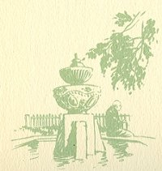
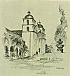

  
[Intangible Textual Heritage](../../../index.md)  [Native
American](../../index)  [California](../index)  [Index](index.md) 
[Previous](mm10)  [Next](mm12.md) 

------------------------------------------------------------------------

p. 34

 

### Mission Santa Barbara

|                     |
|---------------------|
|  |

OUNDED in 1786, doubtless Santa Barbara is the most famous and best
known of all the Missions, as it is, at the same time the best
preserved. It may be said to stand as it originally was except for the
absence of the Indian homes that once surrounded it. Within its cloister
is the garden widely known as the "Sacred Garden" from which women are
excluded under the Franciscan rule. However, two women are known to have
been admitted--the Princess Eulalie of Spain and the wife of President
McKinley.

p. 35

 

[  
Click to enlarge](img/03500.jpg.md)  
Mission Santa Barbara  

 

------------------------------------------------------------------------

[Next: Mission La Purisima Concepcion](mm12.md)
