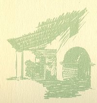
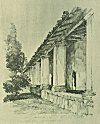

  
[Intangible Textual Heritage](../../../index)  [Native
American](../../index)  [California](../index)  [Index](index) 
[Previous](mm11)  [Next](mm13) 

------------------------------------------------------------------------

p. 36

 

### Mission La Purisima Concepcion

|                     |
|---------------------|
|  |

HE eleventh Mission, founded in 1787. It was originally a most beautiful
thing from an architectural point of view erected on a lovely plain in
the Valley of Lompoc near the present little city of that name. It was
used mainly as a monastery to which the Mission Fathers were wont to
retire for special prayer and contemplation. So completely fallen to
ruin is La Purisima now that the heedless traveler, may easily overlook
it.

p. 37

 

[  
Click to enlarge](img/03700.jpg)  
Mission La Purisima Concepcion  

 

------------------------------------------------------------------------

[Next: Mission Santa Cruz](mm13)
