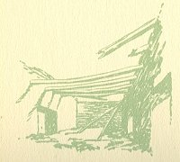
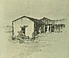

  
[Intangible Textual Heritage](../../../index)  [Native
American](../../index)  [California](../index)  [Index](index) 
[Previous](mm13)  [Next](mm15) 

------------------------------------------------------------------------

p. 40

 

### Mission La Soledad

|                     |
|---------------------|
|  |

HIRTEENTH in the great chain, founded in 1791. As its name implies it
was a lonely and solitary place. Only a few of its walls now stand which
the sightseer can gaze upon by a short journey of a mile or so from
Soledad City located on the main California Highway. It was here, when
the Missions were confiscated by the Mexican government, that Father
Saria (not Serra) remained with his stricken Indian neophytes and died
among them of sheer starvation as he was weakly attempting to ascend the
altar steps one morning to celebrate the Divine Service.

p. 41

 

[  
Click to enlarge](img/04100.jpg)  
Mission La Soledad  

 

------------------------------------------------------------------------

[Next: Mission San Jose de Guadalupe](mm15)
