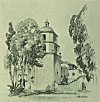

  
[Intangible Textual Heritage](../../../index.md)  [Native
American](../../index)  [California](../index)  [Index](index.md) 
[Previous](mm18)  [Next](mm20.md) 

------------------------------------------------------------------------

p. 50

 

### Mission San Luis Rey de Franca

|                     |
|---------------------|
|  |

HIS was the eighteenth Mission and was founded in 1798. The Franciscan
Fathers have returned to it and have done a great deal to restore it to
its original proportions. It was builded entirely of adobe and,
according to Buell, stands preeminent architecturally. It is to be seen
four miles inland from the town of Oceanside as the traveler enters San
Diego County from the North. Many interesting relics of the early
Mission days are on exhibition in the museum. In the patio of San Luis
Rey the original pepper tree of California still stands green and
growing.

p. 51

 

[  
Click to enlarge](img/05100.jpg.md)  
Mission San Luis Rey de Franca  

 

------------------------------------------------------------------------

[Next: Mission Santa Ines](mm20.md)
