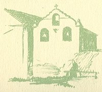
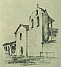

  
[Intangible Textual Heritage](../../../index.md)  [Native
American](../../index)  [California](../index)  [Index](index.md) 
[Previous](mm19)  [Next](mm21.md) 

------------------------------------------------------------------------

p. 52

 

### Mission Santa Ines

|                     |
|---------------------|
|  |

OUNDED in 1804, nineteenth in the chain, located near the town of Los
Olivos. This is one of the most beautiful of all Missions, and a great
deal of restoration work has been done upon it mainly through the
financial assistance of the Society of the Native Sons of the Golden
West. Surrounding the old church is an Indian Reservation still
maintained by the Government upon which a few Indian families continue
to live. Much of the credit for the restoration of this beautiful
edifice is due to the zeal of Father Alexander Butler who was for many
years the resident priest.

p. 53

 

[  
Click to enlarge](img/05300.jpg.md)  
Mission Santa Ines  

 

------------------------------------------------------------------------

[Next: Mission San Rafael Arcangel](mm21.md)
