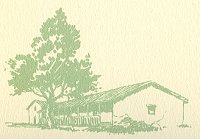
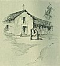

  
[Intangible Textual Heritage](../../../index.md)  [Native
American](../../index)  [California](../index)  [Index](index.md) 
[Previous](mm20)  [Next](mm22.md) 

------------------------------------------------------------------------

p. 54

 

### Mission San Rafael Arcangel

|                     |
|---------------------|
|  |

HE twentieth Mission, founded in 1817 has been entirely annihilated by
time and the neglectful years. It was one of the two establishments
erected north of the Bay of San Francisco in a beautiful and fruitful
section of the country. A Masonic Temple now stands on the site. A few
broken tiles are the only evidence remaining of this once devoted
Franciscan outpost. In due time, no doubt, a suitable tablet or monument
will be erected to mark the spot.

p. 55

 

[  
Click to enlarge](img/05500.jpg.md)  
Mission San Rafael Arcangel  

 

------------------------------------------------------------------------

[Next: Mission San Francisco de Solano](mm22.md)
