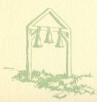
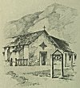

  
[Intangible Textual Heritage](../../../index.md)  [Native
American](../../index)  [California](../index)  [Index](index.md) 
[Previous](mm21)  [Next](mm23.md) 

------------------------------------------------------------------------

p. 56

 

### Mission San Francisco de Solano

|                     |
|---------------------|
|  |

HE twenty-first and the last of the Missions was founded on America's
Independence day, July 4, 1824. The ancient church still stands intact
and is surrounded by many historic graves marked by gorgeous monuments.
The Mission is located in the town of Sonoma famous as the scene of the
American adventure known in history popularly as the "Bear Flag
Republic." The Sonoma Valley figures as the "Valley of the Moon" in one
of Jack London's Novels.

p. 57

[  
Click to enlarge](img/05700.jpg.md)  
Mission San Francisco de Solano  

------------------------------------------------------------------------

[Next: Index](mm23.md)
