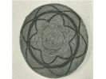

  
[Intangible Textual Heritage](../../../index)  [Native
American](../../index)  [California](../index)  [Index](index) 
[Previous](mrci13)  [Next](mrci15) 

------------------------------------------------------------------------

  
*A Mission Record of the California Indians*, by A.L. Kroeber, \[1908\],
at Intangible Textual Heritage

------------------------------------------------------------------------

#### *Santa Cruz*. [58](#fn_58)

At this place they ordinarily live on salmon and lampreys, of which
there are many in the river which flows at the mission. [59](#fn_59)

 

Their dances are most insipid. They gather in a circle and without
moving from the spot bend their bodies. They move their feet and make
many contortions to the sound of their disagreeable voices, with which
they do not form articulate words.

p. 25

There are some among them, evil-minded old men, who instill them with a
panic fear towards the demon whom they regard as the author of all
evil. [60](#fn_60) That he may not trouble them,
they make them believe that they must place a little of the flour which
they eat, or of any other of their foods, on this stone or in that log
in such and such a place. For the same purpose they sometimes hold
secret dances at night, always without the knowledge of the fathers. It
is known that at night the adult men alone gather in a field or wood. In
the middle they place a tall stick crowned with a bundle of tobacco
leaves, or branches of trees or other plants. At the foot of the stick
they put their foods and glass beads. They prepare for the dance,
tornandose their bodies and faces. When they are all gathered, the old
man whom they look up to as their master or soothsayer goes out to give
ear to the commands of the devil. Returning after a short time, he
imparts to the poor innocents, not what he op \[*sic*\] of the father of
lies, but what his own perversity and malice suggest to him. Thereupon
they proceed to their dance, which they continue until day.

 

When an Indian wishes to marry, he goes to the house of her whom he
desires for a wife and seats himself near her, sighs without speaking a
word, and throwing at the feet of her father some beads,—which are small
snails or pieces of shells strung on a thread—he goes out and without
further ceremony or rite he is married.

 

Generally they are peaceful. They do not give quarter to the enemy. When
one of these is killed in battle, they tear his limbs to pieces. They
remove the top of the skull, [61](#fn_61) place
it on a pike (pica), carry it in triumph to their village, y la pasean
por todas las de sus abiados.

------------------------------------------------------------------------

### Footnotes

[24:58](mrci14.htm#fr_58) The following was
probably written by Father Andreas Quintana. Santa Cruz is in Costanoan
territory, and so far as known was settled only with Indians of this
family.

[24:59](mrci14.htm#fr_59) Salmon and lampreys,
ordinarily known as eels, were the most important aboriginal fish foods
of northern California.

[25:60](mrci14.htm#fr_60) The "demon who is the
author of all evil" is of course a missionary conception, as are the
"perversity and malice" attributed to the head man of the dances.

[25:61](mrci14.htm#fr_61) Many of the California
Indians did not scalp, but cut off the head or the skin of the entire
head except the face.

------------------------------------------------------------------------

[Next: Santa Clara](mrci15)
