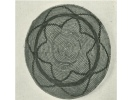

  
[Intangible Textual Heritage](../../../index.md)  [Native
American](../../index)  [California](../index)  [Index](index.md) 
[Previous](mrci15)  [Next](mrci17.md) 

------------------------------------------------------------------------

  
*A Mission Record of the California Indians*, by A.L. Kroeber, \[1908\],
at Intangible Textual Heritage

------------------------------------------------------------------------

#### *San Jose*. [64](#fn_64.md)

Only in war do they obey the most valiant or successful one, and in
matters of superstition their wizards and magicians. Beyond this they
admit no civil, political, nor even domestic subordination. In their
quarrels they have no appeal, except to force, whence it follows that
even those of the same family sometimes kill one another for nothing at
all. [65](#fn_65.md)

 

It is said that only one village or nation, of the many that composed
the population of this mission, adored the sun when it retired to the
southern pole. They considered it angered, made a dance for it, and
offered it seeds, until they knew that it had turned and was again
approaching.

------------------------------------------------------------------------

### Footnotes

[26:64](mrci16.htm#fr_64.md) Mission San Jose,
which was not at the present city of San Jose, but some distance to the
north, was in Costanoan territory, but included in its population
Indians of the Miwok and perhaps other families. Nearly all of the few
descendants of the Indians once at this mission are Miwok. Fathers
Buenaventura Fortuni and Narciso Duran were at San Jose in 1811.

[26:65](mrci16.htm#fr_65.md) It looks as if this
passage and the preceding paragraph from Santa Clara had had a common
origin.

------------------------------------------------------------------------

[Next: San Francisco](mrci17.md)
