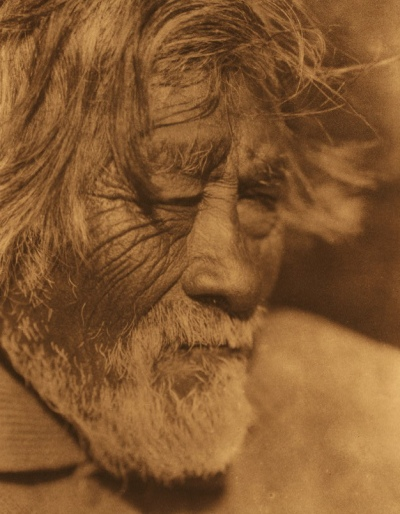

  
[Intangible Textual Heritage](../../../index)  [Native
American](../../index)  [California](../index) 

------------------------------------------------------------------------

<table width="75%">
<colgroup>
<col style="width: 50%" />
<col style="width: 50%" />
</colgroup>
<tbody>
<tr class="odd">
<td width="50%" data-valign="TOP"> 
Diegueño of Santa Ysabel, Edward Curtis [1916] (Public domain image)</td>
<td width="50%" data-valign="CENTER"><h1 id="notes-on-the-shoshonean-dialects-of-southern-california" data-align="CENTER">Notes on the Shoshonean Dialects of Southern California</h1>
<h2 id="by-a.-l.-kroeber" data-align="CENTER">by A. L. Kroeber</h2>
<h4 id="section" data-align="CENTER">[1909]</h4></td>
</tr>
</tbody>
</table>

------------------------------------------------------------------------

[Contents](#contents)    [Start Reading](nsd00)    [Page
Index](pageidx)    [Text \[Zipped\]](nsdtxt.zip)

------------------------------------------------------------------------

This short monograph has some of the last linguistic data on the long
extinct Native Southern Californian languages salvaged by A. L. Kroeber,
the dean of Native Californian linguistics.

------------------------------------------------------------------------

 [Title Page](nsd00)  
[Contents](nsd01)  
[Introduction](nsd02)  
[Cahuilla](nsd03)  
[Agua Caliente](nsd04)  
[San Juan Capistrano](nsd05)  
[Gabrielino](nsd06)  
[Serrano](nsd07)  
[Chemehuevi](nsd08)  
[Kern River](nsd09)  
[Giamina](nsd10)  
[General Comparisons](nsd11)  
