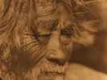

  
[Intangible Textual Heritage](../../../index)  [Native
American](../../index)  [California](../index)  [Index](index) 
[Previous](nsd01)  [Next](nsd03) 

------------------------------------------------------------------------

  
*Notes on the Shoshonean Dialects of Southern California*, by A. L.
Kroeber, \[1909\], at Intangible Textual Heritage

------------------------------------------------------------------------

p. 235

### INTRODUCTION.

The following linguistic notes which, like all preceding studies in this
series, have been made possible by the generosity of Mrs. Phoebe A.
Hearst to the Department of Anthropology of the University of
California, are supplementary to a paper on "The Shoshonean Dialects of
California," issued in Volume 4 of the

p. 236

present series of publications in 1907. The orthography described in
that paper has been used here. [1](#fn_0) The
character ’ is however better described as a glottal stop, while
aspirations are denoted ‘. by The Cahuilla, Agua Caliente, Serrano, and
Gabrielino information here presented was obtained at Cabezon, Morongo,
and San Manuel reservations, in the course of a trip made in 1907, the
ethnological results of which have been discussed in a previous paper in
this volume, "Ethnography of the Cahuilla Indians." The data on the
dialect of San Juan Capistrano were secured at that place late in 1907.
The Chemehuevi notes were given in 1908 by two Chemehuevi living among
the Mohave at Needles. As vocabularies of Agua Caliente, Gabrielino, and
Chemehuevi have been given in the former paper mentioned, new
vocabularies that were obtained in these dialects are presented here
only in so far as they contain new terms, or words secured in different
form. The newly obtained Serrano and Juaneño vocabularies represent
dialects that had not been previously heard by the author, and are
therefore given in full.

------------------------------------------------------------------------

### Footnotes

[236:1](nsd02.htm#fr_0) In brief, x is spirant of
k, g‘ of g; q, g, velar; ñ, nasal of k; c, sh;
t•, palatal; v, bilabial; ì, è, è, ù, long open;
ī, ē, ō, ū, long close; ö, ü, Shoshonean ö, ü; a i, etc.,
whispered; n, nasalization; ’, glottal stop; ‘, aspiration;
´, accent.

------------------------------------------------------------------------

[Next: Cahuilla](nsd03)
