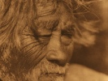

  
[Intangible Textual Heritage](../../../index)  [Native
American](../../index)  [California](../index)  [Index](index) 
[Previous](nsd02)  [Next](nsd04) 

------------------------------------------------------------------------

  
*Notes on the Shoshonean Dialects of Southern California*, by A. L.
Kroeber, \[1909\], at Intangible Textual Heritage

------------------------------------------------------------------------

### CAHUILLA.

Two Cahuilla vocabularies were obtained, one from Antonio Martinez at
Cabezon in the desert, the other from Jose Miguel at Banning. The former
represents the dialect of the Colorado desert, the latter the dialect of
San Gorgonio Pass and Palm Springs. Antonio Martinez has an unusually
clear enunciation. Jose Miguel is from Agua Caliente, the hot springs of
Warner's ranch, where the dialect of that name, somewhat different from
both Cahuilla and Luiseño, is spoken. He has lived long at Banning, and
appears to speak Cahuilla with more readiness than his closely related
native speech. The difference between the desert and the Banning
dialects of Cahuilla is scarcely perceptible. The only word found in
which the two distinctly differ was the example chosen by Jose Miguel to
illustrate the diversity: no, which is ki’i in the desert and qowa in
the pass. A number

p. 237

of words in the desert dialect show the sound ny, as naxanyic, man. In
the Banning vocabulary this ny is always replaced by n; but it is not
certain whether this difference is dialectic or due to individual
peculiarities of the informants. In the following list the first word of
each meaning is from the desert, the second from the pass. Where only
one word is given, the form is either alike in both dialects or the word
was obtained only in the desert.

*Vocabulary*.

Five, namu-qwan-añ; six, qwan-supli; seven, qon-wi’; eight, qon-pa’;
nine, qon-witcu, or qon-witciw‘; eleven, peta-supli; twelve, peta-wi‘;
etc.; sixteen, peta-qwan-supli; twenty, wis namitcumi; twenty-one, wis
namitcumi peta-supli; thirty, pas namitcumi; forty, witcius namitcumi;
fifty to ninety, namugwanañes, kwansuplis, qonwis, qonpas, qonwitcius
namitcumi; one hundred, supli pisetiwenit.

Man, naxanyic, naxanic; woman, nyitcil, nitcil; boy, qeat, kiat, plural,
qiqitam; girl, ñawicmal; girl at puberty, elka; young man, eqwacmal (cf.
Luiseño aqwalimai, baby); old man, naxaluwil; old woman, nyicluwil,
nicluwil; person, taxliswit, people, taxliswitcem;
whites—Spanish-speaking, tciatcem, American, melkitcem.

My father, ne-na; my mother, ni-ye; my son, ne-mailyoa; my daughter,
ne-suñama; my elder brother, ne-pas; my younger brother, ne-yul; my
elder sister, ne-qic; my younger sister, ne-nawail.

Head, hair, yuluka, nu-yuluka; skull, yuluka-kavoma; forehead, wi’i, ne-wi’i; ear, naq’a, ne-naq’a;
eye, he-puc, ne-puc; eyebrows, yul-sev-em;
eyelashes, puc-tcavay-am; nose, he-mu, ne-mu;
mouth, lip, teeth, tam’a, no-tam’a; tongue, he-nañ, ne-nañ; beard,
yul-tamam, ne-yul-tamum (hair-mouth); chin, eyewoka; neck, qily’i,
ne-qily’i; throat, quspi; arm, hand, he-ma’, ne-ma’; elbow, puviam, ne-puvium; nail, sal’u,
ne-sal’o; belly, tii; breast, he-tau‘, he-tawh, ne-tau; back, husa;
back-bone, hululu; ribs, tcawaa; shoulder, sek’a; collarbone, qawinaxa;
leg, foot, he’-i, ne’-i; knee, tam’i, ne-tam’i; ankle, he’-i qawa; hip,
pakiwa; bone, te’i, plural te’il, ne-te’i; heart, he-sun, ne-sun; liver,
nem’a, ne-nem’a; lungs, yavaiwa; kidney,
pipiviskun; intestines, sai; brain, yuxosxo;
fat, he-wi; fat person, a fat one, wi-k; milk, he-pily; skin, sav’a; blood ("of a person"), he-ewh, he’-ew‘, ne-ew;
"much blood," ew‘-il.

Chief, net, kik; shaman, pul; rich, mexana-k; poor, sunsunik’a.

House, kic; my house, ne-ki; houses, kikic; sweat-house, huyetcat;
knife, iron, dukvac (sky); road, pit.

Sky, iron, dukvac, dukmatbic; sun, tamiat,
damiat; moon, menyil, menil; star, suwet, stars, suwet-em; night,
dukmiat; day, hatiwenet, damet-pik; thunder, memla qalet; "thunder
strikes," pipivan qalet; lightning, tauwal;
rainbow, piaxtem; meteor, ñamñam; large low meteor, living on San
Jacinto mountain, dakuc; comet, suwet he-qwasqa (star its-tail); fog,
paxic, baxic; rain, wewinyic, wewunic; snow, ice, yuyat; hail, tevaxalem; fire, kut, gut; smoke, miat; steam, mululkal;
ash, nisxic; coal, dul; water, pal, bal; ocean,

p. 238

pal setaxat (water "salty"), or pal nukat (water "made"); stream,
wanyic, wanic; lake, pal muyiwenet; spring, pal piskalet (water
emerging); well, walinat; earth, temal, demal; earthquake, temal
ñilyiac; sand, ñatcic; rock, qawic; mountain, mumawet; cliffs, large
rocks, hawayat; salt, iñil; alkali, luñayil.

Wood, tree, qelawat, gelawat; grass, brush,
samat; mesquite, menyikic; screw mesquite, qwinyal; cottonwood,
lavalvaanat; willow, saxat; tree yucca, panuul;
chia (sage seeds), pasal; species of seeds, seic, butcil.

Dog, awal; bear, hunwet; wolf, iswet; coyote, isil; deer, sukat;
antelope, tenil, plural, tenl-am; horse (probably originally elk),
pa-sukat (water-deer? On Cahuilla reservation, in the mountains, the
Spanish caballo is used for horse); mountain-sheep, baat; panther,
dukwet; wild-cat, dukut; fox, wilyal; skunk, tekwil; badger, hunal;
jackrabbit, suic; rabbit, tavut, tevit-em; ground-squirrel, qiñic; rat, qawil.

Bird, wik’ikmal, plural, wik’ikmaily-am; eagle, aswit; condor,
yuñawivut; buzzard, yuñawi-c; species of hawk,
qwaal, kisil, gaukuc; owl, mut; ground-owl,
ququl; raven, alwat; crows, alwamaily-am; blackbirds, paxantcim; dove,
maxivit or maxayil; road-runner, puic; ducks,
xanamo-im (cf. Mohave, hanemo, duck); hummingbird, dutcil.

Rattlesnake, sewet; gopher-snake, bukawet; milk-snake, palokol; large
red snake, tataxul; lizard, mulyak, tcaxul-am; turtle, ayil; frog, toad,
waxatcil; fish, kiyul.

Fly, a’awat; species of spiders, xwalxwal, kuituk; tarantula,
qweyexevac; bees, sasañ-em; yellow-jacket,
kumsexwet; worms, sivuyal-em; large ants,
ant-em; small ants, kuvucnily-am; fleas,
mukatc-em; lice, qo-am.

White, tewie-neck’c; black, tul-nekic (dul, coal); red, sel-nekic;
yellow, teset-nekic; green, blue, tukwic-nekic (dukvac, sky); large, amnawat; small, little, inyis,
inyic-il; good, atca-i; it is well, atca-m; bad, elelkwic.

I, ne; thou, e; we, tcemem; ye, emem; this, iv’i; that, he, pe; those, they, pe-em; here, ipa’;
there, peña; much, metewet; who, haxi; to-day, iv’ax; yesterday, tuku, duku; tomorrow, tulekaan,
paiba; far, xawun; near, suntci; yes, hè’; it is well, atcam; no, ki’i
(in desert), qowa (in San Gorgonio pass).

Eat, wayaki; I will eat, hen-wayek-nik; I have eaten, aina-wayaki;
hunger, qwalyipic nemok; drink, pa; thirst, takotpic nemuk; run,
peniwa-ka; dance, hen-tceñen-ka; sing, hen-taxmu-ka; sleep, en-kup-ka,
kup-e, kup-le, kup-le-wet; kill, meka; dead, mukic; alive, mo-ne-hyukal;
sit, ne-hiukyal; sit down, nyatce; stand, tawic-nik; I will lie down,
ipantatcawe-nik; gamble, hen-tuxpi-ka, malis-wik; cry, hen-ñan-ik;
shout, hen-wai-ka; jump, hen-pepotcax-ka; fly, hen-hiñ-ik; hit with
stick, pelwuk-ik; hit with hand, pen-katcin-ka; give, e-max-ik; give me,
ne-max-ai.

Velar sounds are readily distinguished from forward k sounds in
Cahuilla, though not uttered with the forcible or spirant quality which
they often tend to possess in other languages. Glottal stops occur both
after final vowels, such as -ma’, hand, between vowels, as in te’i,
bone, and after consonants preceding

p. 239

a vowel, such as tam’a, tooth. A final aspirated u or w was observed
several times. Witcu, four, is sometimes heard witciwh or witciw‘; -ew‘,
blood, and -tau, -taw‘, breast, are other cases. R, which occurs
sparingly in Luiseño, is absent from Cahuilla. Bilabial v occurs beside w, as in all Shoshonean dialects known
to the author. The sound ñ, the nasal of k, is found initially, finally,
and medially. The ü, ö
sounds so characteristic of most Shoshonean dialects and certain
neighboring languages, are wanting in Cahuilla, as they are in Luiseño
and Agua Caliente. They are found in Serrano and Gabrielino, and
apparently in all Shoshonean dialects except those of the
Luiseño-Cahuilla group. Obscure vowels, that is, vowels so pronounced as
to be more or less deficient in characteristic quality, are frequently
heard.

*Stems and Combinations of Consonants*.

Consonants in juxtaposition are not rare in Cahuilla, but a regular
alternation of vowel and consonant is more frequent. So many of the
combinations of consonants are evidently due to composition,
reduplication, or shortening under the influence of suffixes, that there
is every reason for concluding that Cahuilla stems never contain double
consonants. In a small number of words there are combinations of
consonants which in the present state of knowledge cannot be explained
by any of the above processes. But these words are so few, and have so
little inherent appearance of being stems, that they can furnish but
very doubtful evidence.

The consonants qw or kw, ly, and ny, in such words as namuqwanañ,
qwinal, hipily, qily’i, naxanyic, nyitcil, menyil, wanyic, must be
regarded as only developments of consonants that were single in the
original forms of these stems—q or k, l, and n. These simple forms often
occur in the same stems in Luiseño and other dialects. Qw, ly, and ny
are characteristic sounds also of Mohave of the Yuman family, and
correspond at least at times to unlabialized and unpalatalized sounds in
related dialects. In view of this identity of phenomena, the
geographical proximity of Cahuilla and Mohave is undoubtedly of
significance.

Among combined consonants due to composition and derivation are:
el-el-kwic, bad; nyic-luwil, old woman, from nyitc-il,

p. 240

woman; ñawic-mal, girl, and other words with diminutive suffix -mal;
qon-supli, six, and other composite numerals; tcem-ki, our house, and
other forms with pronominal prefixes; mul-ul-kal, steam; descriptive
terms such as pal-setaxat, ocean, water-salty; yul-sevem, eyebrows, and yul-tamam, beard, from yul-uka,
hair; puc-tcavayam, eyelashes, from puc, eye;
tax-liswit, person, atax in other dialects; nis-xic, ash, xoc-xic in
other dialects; duk-miat, night, dug-al, dug-it, etc. in other dialects;
duk-vac, duk-mat-bic, sky, duk-upar, dog-umbal,
in other dialects.

Combined consonants due to duplication of stems are found in yu-xos-xo,
brain; ñam-ñam, shooting star; sun-sun-ika, poor; xwal-xwal, spider.

Double consonants caused by the omission of a vowel dropped to
compensate for the addition of the plural suffix, are found in tenl-am,
antelopes, from singular tenil; probably in ant-em, ants, singular in
Luiseño anut; and in paxantc-im, blackbirds, which appears to be derived
from a singular paxanic. Piaxt-em, rainbow, may be in the same class.

Somewhat similar to these cases is the numeral supli, one, supul in
other dialects.

The only known words for whose double consonants no specific
explanations can yet be offered, are: quspi, throat; amnawet, large;
suntci, near; lavalvanat, cottonwood; k’iksawal, jimson-weed; kuvucnilyam, small ants; kumsexwet, yellow-jacket;
iswet, wolf; hunwet, bear; dukwet, panther; aswit, eagle. It is evident
that at least the majority of these are not simple stems. Kuvucnilyam, small ants, and kumsexwet,
yellow-jacket, [2](#fn_1) are obviously compounds
or derivatives. The four words is-wet, wolf, hun-wet, bear, duk-wet,
panther, and as-wit, eagle, seem to contain a final element denoting
size or superlativeness. It will be observed that each of these animals
is the largest of its kind. [2a](#fn_2) That the
stem of iswet is is-, and not isw-, appears from is-il, coyote.
Similarly duk-ut is wildcat, corresponding to duk-wut, panther.

The number of known double consonants that are unanalyzable

p. 241

is thus so small as to give every prospect of their being resolved
before further study, and that the stems of Cahuilla will thus
positively prove to contain only simple consonants.

*Pronouns*.

The pronouns in their independent form and as possessive prefixes are:

|     |                      |       |
|-----|----------------------|-------|
| 1   | ne                   | ne-   |
| 2   | e                    | e’e-  |
| 3   | pe (demonstrative)   | pehe- |
| 1   | tcemem               | tcem- |
| 2   | emem                 |       |
| 3   | peem (demonstrative) |       |

*Plural*.

The following cases of plural forms with the ending -am were noted. All
of these are words denoting animate beings, except the terms for stars,
beard, eyebrows, and eyelashes. The reason for the use of the plural in
the last three is obvious.

Yul-sev-em, yul-tam-am, puc-tcavay-am, suwet-em, qi-qit-am, melkitc-em,
taxliswitc-em, tciatc-em, ant-em, kuvucnily-am,
sasañ-em, tevit-em, tenl-am, wik’ik-maily-am,
xanamo-im, alwamaily-am, tcaxul-am, qo-am, mukatc-em, sivuyal-em. Probably plural are: tevaxal-em, hail, piaxt-em, rainbow, paxantc-im,
blackbirds.

A plural by reduplication also occurs. It does not supersede but is
accompanied by the suffix -am.

|            |                 |
|------------|-----------------|
| house, kic | houses, ki-kic  |
| boy, qeat  | boys, qi-qit-am |

It is probable that the expression of the plural by reduplication is
restricted. Similar cases have been observed in Luiseño:

|                   |                       |
|-------------------|-----------------------|
| man, yaac         | men, ya-yitc-am       |
| woman, cuñal      | women, cu-cñal-am     |
| old woman, necmal | old women, ne-nicl-am |
| chief, not        | chiefs, no-not-om     |

It is not quite clear whether the variability of the suffix between -em
and -am is dependent upon a partial assimilation of

p. 242

its vowel to the vowels of the stem or whether it is regulated by more
complex rules. In some ten or twelve of the cases obtained -am follows
a, o, or u stems and -em i or e stems; whereas in about eight instances
the reverse is the case. In a number of the instances, however, the lack
of accord between suffix vowel and stem vowels is only apparent. Thus
qi-qit-am is derived from a singular qeat. Tenl-am is from a singular
tenil, but the i is not radical and is unaccented, and the radical e
appears to replace an original back vowel, as in Luiseño tonla.

In Luiseño the vowel of the plural suffix also varies, but instead of
being a or e it is either a or o or u. The correspondence of Luiseño o
and Cahuilla e is frequent, appearing in the word tonla-tenil just
mentioned, as well as in many others, and in the pronouns and pronominal
prefixes.

The use of certain terms, denoting parts of the body, without a
possessive pronoun and with the noun terminative -l, appears to give
them a plural connotation. Bone is te’i; te’i-l was given and translated
as "bones." Blood is -ew‘; blood as a substance, or "much blood," is
ew‘-il. It is probable that this suffix is only the common ending -l
found on many substantives of animate and inanimate meaning. Its plural
or collective force appears to be due to the fact that its occurrence on
terms denoting parts of the body is limited to the unusual cases when
such words are not accompanied by a possessive pronoun, which must
ordinarily be used with all nouns of this class. In such cases these
words therefore denote the substance rather than specific objects; from
this it is only a step to a collective meaning, and the collective
shades naturally into the plural.

*Composition and Derivation*.

A few compound nouns were observed. Most of these may be compositions of
a noun with a verbal stem; but yul-tam-am, beard, is undoubtedly derived
from yul-uka, hair, yu-la in Luiseño, and tam’a, mouth or tooth.
Pa-sukat, horse, in other dialects apparently elk, may be
"water-deer." [3](#fn_3) If these cases are

p. 243

correct, they are interesting in view of Mr. P. S. Sparkman's statement
that there is no known compound noun in the Luiseño language. [4](#fn_4)

The noun-ending -mal is a diminutive. It is found also in Luiseño.
Before the plural -am this suffix in Cahuilla becomes -maily-.
Adjectives of color end in -nekic. Black, dul-nekic, seems to mean
"charcoal color." The suffix -s gives the numerals adverbial force, with
the meaning of "the number of times." Two is wi. Twice is wi-s. These -s
forms are used in forming the higher numerals by multiplication.

A number of endings on verb stems have been observed, though their
meanings are too far from determination to render their discussion
profitable. They are -ka, -nik and -ik, -i and -e, -le, -le-wet, -am,
and -nemok, with the prefix or preposed particle hen-. The common
Luiseño imperative ending -x has not been heard.

*Noun Endings*.

It has been said [5](#fn_5) that in all
Shoshonean dialects, and probably throughout the whole Uto-Aztekan
family, it appears "that a noun cannot stand as a naked stem, but
requires a suffix; but that any form of composition into which the stem
enters, such as the addition of a possessive affix, makes the terminal
suffix unnecessary," and it is dropped. An examination of the new
Cahuilla material makes an amplification of this statement possible. Mr.
Sparkman has stated [6](#fn_6) that in Luiseño
certain nouns, such as those denoting terms of relationship and parts of
the body, cannot occur without a possessive pronoun. This of course is
sufficient to distinguish them from other nouns that are usable without
possessive prefixes. In Cahuilla such nouns, both animate and inanimate,
almost always end either in l, c, or t. There are very few exceptions to
this rule. On the other hand, words denoting parts of the body do not
show these endings, but with very few exceptions end in a vowel. Many of
the terms obtained for

p. 244

parts of the body were given without a possessive prefix. Thus: yuluka,
head; naq’a, ear; tam’a, mouth; quspi, throat, qily’i, neck; and others.
If it were not for these non-pronominal forms it might be supposed that
words denoting parts of the body possessed the characteristic endings of
other nouns, and only failed to show them on account of their constant
usage with the pronominal prefix which is incompatible with the ending.
Indeed it is possible that such forms as naq’a and tam’a are not good
Cahuilla, that they are forms abstracted by the linguistic consciousness
of the informant rather than forms which can be used with morphological
correctness in connected speech. This, however, is only supposition; and
the fact remains that according to the information available, terms for
parts of the body differ from other substantives in showing forms like
naq'a side by side with prefixed but unabbreviated forms like ne-naq’a,
while other nouns must choose between the alternative forms such as ki-c
and ne-ki. There is nothing to show that forms like naq’al, naq’at, or
naq’ac exist or ever existed in Cahuilla.

The only nouns denoting parts of the body that have been found with a
detachable noun-suffix are "bone" (te’i-l) and "blood" (ew‘-il) in
Cahuilla, and "blood" (ou-la) and "hair" (yu-la) in Luiseño. Their
suffix -l has already been mentioned. It is suggestive that these three
words are among the few terms signifying parts of the body, that can
denote a substance. That is to say, they can refer to the object in
general, or to a quantity of it obtained from different individuals,
instead of being limited to signifying a part or parts of specific
persons or animals.

No terms for parts of the body ending in t have been found, and only one
in c, puc, eye, which however is not lost when a possessive prefix is
added to the word, and is therefore not a noun-termination in this case.
The only others without final vowel observed are: nañ, tongue; puviam, elbow; pily, milk; pipiviskun, kidney; and sun, heart.

Of words other than those denoting parts of the body or terms of
relationship, and excluding nouns ending in a verbal component or
obtained only in the plural form, the following alone do not show one of
the endings -l, -t, -c: ñamñam, shooting star; xwalxwal, spider; kuituk,
another species of spider; and elka, a

p. 245

girl at puberty. [7](#fn_7) It is interesting
that two of these four words are reduplicated. In Luiseño a somewhat
greater number of such nouns have been found. One of them is also
duplicated, three end in -ax, and the remainder in vowels. [8](#fn_8)

A number of nouns which in Cahuilla end in -l, -c, show Luiseño forms in
-la, -tea. Some of these nouns occur also in Luiseño without the final
-a., but in that case are objective, the normal or subjective form
showing the -a. Thus hu-la is given by Mr. Sparkman [9](#fn_9) with the objective hu-l, ki-tca, house, is
ki-c in the objective, and to-t, presumably objective, has been found
beside the form do-da or to-ta, rock. The Agua Caliente vocabulary
previously published, and the one given below, differ in a number of
nouns in the presence and absence of final -a. This disagreement is
undoubtedly to be explained in the same way, since there is no reason
for assuming a different relationship between ki-tca and ki-c in Agua
Caliente. This omission of the final -a is however not the only method
of expressing the objective case of nouns in Luiseño. In many instances,
according to Mr. Sparkman, the objective does not differ from the
subjective. In others a suffix -i is used for the objective. Mr.
Sparkman gives -hu-y for the objective of hu-la when in composition with
a pronominal prefix. Further objective forms with the same suffix are:
cuula-i, star, and pu-c’la-i, his nail or its claw. It is doubtful
whether the final -a of Luiseño and Agua Caliente is in reality, or in
origin, a subjective suffix appended to the noun ending; or whether it
is part of the noun ending itself, which

p. 246

from some unknown cause has developed into this expanded form in these
two dialects, only, however, to be reduced to its simpler consonantal
element when the word is used objectively. In any case this ending is
not known to occur in Cahuilla or the dialect of San Juan Capistrano,
and appears to be limited, in Luiseño and Agua Caliente, to the
subjective case of certain noun-terminations.

The equivalence between Luiseño c and tc in the forms ki-c and ki-tc-a
has a number of parallels in this and other dialects. Thus, Cahuilla
mokwac, flea, becomes mukatc-em in the plural; nyitc-il, woman,
corresponds with nyic-luwil, old woman. Final c is not the only sound
for which to appears as the substitute before vocalic suffixes in
Cahuilla: taxliswit, person, is taxliswitcem in the plural.

It does not appear that the noun suffixes -l, -c, -t are always lost
when the stem enters into composition or derivation. Before the plural
suffix -am the ending is certainly generally retained in Cahuilla, and
cases are not wanting in Luiseño. Tenil is tenl-am in the plural; suwet
becomes suwet-em; qeat, qi-qit-am; and mokwac, just given, mukatc-em.
The diminutive suffix -mal becomes -maily-am. The only Cahuilla form
obtained which appears to show the loss of a noun-ending before the
plural suffix is sa-sañ-em, the singular of which, while not obtained,
perhaps corresponds to Luiseño sa-sañ-la. [10](#fn_10)

------------------------------------------------------------------------

### Footnotes

[240:2](nsd03.htm#fr_1) Compare Boscana, San Juan
Capistrano dialect: sejar (= sexar), bee.

[240:2a](nsd03.htm#fr_2) Compare also yunavi-wut or yuñawi-vut, condor,
with yuñawi-c, buzzard.

[242:3](nsd03.htm#fr_3) Unless pa- means true,
real, as it is said to in "Pa-ute." Compare Gabrielino pa-wicokot,
condor.

[243:4](nsd03.htm#fr_4) Am. Anthr., n.s., VII,
657, 1905.

[243:5](nsd03.htm#fr_5) Present series, IV, 91.

[243:6](nsd03.htm#fr_6) Loc. cit.

[245:7](nsd03.htm#fr_7) Cahuilla nouns in -l are:
menyil, temal, iñil, bal, dul, mululkal, luñayil, tauwal, qwinyal, amul,
panuul, pasal, butcil, k’iksawal, nyitcil, naxaluwil and nyicluwil, pul,
awal, isil, wilyal, tenil, qawil, tekwil, hunal, qwaal, kisil, ququl,
dutcil, maxayil, ayil, tataxul, palokol, kiyul.

Nouns in -c are: kic, dukvac, dukmatbic, ñatcic,
qawic, wanyic, nisxic, wewinyic, paxic, dakuc, menyikic, seic, naxanyic,
seic, qiñic, yuñawic, gaukuc, qweyexevac, puic.

Nouns in -t are: tamiat, suwet, tukmiat, mumawet, hawayat, kut, miat,
walinat, yuyat, qelawat, samat, lavalvanat, saxat, taxliswit, qeat, huyetcat, pit, net,
iswet, hunwet, dukwet, dukut, tavut, sewet,
sukat, aswit, yuñawivut, mut, alwat, maxivit,
bukawet, aawat, kumsexwet.

[245:8](nsd03.htm#fr_8) About 100 Luiseño names
of plants given by Mr. Sparkman in his paper recently published in
volume VIII of this series end as follows: in -t, 38; in -l, 24, -la,
11, total -l, 35; in -c (-sh), 19, -s, l, -tca (-cha), l, total -c, 21;
in other consonants, l, pikwlax; in vowels, 4: posi’kana, sikimona,
pehevi, tisi.

[245:9](nsd03.htm#fr_9) Loc. cit.

[246:10](nsd03.htm#fr_10) Boscana, p. 333, gives
sejet (sexat), willow, the name of a place, as meaning "place of wild
bees," that is, "bee." His accompanying form, sejar pepau, honey, is
"bee his-water," and shows sexar, or some similar form, such as c•aka
(obtained by the author for "bumble-bee"), to be the San Juan Capistrano
word for bee. Compare however Cahuilla kumsexwet, yellow-jacket, wasp,
which makes it possible that sexat existed as a parallel variant form in
Juaneño.

------------------------------------------------------------------------

[Next: Agua Caliente](nsd04)
