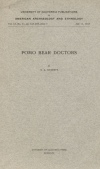

  
[Intangible Textual Heritage](../../../index.md)  [Native
American](../../index)  [California](../index)  [Index](index.md) 
[Next](pbd01.md) 

------------------------------------------------------------------------

*Pomo Bear Doctors*, by S.A. Barrett, \[1917\], at Intangible Textual
Heritage

------------------------------------------------------------------------

UNIVERSITY OF CALIFORNIA PUBLICATIONS

IN

AMERICAN ARCHAEOLOGY AND ETHNOLOGY

Vol. 12, No. 11, pp. 443-465, plate 7 July 11, 1917

# POMO BEAR DOCTORS

###### BY

## S. A. BARRETT

#### UNIVERSITY OF CALIFORNIA PRESS

#### BERKELEY

#### \[1917\]

[  
Click to enlarge](img/cover.jpg.md)  
Cover  

PLATE 7

[  
Click to enlarge](img/front.jpg.md)  
POMO BEAR DOCTOR'S SUIT  
MODEL IN PEABODY MUSEUM  

Scanned at Intangible Textual Heritage, January 2007. Proofed and
formatted by John Bruno Hare. This text is in the public domain in the
United States because it was published prior to January 1st, 1923. These
files may be used for any non-commercial use, provided this notice of
attribution is left intact in all copies.

------------------------------------------------------------------------

[Next: Contents](pbd01.md)
