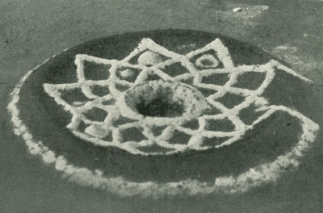

  
[Intangible Textual Heritage](../../../index.md)  [Native
American](../../index)  [California](../index.md) 

------------------------------------------------------------------------

<table width="75%">
<colgroup>
<col style="width: 50%" />
<col style="width: 50%" />
</colgroup>
<tbody>
<tr class="odd">
<td width="50%" data-valign="TOP"> 
UCPAAE Pl. 12, Fig. 2. Sand Painting for the Girls' Ceremony [1908] (Public Domain Image)</td>
<td width="50%" data-valign="CENTER"><h1 id="the-religion-of-the-luiseño-indians-of-southern-california" data-align="CENTER">The Religion of the Luiseño Indians of Southern California</h1>
<h2 id="by-constance-goddard-dubois" data-align="CENTER">by Constance Goddard DuBois</h2>
<h4 id="section" data-align="CENTER">[1908]</h4></td>
</tr>
</tbody>
</table>

------------------------------------------------------------------------

[Contents](#contents)    [Start Reading](roli00.md)    [Page
Index](pageidx)    [Text \[Zipped\]](rolitxt.zip.md)

------------------------------------------------------------------------

This is a primary source of information on the religious beliefs and
practices of the Luiseño people, who resided in what is now North San
Diego and Orange counties in California. DuBois spent years with the
remaining Native Southern Californians, and her ethnological work is of
continuing value. This monograph includes information on ceremonials,
mythology and lore. There are descriptions of dozens of songs used in
magical and ritual context. She includes two versions of the Luiseño
creation myth cycle, one of the most extensive in the literature of
Californian creation mythology.

------------------------------------------------------------------------

 [Title Page](roli00.md)  
[Contents](roli01.md)  
[Editor's Note](roli02.md)  
[Introduction](roli03.md)  

### Initiation Ceremonies

[The Toloache Ceremony](roli04.md)  
[Wanawut, the Sacred Net](roli05.md)  
[The Sand Painting](roli06.md)  
[The Ant Ordeal](roli07.md)  
[The Chungichnish Ceremony of Unish Matakish](roli08.md)  
[Wukunish, the Girls’ Ceremony](roli09.md)  
[Sacred Chungichnish Objects](roli10.md)  

### Mourning Ceremonies

[The Image Ceremony](roli11.md)  
[The Notish Ceremony](roli12.md)  

 

[Ceremonial Songs](roli13.md)  

### Myths

[Introduction](roli14.md)  
[Luiseño Creation: Third Version](roli15.md)  
[Luiseño Creation: Fourth Version](roli16.md)  
[Origin of the Notish Mourning Ceremony](roli17.md)  
[A Chungichnish Story](roli18.md)  
[Nahachish](roli19.md)  
[The Spirit Wife](roli20.md)  
[The Dance of the Spirits](roli21.md)  
[The Spring Behind the Cemetery](roli22.md)  
[The Walking Tamyush](roli23.md)  
[How Coyote Killed the Frog](roli24.md)  
[The Flood](roli25.md)  

### Traditional Knowledge

[Ancestral Landmarks and Descent of Songs](roli26.md)  
[Clans Or Traditional Groups](roli27.md)  
[Star Lore And Calendar](roli28.md)  
[The Origin of Music](roli29.md)  

### Appendices

[Appendix I. Games, Arts, And Industries Of The Diegueños And
Luiseños](roli30.md)  
[Appendix II. Notes On The Luiseños (A. L. Kroeber)](roli31.md)  

 

[Plates](roli32.md)  
[Erratum](roli33.md)  
