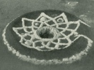

  
[Intangible Textual Heritage](../../../index.md)  [Native
American](../../index)  [California](../index)  [Index](index.md) 
[Previous](roli31)  [Next](roli33.md) 

------------------------------------------------------------------------

  
*The Religion of the Luiseño Indians of Southern California*, by
Constance Goddard DuBois, \[1908\], at Intangible Textual Heritage

------------------------------------------------------------------------

### PLATES.

  [  
Click to enlarge](img/pl01.jpg.md)  
Plate 16  

Plate 16 (referred to on page [80](roli04.htm#page_80) as Pl. 1.md). Fig.
1.—Medicine-man smoking stone pipe preparatory to swallowing wooden
"sword." Fig. 2.—Medicine-man swallowing wooden "sword" about an inch
wide and fourteen inches long.

  [  
Click to enlarge](img/pl02.jpg.md)  
Plate 17  

Plate 17 (referred to on page [88](roli06.htm#page_88) as Pl. 2.md). Fig.
1.—A Diegueño woman sitting by a storage olla. Fig. 2.—Model of
sand-painting for girls’ ceremony.

  [  
Click to enlarge](img/pl03.jpg.md)  
Plate 18  

Plate 18 (referred to on page [98](roli10.htm#page_98) as Pl. 3.md).
Feather headband and skirt of string and feathers.

  [  
Click to enlarge](img/pl04.jpg.md)  
Plate 19  

Plate 19 (referred to on pages [158](roli26.htm#page_158.md),
[159](roli26.htm#page_159), as Pl. 4.md). Fig. 1.—The ancestral home of
Lucario Cuevish. Fig. 2.—A painted rock, once a woman, on which two
sacred stones are poised.

------------------------------------------------------------------------

[Next: Erratum](roli33.md)
