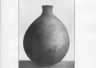

  
[Intangible Textual Heritage](../../../index.md)  [Native
American](../../index)  [California](../index)  [Index](index.md) 
[Previous](rpdi09)  [Next](rpdi11.md) 

------------------------------------------------------------------------

  
*Religious Practices of the Diegueño Indians*, by T.T. Waterman,
\[1910\], at Intangible Textual Heritage

------------------------------------------------------------------------

### MOURNING CEREMONIES.

Quite as significant as the adolescence ceremonies are the mourning
rites. Mourning for a relative usually lasts among the Diegueño for one
year. The hair of both men and women was formerly cut short during this
period, and the face sometimes painted black. Cremation was universally
practiced by the Diegueño until they came under the influence of the
missions. As far as can be learned, each body was burned without any
rites other than the one mentioned above, [73](#fn_78.md) the purpose of

p. 306

which was to make the spirit done with it. [74](#fn_79.md) The clothing and other property was laid
aside for use in the Mourning ceremony. Whatever ashes remained after
the cremation were gathered up and placed in a small-mouthed jar of
pottery, of the type used for carrying water on the desert (pl.
[23](rpdi27.htm#img_pl23)). [75](#fn_80.md) This
jar was then put away in some hidden place among the rocks, or buried on
a hillside.

The funerary or mourning ceremony occurs on the anniversary of the
death. At this time the clothing and personal property of the deceased
person is publicly burned amid appropriate ceremonies. This burning is
made the occasion of a large gathering. As usual in California, the
family who gives the ceremony is at the total expense of entertaining
all the visitors, and in addition to this, considerable property in the
form of baskets, of late replaced in large degree by money and calico,
is given away and burned on the funerary fire. If difficulty is
experienced by the family in getting together sufficient property, the
festival may be postponed for two and even three years.

------------------------------------------------------------------------

### Footnotes

[305:73](rpdi10.htm#fr_78.md) See page
[279](rpdi02.htm#page_279.md).

[306:74](rpdi10.htm#fr_79.md) This is performed
also in the Eagle ceremony, the account of which see below.

[306:75](rpdi10.htm#fr_80.md) Cf. C. G. DuBois,
"Diegueño Mortuary Ollas," Am. Anthr., n.s. IX, 484, 1907, pl. 29.

------------------------------------------------------------------------

[Next: The Clothes-Burning Ceremony](rpdi11.md)
