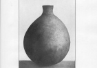

  
[Intangible Textual Heritage](../../../index.md)  [Native
American](../../index)  [California](../index)  [Index](index.md) 
[Previous](rpdi15)  [Next](rpdi17.md) 

------------------------------------------------------------------------

  
*Religious Practices of the Diegueño Indians*, by T.T. Waterman,
\[1910\], at Intangible Textual Heritage

------------------------------------------------------------------------

### THE EAGLE CEREMONY.

The Eagle dance or ceremony, expa ima, is a mourning ceremony held on
the anniversary of the death of a kwaipai, or leader of the
dances. [90](#fn_97.md)

An Eagle dance which was observed by the writer at Mesa Grande, occurred
at the end of a three-day festival. During each of the first two days
the people in holiday attire loitered about the fiesta grounds, busying
themselves in a general way with the usual "fiesta" events. A peon
gambling game [90a](#fn_98.md) was running during
most of the time; and in the afternoons and

p. 315

evenings there was considerable gambling with poker and chuck-a-luck.
Every afternoon, however, a Whirling or Tapakwirp dance was held, and
after nightfall, a War dance or Horloi. In a cage under a brush shelter or "ramada" off
to one side, there was kept a large bald-eagle. Some months before he
had been purchased in readiness for this ceremony from the people to the
southward. This had been in accordance with well established usage. If a
village used an eagle from a nest near by, it would be hard, it was
thought, to make the spirit leave his body when he was killed. It would
have an attachment for its old home and would therefore linger about.

Each afternoon before the Tapakwirp or Tatahuila dance, the daughter of
the old leader or kwaipai wailed for some time. This was the only
indication that a mourning ceremony was in progress.

On the third evening, toward nightfall, an extra large fire was kindled,
and for two or three hours the old men danced the Horloi. The final part of the
dance was, however, omitted. The dance-circle was then cleared, and one
of the oldest men announced: "All will sit down and smoke tobacco."
After some time an old man, said to be called the kaponail, [91](#fn_99.md) who sat on a
stool to one side, exclaimed "mwau." Several others then went to the
middle of the dance-circle and motioned upward three times, grunting as
they did so. Then a so-called "capitan" made a long and very emphatic
harangue. He said that the ceremony they were about to perform was very
ancient. He explained that it had not been held for a long time, but
that they were going to perform it just as had always been done. The
kwaipai had died, he proceeded, and the old men had determined to get
together clothes and property and send it to him, and to kill the eagle
and send it with messages of respect to him. The eagle, he explained, in
this ceremony, though he appeared to be a bird, was really a man. He was
not to be killed by ordinary means, but would be "witched to death" by
the dancers. Nobody therefore was to move about or make a noise, but all
were to remain quiet and see this wonder. It was

p. 316

extremely hard to kill the eagle in this way, and the dancers could do
it only because they had a great deal of "power."

Soon after the close of this speech the oldest one of the dancers began
singing and sounding his rattle off in the darkness beyond the light of
the fire. Soon he appeared in the dance-circle at the head of a line of
old men. One of these carried the eagle. The other people of the
rancheria fell in line behind them and all marched around the fire,
twisting from side to side. As the eagle was carried into the circle,
the daughter of the deceased kwaipai wailed and threw some new calico
over him. The song was as follows:

<table data-border="0">
<colgroup>
<col style="width: 50%" />
<col style="width: 50%" />
</colgroup>
<tbody>
<tr class="odd">
<td data-valign="top" width="327">
otolyi wam 
emi.lyi wam 
inya-capa-a 
inya-capa
</td>
<td data-valign="top" width="327">
flapping he-is-gone <a href="#fn_100">92</a> 
on-his-feet he-is-gone 
my eagle 
my eagle <a href="#fn_101">93</a>
</td>
</tr>
</tbody>
</table>

After this song had been repeated a number of times, there was a
ceremonial pause or rest, during which the eagle was passed to another
old man. [93a](#fn_102.md) During these pauses
there was a general wailing. The dancing continued in this way without
change until seven songs in all had been sung. They were obtained as
phonograph records on the day following the ceremony, the order being
established by notes and texts taken down at the time of singing.
Although the arrangement was afterwards learned to be fortuitous, [94](#fn_103.md) the reader can see that these songs
seem to outline a myth or story.

<table data-border="0">
<colgroup>
<col style="width: 50%" />
<col style="width: 50%" />
</colgroup>
<tbody>
<tr class="odd">
<td data-valign="top" width="327">
wumi wam 
icpa kukonyil
</td>
<td data-valign="top" width="327">
crying he-is-gone <a href="#fn_104">95</a> 
eagle black
</td>
</tr>
<tr class="even">
<td data-valign="top" width="327">
 
</td>
<td data-valign="top" width="327">
 
</td>
</tr>
<tr class="odd">
<td data-valign="top" width="327">
expa kunumsup 
ewel hakwimp
</td>
<td data-valign="top" width="327">
<em>Said to mean:</em> White Eagle puts his nest on big cliffs. Eagle from the West puts his nest on sycamore trees along the edge of creeks. <a href="#fn_105">96</a>
</td>
</tr>
</tbody>
</table>

p. 317

<table data-border="0">
<colgroup>
<col style="width: 50%" />
<col style="width: 50%" />
</colgroup>
<tbody>
<tr class="odd">
<td data-valign="top" width="327">
wumi amai yiwama
</td>
<td data-valign="top" width="327">
crying up-in-the-air he-is <a href="#fn_106">97</a>
</td>
</tr>
<tr class="even">
<td data-valign="top" width="327">
 
</td>
<td data-valign="top" width="327">
 
</td>
</tr>
<tr class="odd">
<td data-valign="top" width="327">
kwonyūwai mayiwa 
expa apakwal.
</td>
<td data-valign="top" width="327">
(the)-nest there-it-is <a href="#fn_107">98</a> 
<a href="errata.htm#2">eagle</a> chicken-hawk
</td>
</tr>
<tr class="even">
<td data-valign="top" width="327">
 
</td>
<td data-valign="top" width="327">
 
</td>
</tr>
<tr class="odd">
<td data-valign="top" width="327">
amu tcapuk xatca tcapuk 
wiu amai inyau purkak
</td>
<td data-valign="top" width="327">
Orion(?) coming-out Pleiades coming-out <a href="#fn_108">99</a> 
now up-in-sky sun (he)-finishes
</td>
</tr>
<tr class="even">
<td data-valign="top" width="327">
 
</td>
<td data-valign="top" width="327">
 
</td>
</tr>
<tr class="odd">
<td data-valign="top" width="327">
expa lamalama kiwiw!
</td>
<td data-valign="top" width="327">
eagle is-a-man, look! <a href="#fn_109">100</a>
</td>
</tr>
</tbody>
</table>

In the pauses between several of these songs, one man held the eagle
aloft while another took his stand some distance away and pointed a
small stick at the bird. He aimed this stick as a man aims a rifle,
twisting it over and over, however, with his thumb and forefinger. At
[the](errata.htm#3.md) same time he exclaimed "ahahaha! ahahaha!" Some of
the dancers dipped the end of the stick in the fire before they pointed
it at the eagle. In this way death is supposed to be conveyed through
the stick. Following this action a second man always approached the
eagle and waved his feather tuft in front of it. Then he brushed or
"dusted" its head three times [101](#fn_110.md)
with the plume. At the same time they blew or made a laughing sound.
Several of the old men at various times blew tobacco smoke over the
bird. All this was done "to brush away death, so they could tell him
more." [101a](#fn_111.md)

At the conclusion of the last song above, several people, relatives of
the dead kwaipai, approached the eagle and threw new calico over it,
wailing at the same time. The most muscular one of the old men then took
the eagle, and held it aloft at arm's length. Another dancer took a
position across the dance-circle. Raising his stick this second man
pointed it slowly and impressively at the eagle. After a pause, he broke
into a sudden shout, " ahahaha!" and made his stick quiver. At the same
moment the man who was holding the eagle pressed his finger in over its
heart and killed it. The muscular exertion required showed in the
trembling of his arms as he made the effort. The attention

p. 318

of the onlookers had of course been attracted to the other man by his
peculiar actions and his sudden shout. The real cause of the eagle's
death seemed not to be understood by the onlookers.

As the eagle sank forward dead, many of the company wailed. Someone
threw another piece of calico several yards long over the bird. The
daughter of the old leader in whose honor the ceremony was made
scattered considerable money in small change among the crowd. This was
gathered up by anybody who wanted it.

Soon the old man who directed the ceremony began to sound his rattle
again. The singing and dancing continued far into the night. The old men
took turns carrying the dead eagle around the fire. The songs were as
follows:

<table data-border="0">
<colgroup>
<col style="width: 50%" />
<col style="width: 50%" />
</colgroup>
<tbody>
<tr class="odd">
<td data-valign="top" width="327">
awir amanha
</td>
<td data-valign="top" width="327">
wings he-flies <a href="#fn_112">102</a>
</td>
</tr>
<tr class="even">
<td data-valign="top" width="327">
 
</td>
<td data-valign="top" width="327">
 
</td>
</tr>
<tr class="odd">
<td data-valign="top" width="327">
axa inyau winyau kiwiw
</td>
<td data-valign="top" width="327">
water I am-beating look! <a href="#fn_113">103</a>
</td>
</tr>
<tr class="even">
<td data-valign="top" width="327">
 
</td>
<td data-valign="top" width="327">
 
</td>
</tr>
<tr class="odd">
<td data-valign="top" width="327">
axa wakum wakumu 
mixa-i wakumu
</td>
<td data-valign="top" width="327">
water rolls rolls <a href="#fn_114">104</a> 
your-water rolls
</td>
</tr>
<tr class="even">
<td data-valign="top" width="327">
 
</td>
<td data-valign="top" width="327">
 
</td>
</tr>
<tr class="odd">
<td data-valign="top" width="327">
axa kaiakwiru-u 
mixa kaiakwiru
</td>
<td data-valign="top" width="327">
water its-edge <a href="#fn_115">105</a> 
water-of-ocean its-edge
</td>
</tr>
<tr class="even">
<td data-valign="top" width="327">
 
</td>
<td data-valign="top" width="327">
 
</td>
</tr>
<tr class="odd">
<td data-valign="top" width="327">
expa ruara kiwiw 
expa manamana kiwiw
</td>
<td data-valign="top" width="327">
eagle is-swooping look <a href="#fn_116">106</a> 
eagle is-flying look
</td>
</tr>
<tr class="even">
<td data-valign="top" width="327">
 
</td>
<td data-valign="top" width="327">
 
</td>
</tr>
<tr class="odd">
<td data-valign="top" width="327">
kwinyora kwinyora 
axwata kwinyora 
inya expa
</td>
<td data-valign="top" width="327">
colored colored <a href="#fn_117">107</a> 
red colored 
my eagle
</td>
</tr>
<tr class="even">
<td data-valign="top" width="327">
 
</td>
<td data-valign="top" width="327">
 
</td>
</tr>
<tr class="odd">
<td data-valign="top" width="327">
waiyu il waiyu 
wam il wam 
ik-apa namcap 
wam-i wam 
axawi ik-aspa 
inya il waiyu
</td>
<td data-valign="top" width="327">
coming black (-eagle) coming <a href="#fn_118">108</a> 
going black (-eagle) going 
eagle white 
going going 
to-water eagle 
my black (-eagle) is coming
</td>
</tr>
<tr class="even">
<td data-valign="top" width="327">
 
</td>
<td data-valign="top" width="327">
 
</td>
</tr>
<tr class="odd">
<td data-valign="top" width="327">
iū nya axa 
mīpawoka
</td>
<td data-valign="top" width="327">
eye my water <a href="#fn_119">109</a> 
it-is-flowing
</td>
</tr>
</tbody>
</table>

p. 319

An important part of the ceremony remained yet to be performed. That was
the burying of the eagle. This was not done, through some
misunderstanding, until the following morning. The grave for the eagle
was dug by one of the old men in the center of the dance-circle. Its
long axis was north and south. No songs or ceremonies of any kind
accompanied the digging. The dead eagle, wrapped tightly in a new piece
of red calico, was laid on the west side of the grave. After the first
part of the ceremony had been completed, and before the eagle was thus
brought out for the burial, the longest feathers had been ceremonially
plucked, in order to make a dance-skirt. This had been done by the old
men in a private place. During the operation no word was spoken, in
order "not to bring bad luck."

The leader took his place, kneeling, on the west side of the grave and
facing it. Four other old men knelt about, completing the circle. The
leader then took the eagle in his hands and waved it three times in a
circle, saying each time "wu—o." The other men grunted deeply after each
circling motion. The leader then raised it aloft three times, while the
others grunted again each time. Finally he waved it first to the left
and then to the right, while the others grunted each time as before.
Then he began to pat the bird with both hands together, while the others
imitated his movements with their own hands, but did not touch the eagle
directly. As this patting progressed, the men chanted in a curious
choppy monotone:

<table data-border="0">
<colgroup>
<col style="width: 50%" />
<col style="width: 50%" />
</colgroup>
<tbody>
<tr class="odd">
<td data-valign="top" width="327">
wesi wesi 
ki-i kiya 
papyau wesi 
kiyi kiyi
</td>
<td data-valign="top" width="327">
done done 
... ... 
... done 
... ...
</td>
</tr>
</tbody>
</table>

At the end of three repetitions of this song, they all expelled their
breath very forcibly three times. The whole was then repeated three
times. Then the leader exclaimed "tca," and all said together, in deep
[guttural](errata.htm#4.md) tones, "hi u hi," or something to which these
sounds are an approximation. The eagle was then put in the hole and the
dirt pushed in from all sides. Another piece of red calico was thrown in
the air by the daughter of the dead leader.

p. 320

The old man who had led the singing then pressed the mound of earth
three times with his hands, saying " Once I put it, twice I put it,
three times I put it." All grunted once at each phrase. Then all stood
up and began pressing the grave with their feet. This movement gradually
assumed the form of a march around the grave, circling from right to
left. The women had in the meantime gathered on the west of the
dance-circle, and as the old men marched both men and women chanted.

toki toki  
aso aso

\[paragraph continues\] Their utterance in
this song was very abrupt, sounding like "to! ki! to! ki! a! so! a! so!"
When this had been repeated three times, the old men motioned away into
the air with a grunt. Throughout this song the man who led in the
singing made a steady long roll with his rattle.

At the end of the song there was a short pause. Then the dancers turned
sideways to face the grave, and stepped sideways to the right. The song,
in which both men and women took part, was as follows:

mero romki  
hiyau tcaau  
alwe potaxau

\[paragraph continues\] This was repeated
three times, then three grunts and stamps were given by all the dancers.
After the song the dancers broke up and transferred their interest to a
peon game which was then progressing. The Eagle dance was over.

------------------------------------------------------------------------

### Footnotes

[314:90](rpdi16.htm#fr_97.md) Luiseño accounts in
the present series, VIII, pp. 7, 113, 114, 182, 227; Am. Anthr., n.s.
VII, 625, 1905. An early reference is in the present series, VIII, 1-27,
1908, A. L. Kroeber, "A Mission Record of the California Indians," in
which see p. 4.

[314:90a](rpdi16.htm#fr_98.md) See below.

[315:91](rpdi16.htm#fr_99.md) Cf. preceding, [p.
294](rpdi07.htm#page_294.md).

[316:92](rpdi16.htm#fr_100.md) Said of a bird
hopping along on the ground before he launches himself into the air.

[316:93](rpdi16.htm#fr_101.md) University of
California phonograph record 707(2).

[316:93a](rpdi16.htm#fr_102.md) These brief but
frequent intermissions are characteristic of all Diegueño ceremonies.

[316:94](rpdi16.htm#fr_103.md) The leader
explained that he had not heard the songs for years, and sung them just
as he could remember them.

[316:95](rpdi16.htm#fr_104.md) University of
California phonograph record 711(1).

[316:96](rpdi16.htm#fr_105.md) *Ibid*.,
712(2).

[317:97](rpdi16.htm#fr_106) *Ibid*., 713(1.md).
The song refers to the young eaglets in the nest.

[317:98](rpdi16.htm#fr_107) *Ibid*., 713(2.md).
The song is to explain that "Eagle and Chickenhawk once were friends".

[317:99](rpdi16.htm#fr_108) *Ibid*., 709(1.md).

[317:100](rpdi16.htm#fr_109) *Ibid*., 712(1.md).

[317:101](rpdi16.htm#fr_110.md) One man did it
four times instead of three.

[317:101a](rpdi16.htm#fr_111.md) More messages for
the deceased kwapai?

[318:102](rpdi16.htm#fr_112.md) University of
California phonograph record 703.

[318:103](rpdi16.htm#fr_113.md) *Ibid*.,
705(2). The waves say this to the eagle.

[318:104](rpdi16.htm#fr_114.md) *Ibid*.,
706(1).

[318:105](rpdi16.htm#fr_115.md) University of
California phonograph record 706(2). The eagle says this as
he walks in the edge of the surf.

[318:106](rpdi16.htm#fr_116.md) *Ibid*.,
706(3).

[318:107](rpdi16.htm#fr_117.md) *Ibid*.,
707(1).

[318:108](rpdi16.htm#fr_118.md) *Ibid*.,
708(1).

[318:109](rpdi16.htm#fr_119.md) *Ibid*.,
708(3). Sung as they wept for the eagle.

------------------------------------------------------------------------

[Next: The “War” Dance](rpdi17.md)
