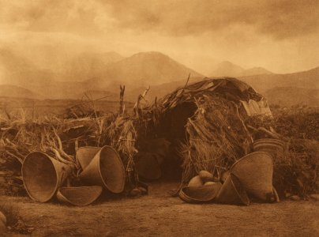

  
[Intangible Textual Heritage](../../../index)  [Native
American](../../index)  [California](../index) 

------------------------------------------------------------------------

<table width="80%">
<colgroup>
<col style="width: 50%" />
<col style="width: 50%" />
</colgroup>
<tbody>
<tr class="odd">
<td data-valign="CENTER" width="50%"></td>
<td data-valign="CENTER" width="50%"><h1 id="some-western-shoshoni-myths" data-align="CENTER">Some Western Shoshoni Myths</h1>
<h2 id="by-julian-h.-steward" data-align="CENTER">by Julian H. Steward</h2>
<h4 id="bureau-of-american-ethnology-bulletin-136" data-align="CENTER">Bureau of American Ethnology Bulletin 136</h4>
<h4 id="section" data-align="CENTER">[1943]</h4></td>
</tr>
</tbody>
</table>

------------------------------------------------------------------------

The Shoshone (also spelled Shoshoni) are Native Americans of the Great
Basin region, and south and east of the Sierra Nevada mountain range.
Shoshoneans are distributed widely--from Southern California, Death
Valley and Mono Lake, through Utah to Western Colorado. Sacajawea, the
woman who guided the Lewis and Clark expedition, was a Utah Shoshone.

While the beliefs of other Shoshonean tribes are fairly well documented,
there is little published information about the mythology of the Great
Basin Shoshone per se. This collection reveals that the Western
Shoshone, who lived in central Nevada, were very similar to the Northern
Californians in this regard. Their myths are inhabited by the lusty
trickster Coyote, and other primordial zoomorphic demigods.

------------------------------------------------------------------------

[Title Page](wsm00)  
[Contents](wsm01)  
[Introduction](wsm02)  
[The Theft of Fire (Saline Valley, California. Shoshoni)](wsm03)  
[The Theft of Fire (Panamint Valley, California. Shoshoni)](wsm04)  
[The Theft of Pine Nuts (Saline Valley, California. Shoshoni)](wsm05)  
[The Origin of People (Smith Valley, Nevada. Shoshoni)](wsm06)  
[The Theft of Pine Nuts (Elko, Nevada. Shoshoni)](wsm07)  
[The Theft of Pine Nuts (Winnemucca, Nevada. Northern Paiute)](wsm08)  
[The Origin of People (Panamint Valley, California. Shoshoni)](wsm09)  
[The Origin of People (Death Valley, California. Shoshoni)](wsm10)  
[The Origin of People (Beatty, Nevada. Shoshoni)](wsm11)  
[The Origin of People (Ash Meadows, Nevada. Shoshoni)](wsm12)  
[The Origin Of People (Big Smoky Valley, Nevada. Shoshoni)](wsm13)  
[The Origin of People (Skull Valley, Utah. Gosiute)](wsm14)  
[The Race to Koso Hot Springs (Death Valley, California.
Shoshoni)](wsm15)  
[The Race to Koso Hot Springs (Saline Valley, California.
Shoshoni)](wsm16)  
[Coyote Learns to Fly; The Origin of People (Saline Valley, California.
Shoshoni)](wsm17)  
[Coyote Learns to Fly; Coyote Becomes a Mother (Ash Meadows, Nevada.
Shoshoni)](wsm18)  
[Coyote Learns to Fly (Lida, Nevada. Shoshoni)](wsm19)  
[Coyote Learns to Fly (Big Smoky Valley, Nevada. Shoshoni)](wsm20)  
[Cottontail Shoots the Sun (Saline Valley, California.
Shoshoni)](wsm21)  
[Cottontail Shoots the Sun (Elko, Nevada. Shoshoni)](wsm22)  
[The Length of Winter; Coyote is Bitten (Saline Valley, California.
Shoshoni)](wsm23)  
[Hawk and the Gambler (Saline Valley, California. Shoshoni)](wsm24)  
[The Flood (Saline Valley, California. Shoshoni)](wsm25)  
[Rat and Mountain Sheep (Saline Valley, California. Shoshoni)](wsm26)  
[Cottontail and Wind (Saline Valley, California. Shoshoni)](wsm27)  
[The Deer Stealer (Death Valley, California. Shoshoni)](wsm28)  
[The Sky Brothers (Death Valley, California. Shoshoni)](wsm29)  
[Origin of Death (Big Smoky Valley, Nevada. Shoshoni)](wsm30)  
[Coyote Kills Wolf's Wives (Big Smoky Valley, Nevada.
Shoshoni)](wsm31)  
[Badger, Coyote, and the Woodchucks (Lida, Nevada. Shoshoni)](wsm32)  
[Coyote and the Bear Cubs; The Death of Wolf (Ash Meadows, Nevada.
Shoshoni.)](wsm33)  
[Pole Cat, Takadoa, and Hawk (Elko, Nevada, Shoshoni)](wsm34)  
[Coyote Liberates Game Animals; Wolf is Killed and Restored (Winnemucca,
Nevada. Northern Paiute)](wsm35)  
[The Ice Barrier (Winnemucca, Nevada. Northern Paiute)](wsm36)  
