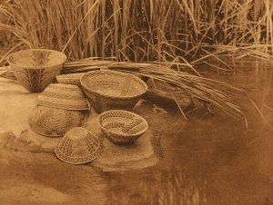

  
[Intangible Textual Heritage](../../../index.md)  [Native
American](../../index)  [California](../index.md) 

------------------------------------------------------------------------

[Buy this Book at
Amazon.com](https://www.amazon.com/exec/obidos/ASIN/B002EQALSY/internetsacredte.md)

------------------------------------------------------------------------

<table width="75%">
<colgroup>
<col style="width: 50%" />
<col style="width: 50%" />
</colgroup>
<tbody>
<tr class="odd">
<td width="50%" data-valign="TOP"> 
By the Pool--Tule River Reservation: Edward Curtis 1924; [Public domain image]</td>
<td width="50%" data-valign="CENTER"><h1 id="yana-texts" data-align="CENTER">Yana Texts</h1>
<h2 id="by-edward-sapir" data-align="CENTER">by Edward Sapir</h2>
<h6 id="university-of-california-publications-in-american-archaeology-and-ethnology-vol.-9-no.-1-pp.-1-235" data-align="CENTER">University of California Publications in American Archaeology and Ethnology Vol. 9, No. 1, pp. 1-235</h6>
<h4 id="section" data-align="CENTER">[1910]</h4></td>
</tr>
</tbody>
</table>

------------------------------------------------------------------------

[Contents](#contents)    [Start Reading](yat00.md)    [Page
Index](pageidx)    [Text \[Zipped\]](yat.txt.gz.md)

------------------------------------------------------------------------

|                                                                                                                           |
|---------------------------------------------------------------------------------------------------------------------------|
|  |

This is a collection of texts from the Yana, a native Californian people
who spoke a Hokan language. The Yana lived in the north-eastern
Sacramento region of California, east of Redding and north of Chico.
Their mythology was very similar to their neighbors, the Maidu, the
Shasta and the Wintun; the trickster, Coyote, plays a very important
role. There is no cosmological origin myth recorded here. Rather the
mythology starts out in a fully realized dream-time inhabited by animal
spirits. They are busy sketching in the world that humans will inhabit.
The text, the 'Origin of Sex, Hands, and Death', starts off with an
interesting twist: women were originally men, and men were originally
women.

The most famous Yana, belonging to a subgroup called the Yahi, was Ishi,
billed as 'The last wild Indian'. Ishi stumbled out of the mountains
near Oroville in 1911, the year after this monograph was published. Ishi
was taken Berkeley where he lived the remainder of his life, studied
closely by the anthropologists Alfred Kroeber and Thomas Talbot
Waterman. Ishi died in 1916. He is the subject of an excellent book by
Theodora Kroeber, wife of Alfred Krober, [Ishi in Two
Worlds](https://www.amazon.com/exec/obidos/ASIN/0520229401/internetsacredte.md).

------------------------------------------------------------------------

 [Title Page](yat00.md)  
[Contents](yat01.md)  
[Introductory Remarks](yat02.md)  

### I. Central Dialect (Gat‘ā'?i)

[I. Flint Boy](yat03.md)  
[II. The Theft Of Fire And The Burning Of The World](yat04.md)  
[III. The Visit of the Geese People to Mount Shasta](yat05.md)  
[IV. Bluejay's Journey to the Land of the Moon](yat06.md)  
[V. The Creation of the Yana](yat07.md)  
[VI. Origin of Sex, Hands, and Death](yat08.md)  
[VII. Coyote and his Sister](yat09.md)  

### II. Northern Dialect (Garī'?i.)

[X. Coyote, Pine Marten, and Loon](yat10.md)  
[XI. The Drowning of Young Buzzard's Wife](yat11.md)  
[XII. Coyote, Heron, and Lizard](yat12.md)  
[XIII. The Finding of Fire](yat13.md)  
[XIV. Indian Medicine-Men](yat14.md)  
[XVI. A Lovers' Quarrel](yat15.md)  
[XVII. Childbirth and Death](yat16.md)  
[XVIII. Death and Burial](yat17.md)  
[XIX. Betty Brown's Dream](yat18.md)  
[XX. Spell Said by a Girl Desirous of Getting A Husband](yat19.md)  
[XXI. Curse on People That Wish One Ill](yat20.md)  
[XII. Prayer on Sneezing](yat21.md)  

### Supplementary Texts

[XXIII. The Rolling Skull](yat22.md)  
[XXIV. Grizzly Bear and Deer](yat23.md)  

### III. Supplementary Yana Myths

[I. The Creation of Men](yat24.md)  
[II. The Contest of Fox and Coyote](yat25.md)  
[III. The Lost Brother](yat26.md)  
[IV. The Flints and Grizzly Bears](yat27.md)  
[V. ‘I'lhat?aina](yat28.md)  
[VI. Fixing the Sun](yat29.md)  
[VII. Woodpecker and Woodrat](yat30.md)  
[VIII. Rabbit Woman and her Child](yat31.md)  
[IX. Coyote and Rabbit Gamble](yat32.md)  
[X. Gopher and Rabbit Gamble](yat33.md)  
[XI. Coyote and the Stump](yat34.md)  
[XII. Loon Woman](yat35.md)  
[XIII. Pine Marten's Quest for Moon's Daughter](yat36.md)  
