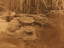

  
[Intangible Textual Heritage](../../../index)  [Native
American](../../index)  [California](../index)  [Index](index) 
[Previous](yat16)  [Next](yat18) 

------------------------------------------------------------------------

[Buy this Book at
Amazon.com](https://www.amazon.com/exec/obidos/ASIN/B002EQALSY/internetsacredte)

------------------------------------------------------------------------

  
*Yana Texts*, by Edward Sapir, \[1910\], at Intangible Textual Heritage

------------------------------------------------------------------------

### XVIII. DEATH AND BURIAL.

p. 192

"He is sick, he is very sick. It looks as if he is going to die. Perhaps
he will not recover. If four days have elapsed and he has not recovered,
you will run to get the medicine-man, and he will suck the sickness out
of him. You will offer him as pay perforated white beads. Wear them
around your neck. Surely he will get up and start hither, for
medicine-men always like perforated white beads." He who had been sent
arrived (at the medicine-man's house) and put the beads down on the
ground. The medicine-man smelled them. "I shall not be able to make him
recover. I shall indeed go to see him anyway. The perforated white beads
already have an odor." [296](#fn_123) He ran
back and

p. 193

arrived home. He hung up the beads and cried, sitting down on the
ground. "Do you put water down on the ground. The medicine-man has
already come." The medicine-man sat down. "Well, I shall try to do what
I can." He doctored him. "He will not recover. I do not understand what
to do, I am beaten." [297](#fn_124) After he
had finished doctoring, he said, "He will die." (The sick man's father)
started in to cry, and they all wept with him. "Do you run to bring them
hither!" he said. "They shall all come here. I do not wish them to be
ignorant about this."

On the following day, at daybreak, he had died. They all started in to
cry together. "Go and dig the grave! Do you put together the perforated
white beads, the dressed buckskin blanket, dentalia, wa'k‘u shell beads,
aprons fringed with pine-nut tassels, various pack-baskets, and
trinkets. Make a burial net of coarse rope, and wrap him up in it." Then
they washed him and combed his hair. The people all came, came together,
dancing and weeping, women, men, and their children, while his mother
cried. He was lifted down and put away in the house, while the people
and his father and mother wept over him. They did not eat anything. Now
they sewed together the deer-hide blanket.

"Now!" said (his father). "Amm!" [298](#fn_125)
Don't think that you will continue to eat. There is no sickness going
about, and yet I am the only one going about that has sickness. Since
the people were not sick, I thought I had a good medicine-man. Perchance
you think you will not go to get wood!" [299](#fn_126) (Thus he spoke to himself). "You will
just go ahead and bury him tomorrow! Do you make the grave deep!" (he
said to the people). There was a man from the south [300](#fn_127) who said, "I do not intend to cry." He
had flint arrowheads and inspired everyone with fear. "Whence is the
poison that is always acting? I have no intention of eating, of eating
my food with tears." It was the

\|

p. 194

brave warrior that spoke thus. "You will bury him at noon. Probably
nearly all have come. They say that there are many weeping for him, they
say the chief weeps for him, they say that he is greatly angered. My
medicine-man forgets, does he not? I shall not be the only one to
cry. [301](#fn_128) Do you all start!"

They took him up and carried him, all sorts of belongings being wrapped
up with him-arrows, bows, and various blankets, Now they had all moved
down to his grave. They brought him down to the grave and put him into
it. "Now! Cry!" said he. His brother lay down in the grave, was pulled
out back again. "Do not weep, you will soon follow him." [302](#fn_129) The women all danced and cried,
weeping for him, putting down water on the ground to the east of him.
"Now it is well, is it not?" he said. "Let me see! Go ahead and fail to
find the poison. [303](#fn_130) In former days
he said to me, 'Surely you shall have no cause to weep, and thus it will
always be with you.' That is what he said to me."

The dead man's mother stayed there all night near the grave. Now the
people all moved off back to his house. "I shall no longer stay in the
house. Set the house on fire!" They set on fire his ropes and all his
belongings. "Set the food on fire!" They set everything on fire, and
moved on to another place. "You all will go to get other food. I did not
think that I would ever be without his laughter when eating." They were
all weeping at night, when suddenly the old woman came back. Now at
night they started in to eat. "Do you all eat after weeping! Truly we
shall all die; we shall not live forever, is it not so? The time of
death is near at hand. [302](#fn_129) Do you
all procure food for yourselves! Go to the river and catch salmon. No!"
he said, "I shall not hurry (to eat). 'Yes, we shall catch salmon (for
you),' he used to say to me. [304](#fn_131) I
shall cry yet a while, if you please. I shall take food soon."

p. 195

The chief spoke. "Pray do it now!" he said (to the warrior). "Lie in
wait for him on his trail. He will find out! They say he has been
talking about me, that is what he has been saying. Yes, he will know! He
thinks that he has sense. I have sense. the sense of a chief. I shall
soon speak out my mind. Though he was my medicine-man, pray shoot him!"
he said. "Take him out into the brush and kill him!"

The people brought wa'k‘u beads, dentalia, and perforated white beads.
"Here! Pound these," they said. He pounded them at the grave. "I did not
know about it, that is why I did not come," (they said). Every summer
they burn food (at the grave).

------------------------------------------------------------------------

### Footnotes

[192:296](yat17.htm#fr_126) I.e., they already
smell of death.

[193:297](yat17.htm#fr_127) Le., I can not cope
with the disease spirit.

[193:298](yat17.htm#fr_128) He angrily
apostrophizes the medicine-man, whom he suspects of having magically
"poisoned" his son.

[193:299](yat17.htm#fr_129) The implication is
that he will murder the medicine-man when he unsuspectingly goes out
into the brush for firewood.

[193:300](yat17.htm#fr_130) This man, named
Wa'it‘awasi, was said to be a brave warrior, a yô'?laina.

[194:301](yat17.htm#fr_131) in other words, the
medicine-man's folks will weep, for he shall not escape with his life.

[194:302](yat17.htm#fr_134) This sort of
consolation seems to be rather Christian than Indian.

[194:303](yat17.htm#fr_133) He is again angrily
apostrophizing the medicine-man. "You will fail to find it, will you?"

[194:304](yat17.htm#fr_135) He remembers how
his son used to say to him, "Don't bother about getting salmon. I'll
attend to that myself."

------------------------------------------------------------------------

[Next: XIX. Betty Brown's Dream](yat18)
