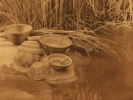

  
[Intangible Textual Heritage](../../../index)  [Native
American](../../index)  [California](../index)  [Index](index) 
[Previous](yat19)  [Next](yat21) 

------------------------------------------------------------------------

[Buy this Book at
Amazon.com](https://www.amazon.com/exec/obidos/ASIN/B002EQALSY/internetsacredte)

------------------------------------------------------------------------

  
*Yana Texts*, by Edward Sapir, \[1910\], at Intangible Textual Heritage

------------------------------------------------------------------------

### XXI. CURSE ON PEOPLE THAT WISH ONE ILL.

p. 199

S\*uwā'! S\*ê'galt!imāyā! [312](#fn_136) May ye
speak to make me happy! May you suddenly experience that wherewith you
curse me! May you suddenly drop dead without being sick! May you drop
dead, you who drink my blood! May you suddenly all perish! Drink my
blood! [313](#fn_137) Would that I might be
happy! May I not be sick in any way!

------------------------------------------------------------------------

### Footnotes

[199:312](yat20.htm#fr_140) p. 198 It has not been found possible to get at the
significance of this apparently formulaic word. It would seem to be a
term of address to the supernatural powers concerned in man's happiness
or woe. For s\*uwā', see note 310.

[199:313](yat20.htm#fr_141) Either to be
interpreted as s\*ī'? dji watdu‘w "drink (imper.) my blood!" or
contracted from s\*ī'dj dji watdu‘w "drink-me my blood!" As Betty Brown
expressed it, "You folks are always mixing up my blood with your
coffee," i.e., "curse me and wish my death."

------------------------------------------------------------------------

[Next: XII. Prayer on Sneezing](yat21)
