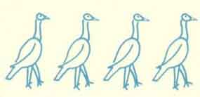

  
[Intangible Textual Heritage](../../../index.md)  [Native
American](../../index)  [Hopi](../index)  [Index](index.md) 
[Previous](toah10)  [Next](toah12.md) 

------------------------------------------------------------------------

p. 46

# CHAPTER IX

### RETURN OF THE SPANIARDS TO HOPI COUNTRY. SHIPAULOVI FOUNDED AS A SANCTUARY

AFTER all this had happened the Hopi were sure that the Spaniards were
going to come back and make an attack on them and they figured that they
would be wiped out. The chief of Shung-opovi thought there should be
someone saved who would keep a record of these happenings in the best
way they could. Now just about that time the Sun Forehead Clan was
admitted into the village. They came from Homolovi. The chief sent one
of his relations of the Bear Clan and his family to Shipaulovi and with
them he sent half of the Sun Forehead Clan. He told them that this
Shipaulovi village would be recognized as an innocent town, and that
whenever the Hopi were attacked by any of their enemies whoever wished
to live, could go there.

After all this the chief just simply waited for the attack to come from
the Spanish, for knowing that he was guilty, he would not hesitate to
give himself up to the Spaniards.

He waited quite a long while about 20 years--but nobody knows just how
long. Finally the Spanish came. When they did come, instead of going up
to the village they camped about three-fourths of a mile below the old
Shung-opovi town and the whole village was in terror. The chief went
down to the camp to ask them if they had come then to be friends, or to
destroy. [25](toah24.htm#xref_25.md)

The captain of the army told him that they had only come for the guilty.
Then the chief said that the whole village was guilty, because everybody
that could had put a hand on the priest. Then the captain said that
could not be, because there were a good many people in the village and
he couldn't understand how everyone could have put a hand on the priest.
Then the chief said, if he was guilty all the people were guilty for he
was their chief and leader. The captain asked the chief to have all the
men of the village descend down there, so the chief called his men to
come. When all the men got there, the captain lined them up and then he
asked the chief to pick out the men that were really guilty.

Before the chief said a word, the men declared they were all guilty; but
the captain would not believe them. During all this excitement there was
one Hopi had the

p. 47

heart to come out with the truth. He stepped out and said he didn't like
to see all the men get killed, for some of them were too young. They
might become good runners or warriors and have long lives to live.

This man turned around to the chief and accused him of simply
sacrificing his men because he didn't want to be put to death alone. He
said that if he saved some of these men or convinced the Spaniards that
these men were not all guilty, he himself would be willing to take the
place of the chief and be the leader of the people. He was a man of the
Strap Clan, closely related to the Bear Clan to which the chief
belonged. This man was angry to think that the chief would sacrifice his
men for nothing.

Then after this man had said he would be the leader of the people, he
asked the chief to step forward and be honest and point out the ones who
were really guilty. But the chief still wasn't man enough to do it, and
he was asked four times before he would pick out the guilty men. The men
were those who held positions in different kinds of ceremonies. With the
Hopi, things like the doing away with the priest are not discussed with
the common people--only among the leaders.

When these men were picked out, their hands were tied behind them and
they were taken prisoners with the chief. The man of the Strap Clan took
his men back to the village and the people coming out to meet them and
seeing these men, declared him the chief. The next morning the men that
were taken prisoners were shot at sunrise. Then the captain sent word up
to the village that if they wished to bury the dead they could come and
do it, but the people would not go down for fear they might get killed,
so they waited until the Spaniards went away.

The new chief took everything in his hands and went down with some of
his men and buried the dead. Each man was buried with his possessions,
turquoise and shell beads. In those days the father's relatives would
give presents of pottery to be buried with the dead. So they were buried
with all those things. [26](toah24.htm#xref_26.md)

Now the people of Shung-opovi had lived in the same village until the
Spanish came back. Then the Strap Clan leader led the people to the top
of the mesa and founded the new Shung-opovi, for he was afraid if they
stayed down below, there would be more Spanish attacks.

From then on the Strap Clan people were leaders in Shung-opovi. During
the next few years things were very prosperous, but it happened that
they failed again--another

p. 48

drought came. At this time the people held a council and made an
agreement that every clan be given a chance to take their turn at
leadership. So from then on, each clan took its turn and it finally came
back to the Bear Clan (each clan held leadership for four years) and
when their turn was up they refused to give it up for they claimed it
was theirs originally. Since they refused to give up their leadership
they have remained the royal family ever since.

About this time another company of Spanish soldiers came and old
Mishongnovi was still inhabited at that time, for all the people had not
yet moved up on top. [27](toah24.htm#xref_27.md) They stopped on the other
side of Mishongnovi and asked the chief if he would make an agreement to
let them in. He refused them four times. Then the captain of the Spanish
soldiers said he had to destroy their village. Of course the people were
very much afraid then, for they had seen what had happened at
Shung-opovi and how the Spanish had killed the leaders of the trouble
over there. Shung-opovi was then partly in ruins for the people were
carrying away the beams to build their new homes on top, but somehow the
Spanish didn't make an attack that time but went away again."

After they had gone away the Mishongnovi people wanted to stop up their
spring, called *Yo-niai-va* (Antelope Chipmunk), which was a good spring
at that time. They closed it up and had a paho-making ceremony. After
they made their prayer offerings every man spun some cotton and when
this was done they selected four different kinds of pahos and then
wrapped cotton yarn over them. It made a round roll, about 10 inches
long and about eight inches in diameter. With this they blocked up the
water hole. Then in front of it they put a plaque and sealed it up
around the edges with sweet cornmeal mush. [29](toah24.htm#xref_29.md) They
did this so that if the Spanish ever came back they would find no water
there. This spring was to be opened up when the good white man or his
brother came back, but today nobody knows just where the spring really
is.

When they had done this they started to move up on top of the mesa, but
before they had all moved, the Spanish came back again. Finding no water
where they had camped before, they went right into the village and
destroyed it. No one was killed and the few people who were left escaped
and moved up to the mesa top. Their, the Spanish tried to get to the new
village on top, but there was no trail and the people had piled up
stones which they rolled down on the Spanish so that they were unable to
climb up.

p. 49

Shipaulovi was pretty well established at this time, but was under a
sub-chief of Shung-opovi, as Mishongnovi was too.

After all these happenings the chiefs of the three villages held a
council and made an agreement that there should be a limited place where
the next white man should stop. This place is where the Sunlight Mission
now stands. It was put up to the Mishongnovi chief that it was to be his
duty to look out for that. There was also another limited line--between
Shipaulovi and Mishongnovi. If any attack should come from the outside
on Mishongnovi, whoever wished to save his own life could go over to the
Shipaulovi side, where they were not supposed to be touched. Shipaulovi
was the place of safety and was not supposed to have any blood stain. No
one there could fight and no one was supposed to fight them.

For a long time these two villages were under Shung-opovi, but finally
it was too much for them to handle, on account of the great number of
ceremonies they were supposed to have. Finally, Mishongnovi was given
its freedom. Shipaulovi today is not altogether under Shung-opovi, but
the people still go to Shung-opovi for their initiation ceremonies
(*Wuwuchime*).

 

 

------------------------------------------------------------------------

[Next: Chapter X. The Return of the Bahana, the White Man](toah12.md)
