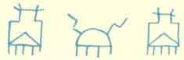

  
[Intangible Textual Heritage](../../../index.md)  [Native
American](../../index)  [Hopi](../index)  [Index](index.md) 
[Previous](toah18)  [Next](toah20.md) 

------------------------------------------------------------------------

p. 103

### YAPONCHA, THE WIND GOD [1](#fn_0.md)

ANY years ago the Hopi were very much troubled by the wind. It blew and
blew all the time. The sand drifted away from their fields, and they
tried to plant their crops but the wind would sweep the soil away before
the seeds would even start to germinate. Sadness and worry were upon
everybody and they made prayer offerings of many pahos but there were no
results.

Many councils were held by the old men in the kivas, where they smoked
their pipes earnestly and asked one another why it was that their gods
should turn such strong wind upon them. And after awhile, they decided
that they would ask the "little fellows" (the two little War Gods
Po-okonghoya and Palongahoya, his younger brother) to help them. Now
these "little fellows" were called in. [75](toah24.htm#xref_75.md) When
they came in they wanted to know why they were called. The Hopis said
that they needed their help, something must be done to the wind. The
"little fellows" said yes, they would see what they could do to help the
people.

They told the men to stay in the kiva and make many pahos. Then the
"little fellows" went to their wise old grandmother, the Spider Woman,
and they asked her to make some sweet corn meal mush for them to take
along on a journey. Of course they knew who Yaponcha (the Wind God) was
and where he lived--over near the Sunset Mountain in the big cracks in
the black rock.

When the corn meal mush was made they came back to the kiva and found
the pahos were ready and also the ball which they always liked to take
along to play with wherever they went, and the bows and arrows had been
made for them, because it was much like going on the warpath for them.
So the arrows were of bluebird feathers which were considered most
powerful in those days.

The two "little fellows" set out toward the San Francisco Peaks. The old
men went with them as far as the Little Colorado River and there they
sat down and smoked their pipes.

The little warriors went on and on, playing with their ball. They
reached the home of the Wind God, Yaponcha,

p. 104

on the fourth day. The Wind God lived at the foot of Sunset Crater in a
great crack in the black rock, through which he is ever breathing and
does so to this day. They threw the pahos into the crack and hurriedly
took out their old grandmother's sticky cornmeal mush, and they sealed
up Yaponcha's door with it. Now he was awfully angry, and he blew and
blew, but he could not get out. The "little fellows" laughed and they
went home, very pleased with themselves, indeed.

But bye and bye, the people in the villages began to feel that it was
very hot. It was getting warmer and warmer every day. Down in the kivas
it was so awfully hot that the men came out and the people came from
their houses and they stood upon the housetops and looked and looked
toward the San Francisco Peaks, to see if there were any clouds coming.
But there wasn't even the tiniest bit of a cloud to give a pleasant
shadow, and not a breath of air, and the people thought that they would
smother.

They thought they must do something right away, so the men made some
more pahos and called the "little fellows" again and they begged them to
go back to Yaponchaki (House of Yaponcha) right away and tell him that
there must be peace, and then give him the pahos and let him out,
because this heat was much worse even, than the wind. So the "little
fellows" said that they would go and see what could be done to make
things better.

On the fourth day they arrived at the house of Yaponcha and they talked
together and decided that the best thing to do would be to let Yaponcha
have just a little hole open, just enough to let him breathe through,
but not large enough for him to come out through, altogether. So they
took out some of the cornmeal mush and right away a nice cool wind came
out, and a little white cloud appeared and went over across the desert
toward the Hopi towns.

When the "little fellows" got home again to the villages, everybody was
pleased and they have been very grateful ever since. Ever since that
time the winds have been just right, and just enough to keep the people
cool without blowing everything away.

Ever since then prayer offerings of pahos, to this day, are made to the
Wind God, Yaponcha, in the windy month of March by the chiefs and high
priests of the three villages of the Second Mesa.

 

 

------------------------------------------------------------------------

### Footnotes

[103:1](toah19.htm#fr_0.md) Reprinted from "Hopi
Legends of the Sunset Crater Region," M. N. A., Museum Notes, Vol. 5,
No. 4, Oct. 1932, p. 17.

------------------------------------------------------------------------

[Next: The Kana-a Kachinas Of Sunset Crater](toah20.md)
