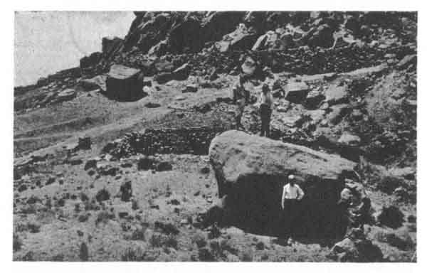
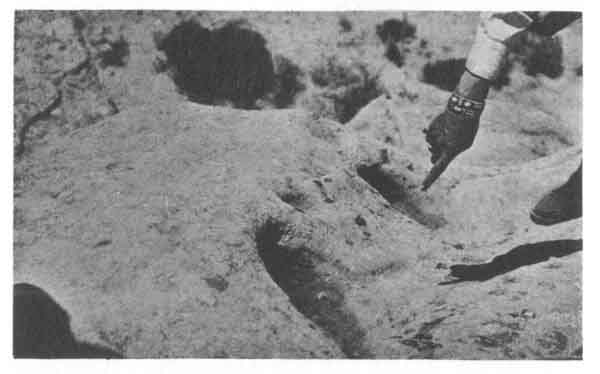

  
[Intangible Textual Heritage](../../../index.md)  [Native
American](../../index)  [Hopi](../index)  [Index](index.md) 
[Previous](toah20)  [Next](toah22.md) 

------------------------------------------------------------------------

p. 111

### THE LADDER DANCE AT OLD SHUNG-OPOVI [1](#fn_2.md)

The present Hopi pueblo of Shung-opovi has occupied its present site
since about 1700. Previous to that time, the pueblo straggled over the
foothills at the mesa base. About a hundred yards west of this pueblo,
over a sharp ridge, lay the old walled-in spring called Shungopa, the
spring that gave the name to the pueblo, and which went dry in the
1870's at the time of a landslide which caused a local earthquake.

About a hundred yards south of this spring stands a large boulder ([Fig.
1](#img_11200).md). On the top of this boulder can be observed three holes
in a row, each hole being about a foot in diameter and between a foot
and two feet deep ([Fig. 2](#img_11300).md). Hopi tradition associates
these holes with a Hopi ceremony now extinct call the Ladder Dance.

THERE WAS one kiva at old Shung-opovi known as the Ash Pile Kiva. They
knew but one dance and that was called the Coal Kachina dance. This kiva
was composed of not well-to-do people. Not having many costumes, all
they had to wear for kilts were old dresses discarded by the women. The
men in the kiva gave the Coal Kachina dance so often that it grew
monotonous to see those Coal Kachinas. So one day they made an
announcement that they would give another kind of dance in four days.
The men in the other kivas said that only some more Coal Kachinas would
come into the kiva. About a day after the announcement was made, the
boys went out hunting. While they were out, one of the boys got away
from the party, and, as he was going around, he jumped a rabbit out of a
bush and he chased after it. The rabbit just kept going westward and the
boy just kept following it. Well, the rabbit finally got into one of the
shrines above Burro Springs, and the rabbit went around back of the
shrine and the boy thought the rabbit was all in and tired and ready to
lay down. When he got around the shrine he saw a kiva. When he looked in
he asked if the rabbit had gone in there. The men who were there said
"Yes," and they asked the boy to come in.

When he got in there, they sat him down beside the fireplace and gave
him a welcome smoke. When he finished

p. 112

that they told him they had sent the rabbit out to get him and bring him
there because they were rather sorry that the men in the other kivas
made fun of the Ash Pile Kiva. Then they told him they would like to
have two or three of the boys go over to the San Francisco Peaks. There
they would show them different kinds of Kachina

 

   
FIG. 1.

 

dances from which they could choose which of the dances they would have
in their kiva. So they asked the boy to go right back home and tell the
rest of the men of his kiva.

When he came home he went right into the kiva. Well, he told these men
what he had seen at the shrine and what news he had been told. He asked
the old men to make some prayer offerings which they would take over to
the San Francisco Peaks to the main Kachina Kiva and said this must be
kept secret from the other people who would be expecting to see the Coal
Kachina dance again. They stayed up late to make their prayer offerings
so that the boys could start out early for the San Francisco Peaks
before the rest of the village woke up. So they came to the foot of the
main peaks that day. The next morning about dawn they started to climb
and at sunrise reached the kiva. When they got there they were asked to
come in, and there they found the same men that the boy saw at the
shrine at Burro Springs. So, as usual, they were given their welcome
smoke. The men said that they would show them different kinds of dances
without losing much time

p. 113

for there was now little time before the dance at Shung-opovi.

So they danced many dances for them and the boys liked the ladder dance
very much. Well, the men at the kiva said the dance was difficult
because the dancers had to climb a limber young Douglas fir tree.
Finally the boys decided to ask these people if they could not do it for
them. The people agreed to do the ladder dance themselves because it
would be so difficult for the people at

 

   
FIG. 2.

 

\[paragraph continues\] Shung-opovi. So when they did agree to do this
they sent the boys back, but they asked them to take back home with them
two young Douglas firs each about a foot high. They told them that when
they got home, they were to find a rock on which to plant these two
trees. When they got home with the two firs they brought them into the
kiva and the men in the kiva performed a ceremony of welcoming the firs
and the boys by smoking.

The next morning the boys took the two trees and went up to the rock
which they thought would be best to plant the trees on. That morning the
whole village noticed the two trees on top of the rock and wondered what
was going to happen. One by one they went to look. There was an old man
up there on watch so that no one could hurt the trees. Everyone who went
asked him what they were for but he told them not to be too anxious
until night came.

That day towards evening the Kachinas began to come out of the kivas.
They kind of paraded around the village. At that time the men from the
Ash Pile Kiva came out all

p. 114

wrapped up in their blankets. These men went out to meet the real
Kachinas who came from the San Francisco Mountains. By that time it was
clouding up. These men met the Kachinas at the place called Lonatchi, a
spring which lies about a mile west of Old Shung-opovi. When they met
them, the Kachinas told the men they must hide out that night so that he
people would believe that they were putting on the dance. So they
decided they would stay there and the Kachinas would go to the village
and the men could follow after dark.

This old man at the rock under the two fir trees would sprinkle cornmeal
on the trees and they would grow about an inch or two, and by that time
the Kachinas got there they were quite tall trees. In this ceremony each
Kachina was in a different costume, except that the two who were to
climb the trees were dressed alike. When the people saw the Kachinas on
the hill around the rock, they all ran up there. They carefully observed
the performance. They were trying to figure out who the Kachinas were.
They resembled men in the different kivas. The two Kachinas climbed the
trees. The trees were so slender that the Kachinas swayed back and
forth. They climbed while the rest sung around. It seemed as if the two
trees had a spirit as the two Kachinas swung back and forth. The song
that the Kachinas sung, the people of Shung-opovi still sing.

Well, after this performance they went to the village. They paraded
around and entered the kiva. Then rain came down. The rest of the kivas
felt jealous. Every once in awhile they would send up a man to peep in
to see if it were true that the men in this kiva were putting on the
dance. About midnight the dance started. All the Kachinas from the other
kivas were out. But the men from the other kivas did not dance. They
just put away their costumes and followed the new Kachinas around. And
then by that time the men who were supposed to put on the dance came in.
They watched the dance too and were not recognized.

After the dance was over the Kachinas went back into the kiva. They were
supposed to go down the Sipapu and go home that way. So the next day
after the dance this kiva was given praise because they had put on a
great dance, different from anything that had ever been seen. From that
day this kiva was recognized because of this dance, whereas, before they
had never been recognized by the people of the village. From then on the
people at Shung-opovi held this kind of a dance every four years until
the town was abandoned (between 1680 and 1700).

------------------------------------------------------------------------

### Footnotes

[111:1](toah21.htm#fr_2.md) Reprinted from M. N. A.,
Museum Notes, Vol. 5, No. 2, Aug. 1932, p. 5.

------------------------------------------------------------------------

[Next: The Ladder Dance At Pivahonkiapi](toah22.md)
