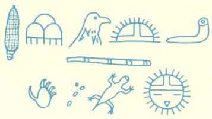

  
[Intangible Textual Heritage](../../../index)  [Native
American](../../index)  [Hopi](../index)  [Index](index) 
[Previous](toah22)  [Next](toah24) 

------------------------------------------------------------------------

p. 121

### DR. FEWKES AND MASAUWU [1](#fn_4)

#### THE BIRTH OF A LEGEND

In the autumn of 1898, the late Dr. Fewkes, archaeologist of the
Smithsonian Institution, was staying at Walpi, one of the Hopi Indian
Pueblos. In the annual report of the director of the Bureau of Ethnology
his visit is noted as follows:

"In November, Dr. J. Walter Fewkes repaired to Arizona for the purpose
of continuing his researches concerning the winter ceremonies of the
Hopi Indians, but soon after his arrival an epidemic of smallpox
manifested itself in such severity as to completely demoralize the
Indians and to prevent them from carrying out their ceremonial plans,
and at the same time placed Dr. Fewkes in grave personal danger. It
accordingly became necessary to abandon the work for the
season." [77](toah24.htm#xref_77)

The Hopis at Walpi have another story of the cause of Dr. Fewkes'
departure.--Ed.

ONE OF the most important of the Hopi winter ceremonies is the Wuwuchim
which comes in November. At a certain time during the ceremony the One
Horned and the Two Horned Societies hold a secret rite in a certain part
of the pueblo, and all the people who live on that plaza go away and
close their houses. No one may witness this ceremony, for Masauwu, the
Earth God, is there with the One Horned Priests who do his bidding in
the Underworld and the Spirits of the dead are there and it is said that
anyone who sees them will be frozen with fright or paralyzed or become
like the dead.

Masauwu owns all the Hopi world, the surface of the earth and the
Underworld beneath the earth. He is a mighty and terrible being for he
wears upon his head a bald and bloody mask. He is like death and he
clothes himself in the raw hides of animals and men cannot bear to look
upon his face. The Hopi say he is really a very handsome great man of a
dark color with fine long black hair and that he is indeed a great
giant. When the Hopi came up from the Underworld and looked about them
in fear, the first sign which they saw of any being of human

p. 122

form, was the great footprints of Masauwu. Now Masauwu only walks at
night and he carries a flaming torch. Fire is his and he owns the fiery
pits. Every night Masauwu takes his torch and he starts out on his
rounds, for he walks clear around the edge of the world every night.

Dr. Fewkes had been in the kiva all day taking notes on what he saw
going on there. Finally the men told him that he must go away and stay
in his house for Masauwu was coming, and that part of the ceremony was
very sacred and no outside person was ever allowed to see what was going
on. They told him to go into his house and lock the door, and not to try
to see anything no matter what happened, or he would be dragged out and
he would "freeze" to death. So he went away into his house and he locked
the door just as he had been told to do and he sat down and began to
write up his notes.

Now suddenly he had a queer feeling, for he felt that there was someone
in the room, and he looked up and saw a tall man standing before him,
but he could not see his face for the light was not good. He felt very
much surprised for he knew that he had locked the door.

He said, "What do you want and how did you get in here?" The man
replied, "I have come to entertain you."

Dr. Fewkes said, "Go away, I am busy and I do not wish to be
entertained."

And now as he was looking at the man, he suddenly was not there any
more. Then a voice said, "Turn your head a moment," and when the Doctor
looked again the figure stood before him once more, but this time its
head was strange and dreadful to see.

And the Doctor said, "How did you get in?", and the man answered and
said, "I go where I please, locked doors cannot keep me out! See, I will
show you how I entered," and, as Dr. Fewkes watched, he shrank away and
became like a single straw in a Hopi hair whisk and he vanished through
the key hole.

Now Dr. Fewkes was very much frightened and as he was thinking what to
do, there was the man back again. So he said once more to him, "What do
you want?", and the figure answered as before and said, "I have come to
entertain you." So the Doctor offered him a cigarette and then a match,
but the man laughed and said, "Keep your match, I do not need it," and
he held the cigarette before his horrible face and blew a stream of fire
from his mouth upon it and lit his cigarette. Then Dr. Fewkes was very
much afraid indeed, for now he knew who it was.

p. 123

Then the being talked and talked to him, and finally the Doctor "gave up
to him" and said he would become a Hopi and be like them and believe in
Masauwu, and Masauwu cast his spell on him and they both became like
little children and all night long they played around together and
Masauwu gave the Doctor no rest.

And it was not long after that Dr. Fewkes went away but it was not on
account of the smallpox as you now know.

\*     \*     \*     \*     \*

Although Dr. Fewkes never reported this story to the outside world, the
Hopis now tell that he related it to the priests in the kiva the next
day after the strange occurrence. We can see how in less than forty
years a legend had its birth.--Ed.

 

 

------------------------------------------------------------------------

### Footnotes

[121:1](toah23.htm#fr_4) Reprinted from M. N. A.,
Museum Notes, Vol. 11, No. 2, Aug. 1938, p. 25.

------------------------------------------------------------------------

[Next: Notes](toah24)
