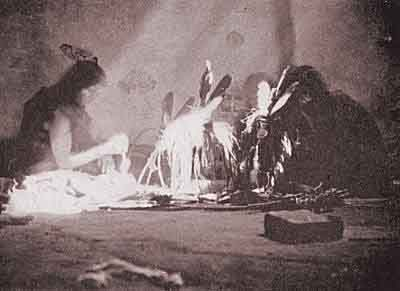

  
[Intangible Textual Heritage](../../../index)  [Native
American](../../index)  [Hopi](../index) 

------------------------------------------------------------------------

[Buy this Book at
Amazon.com](https://www.amazon.com/exec/obidos/ASIN/B002DUCNKA/internetsacredte)

------------------------------------------------------------------------

<table width="75%">
<colgroup>
<col style="width: 50%" />
<col style="width: 50%" />
</colgroup>
<tbody>
<tr class="odd">
<td width="50%" data-valign="TOP"> 
In the Kiva. Image from H.R. Voth, The Oraibi Marau Ceremony, Field Museum Anth. Publ. Vol. XI, No. 1 (Chicago, 1912)</td>
<td width="50%" data-valign="CENTER"><h1 id="the-traditions-of-the-hopi" data-align="CENTER">The Traditions of the Hopi</h1>
<h2 id="by-h.-r.-voth" data-align="CENTER">by H. R. Voth</h2>
<h4 id="section" data-align="CENTER">[1905]</h4></td>
</tr>
</tbody>
</table>

------------------------------------------------------------------------

[Contents](#contents)    [Start Reading](toth000)    [Page
Index](pageidx)    [Text \[Zipped\]](toth.txt.gz)

------------------------------------------------------------------------

|                                                                                                                           |
|---------------------------------------------------------------------------------------------------------------------------|
|  |

This book of Hopi folklore, collected by an ethnographer early in the
20th century, is one of the most extensive available.

It includes a hundred Hopi folk tales, including mythology of the
emergence from the underworld, legends of the wanderings of the clans,
plus historical legends.

It is now known that the Hopi were a bit selective in what they told the
earliest researchers, but this does not lessen the value of this
collection, or call into question its authenticity.

------------------------------------------------------------------------

 [Title Page](toth000)  
[Contents](toth001)  
[1. Origin Myth](toth002)  
[2. Hurúing Wuhti and the Sun](toth003)  
[3. Coming of the Hopi From the Under-world](toth004)  
[4. The Wanderings of the Hopi.](toth005)  
[5. The Origin of Some Oraíbi Clans](toth006)  
[a. the Spider Clan](toth007)  
[b. the Bear Clan](toth008)  
[6. The Snake Myth.](toth009)  
[7. The Snake Myth.](toth010)  
[8. The Wanderings of the Bear Clan (Hon-ñamu).](toth011)  
[9. The Wanderings of the Spider Clan (Kohk'ang-ñamu)](toth012)  
[10. The Origin of the Yáyaatu Society](toth013)  
[11. The Origin of Some Mishóngnovi Clans](toth014)  
[12. The Destruction of Palátkwapi](toth015)  
[13. The Revenge of the Katcinas](toth016)  
[14. How the Circle (Póngo) Katcina And His Wife Became
Stars](toth017)  
[15. The Kokóshori Katcina and the Shongópavi Maiden](toth018)  
[16. How Ball-head (Tatciqtö) Wedded An Oraíbi Maiden](toth019)  
[17. The Ahö'li And Other Wálpi Katcinas](toth020)  
[18. The Two War Gods and the Two Maidens](toth021)  
[19. The Pöokónghoyas and the Cannibal Monster](toth022)  
[20. Pöokónghoya And His Brother As Thieves](toth023)  
[21. How the Pö'okongs Destroyed Cóoyoko And His Wife](toth024)  
[22. How Pö'okong Killed the Bear](toth025)  
[23. The Pö'okongs Attend A Dance](toth026)  
[24. How Pö'okong Won A Bride](toth027)  
[25. How the Antelope Maiden Was Reconciled](toth028)  
[26. The Pö'okongs and the Bálölöokong](toth029)  
[27. How the Yellow Corn-Ear Maiden Became A Bull Snake and Revenged
Herself](toth030)  
[28. A Journey to the Skeleton House](toth031)  
[29. A Journey to the Skeleton House](toth032)  
[30. Skeleton Woman and the Hunter](toth033)  
[31. Másauwuu Marries A Maiden](toth034)  
[32. Másauwuu and the Háno Hunters](toth035)  
[33. Two Yáyaponchatu Trade In Oraíbi](toth036)  
[34. The Kóhonino Hunter](toth037)  
[35. The White Corn-ear Maiden and the Sorcerers](toth038)  
[36. Watermelon-rind Woman (Hölö'kop Wuhti)](toth039)  
[37. The Youth And Maiden Who Played Hide And Seek For Their
Life](toth040)  
[38. The Maiden Who Stole the Youth's Costume](toth041)  
[39. The Two Pueblo Maidens Who Were Married to the Night](toth042)  
[40. How Hiyónatitiwa Defeated the Plan of His Enemies](toth043)  
[41. The Shongópavi Maiden Who Turned Into A Dog](toth044)  
[42. The Blind Man and the Lame Man](toth045)  
[43. Big Head And Goat Horn](toth046)  
[44. Kavúshkavuwnöm And Shovíviounöm](toth047)  
[45. How the Children of Pivánhonk'api Obtained Permission To Catch
Birds](toth048)  
[46. The Jug Boy](toth049)  
[47. The Crow As A Spirit of Evil](toth050)  
[48. The Maiden and the Coyote](toth051)  
[49. Chórzhvûk'iqölö and the Eagles](toth052)  
[50. The Hawk and the Child](toth053)  
[51. Múyingwa, Two Children, and the Humming-bird](toth054)  
[52. The Kalátötö Who Wished To Have Hair On His Head](toth055)  
[53. The Child Who Turned Into An Owl](toth056)  
[54. The Children and the Lizards](toth057)  
[55. The Rooster, the Mocking-bird and the Maiden](toth058)  
[56. The Toad and the Snow Katcínas](toth059)  
[57. The Locust That Came To Life While Being Roasted](toth060)  
[58. The Coyote and the Turtles](toth061)  
[59. The Water Serpent and the Coyote](toth062)  
[60. The Coyote and the Bálölöokong (Water Serpent).](toth063)  
[61. Bálölöokongwuu and the Coyote](toth064)  
[62. The Coyote and the Frog](toth065)  
[63. The Coyote, the Bat, and the Humming-bird](toth066)  
[64. The Coyote and the Humming-bird](toth067)  
[65. How the Coyote Was Deceived By the Wren](toth068)  
[66. The Áahtu and the Coyote](toth069)  
[67. The Coyote and the Turtle-dove](toth070)  
[68. The Coyote and the Blue Jays](toth071)  
[69. The Coyote and the Eagle](toth072)  
[70. The Coyote and the Red Eagle](toth073)  
[71. The Coyote and the Turkeys](toth074)  
[72. The Chíro and the Coyote](toth075)  
[73. The Coyote and the Porcupine](toth076)  
[74. The Coyote and the Badger](toth077)  
[75. The Badger and the Coyote](toth078)  
[76. The Badger, the Coyote, and the Kóhonino Maiden](toth079)  
[77. The Coyote and the Kókontu Maidens](toth080)  
[78. The Coyote and the Grasshoppers](toth081)  
[79. The Coyote and the Grasshopper](toth082)  
[80. The Three Maidens and the Coyote](toth083)  
[81. How the Coyotes Had A Katcina Dance](toth084)  
[82. The Coyote and His Prey](toth085)  
[83. The Bull-snake and the Tû'chvo (wren).](toth086)  
[84. The Snakes and the Locusts](toth087)  
[85. The Squirrel and the Chipmunk](toth088)  
[86. A Bet Between the Cooyoko and the Fox](toth089)  
[87. The Little Gray Mice and the Little Brown Mice](toth090)  
[88. The Badger and the Small Gray Mice](toth091)  
[89. The Badger and the Small Gray Mice](toth092)  
[90. The Mice, the Owl, and the Hawk](toth093)  
[91. The Sparrow-hawk and the Hâ'kwâ](toth094)  
[92. The Sparrow-hawk and the Grasshoppers](toth095)  
[93. The Crow and the Hawk](toth096)  
[94. The Red Eagle Song](toth097)  
[95. The Red Eagle and the Owl](toth098)  
[96. The Bee and the Ásya](toth099)  
[97. The Grasshoppers and the Oraíbi Maiden](toth100)  
[98. How the Beetles Produced Pain](toth101)  
[99. Why the Ants Are So Thin](toth102)  
[100. Lâ'vövölvipiki and Nö'nvövölpiki](toth103)  
[101. The Destruction of Pivánhonk'api](toth104)  
[102. The Destruction of Sikyátki](toth105)  
[103. The Destruction of Aoátovi](toth106)  
[104. The Destruction of Aoatovi](toth107)  
[105. How An Oraíbi Chief Punished His People](toth108)  
[106. A Katcina Race Contest Between the Wálpi and the
Oraíbi](toth109)  
[107. The Last Fight With the Navaho](toth110)  
[108. A Hopi Raid On A Navaho Dance](toth111)  
[109. A Raid On the Hopi Villages](toth112)  
[110. The Early Spanish Missions At Oraíbi](toth113)  

### Abstracts.

[1.--Origin Myth.](toth114)  
[2.--Hurúing Wuhti and the Sun.](toth115)  
[3.--Coming of the Hopi From the Under-world.](toth116)  
[4.--The Wanderings of the Hopi.](toth117)  
[5.--The Origin of Some Oraíbi Clans.](toth118)  
[6.--The Snake Myth.](toth119)  
[7.--The Snake Myth.](toth120)  
[8.--The Wanderings of the Bear Clan.](toth121)  
[9.--The Wanderings of the Spider Clan.](toth122)  
[10.--Origin of the Yáyaatu Society.](toth123)  
[11.--The Origin of Some Mishóngnovi Clans.](toth124)  
[12.--The Destruction of Palátkwapi.](toth125)  
[13.--The Revenge of the Katcinas.](toth126)  
[14.--How the Circle (Póngo) Katcina And His Wife Became
Stars.](toth127)  
[15.--The Kokóshori Katcina and the Shongópavi Maiden.](toth128)  
[16.--How Ball-head (Tatciqtö) Wedded An Oraíbi Maiden.](toth129)  
[17.--The Áhö'li And Other Wálpi Katcinas.](toth130)  
[18.--The Two War Gods and the Two Maidens.](toth131)  
[19.--The Pöokónghoyas and the Cannibal Monster.](toth132)  
[20.--Pöokónghoya And His Brother As Thieves.](toth133)  
[21.--How the Pö'okongs Destroyed Cóoyoko And His Wife.](toth134)  
[22.--How Pö'okong Killed the Bear.](toth135)  
[23.--The Pö'okongs Attend A Dance.](toth136)  
[24.--How Pö'okong Won A Bride.](toth137)  
[25.--How the Antelope Maiden Was Reconciled.](toth138)  
[26.--The Pö'okongs and the Bálölöokong.](toth139)  
[27.--How the Yellow Corn-ear Maiden Became A Bull-snake.](toth140)  
[28.--Journey To the Skeleton House.](toth141)  
[29.--A Journey To the Skeleton House.](toth142)  
[30.--Skeleton Woman and the Hunter.](toth143)  
[31.--Másauwuu Marries A Maiden.](toth144)  
[32.--Másauwuu and the Hano Hunters.](toth145)  
[33.--The Two Yáyaponchatu Trade In Oraíbi.](toth146)  
[34.--The Kóhonino Hunter.](toth147)  
[35.--The White Corn-ear Maiden and the Sorcerers.](toth148)  
[36.--Watermelon-rind Woman (Hölö'kopö' Wuhti).](toth149)  
[37.--The Youth And Maiden Who Played Hide And Seek For Their
Life.](toth150)  
[38.--The Maiden Who Stole the Youth's Costume.](toth151)  
[39.--The Two Pueblo Maidens Who Were Married To the Night.](toth152)  
[40.--How Hiyónatitiwa Defeated the Plan of His Enemy.](toth153)  
[41.--The Shongópavi Maiden Who Turned Into A Dog.](toth154)  
[42.--The Blind Man and the Lame Man.](toth155)  
[43.--Big Head And Goat Horn.](toth156)  
[44.--Kavúshkavuwnöm And Shovíviounöm.](toth157)  
[45.--How the Children of Pivánhonk'api Obtained Permission To Catch
Birds.](toth158)  
[46.--The Jug Boy.](toth159)  
[47.--The Crow As A Spirit of Evil.](toth160)  
[48.--The Maiden and the Coyote.](toth161)  
[49.--Chórzhvûk'iqölö and the Eagles.](toth162)  
[50.--Hawk and the Child.](toth163)  
[51.--Mû'yingwa, Two Children, and the Humming-bird.](toth164)  
[52.--The Kalátötö Who Wished To Have Hair On His Head.](toth165)  
[53.--The Child Who Turned Into An Owl.](toth166)  
[54.--The Children and the Lizards.](toth167)  
[55.--The Rooster, the Mocking-bird, and the Maiden.](toth168)  
[56.--The Toad and the Snow Katcínas.](toth169)  
[57.--The Locust That Came To Life While Being Roasted.](toth170)  
[58.--The Coyote and the Turtles.](toth171)  
[59.--The Water Serpent and the Coyote.](toth172)  
[60.--The Coyote and the Bálölöokong (water Serpent).](toth173)  
[61.--Bálölöokongwuu and the Coyote.](toth174)  
[62.--The Coyote and the Frog.](toth175)  
[63.--The Coyote, the Bat, and the Humming-bird.](toth176)  
[64.--The Coyote and the Humming-bird.](toth177)  
[65.--How the Coyote Was Deceived By the Wren.](toth178)  
[66.--The Áahtu and the Coyote.](toth179)  
[67.--The Coyote and the Turtle-dove.](toth180)  
[68.--The Coyote and the Blue Jays.](toth181)  
[69.--The Coyote and the Eagle.](toth182)  
[70.--The Coyote and the Red Eagle.](toth183)  
[71.--The Coyote and the Turkeys.](toth184)  
[72.--The Chíro and the Coyote.](toth185)  
[73.--The Coyote and the Porcupine.](toth186)  
[74.--The Coyote and the Badger.](toth187)  
[75.--The Badger and the Coyote.](toth188)  
[76.--The Badger, the Coyote, and the Kóhonino Maiden.](toth189)  
[77.--The Coyote and the Kókontu-maidens.](toth190)  
[78.--The Coyote and the Grasshoppers.](toth191)  
[79.--The Coyote and the Grasshopper.](toth192)  
[80.--The Three Maidens and the Coyote.](toth193)  
[81.--How the Coyotes Had A Katcina Dance.](toth194)  
[82.--The Coyote And His Prey.](toth195)  
[83.--The Bull-snake and the Tû'chvo (wren).](toth196)  
[84.--The Snakes and the Locusts.](toth197)  
[85.--The Squirrel and the Chipmunk.](toth198)  
[86.--A Bet Between the Cóoyoko and the Fox.](toth199)  
[87.--The Little Gray Mice and the Little Brown Mice.](toth200)  
[88.--The Badger and the Small Gray Mice.](toth201)  
[89.--The Badger and the Small Gray Mice.](toth202)  
[90.--The Mice, the Owl, and the Hawk.](toth203)  
[92.--The Sparrow Hawk and the Grasshoppers.](toth204)  
[93.--The Crow and the Hawk.](toth205)  
[94.--The Red Eagle's Song.](toth206)  
[95.--The Red Eagle and the Owl.](toth207)  
[96.--The Bee and the Ásya.](toth208)  
[97.--The Grasshoppers and the Oraíbi Maiden.](toth209)  
[98.--How the Beetles Produced Rain.](toth210)  
[99.--Why the Ants Are So Thin.](toth211)  
[100.--Lâ'vövölvipiki And Nö'nvövölpiki.](toth212)  
[101.--The Destruction of Pivánhonk'api.](toth213)  
[102.--The Destruction of Sikyátki.](toth214)  
[103.--The Destruction of Aoátovi.](toth215)  
[104.--The Destruction of Aoátovi.](toth216)  
[106.--A Katcina Race Contest Between the Wálpi and the
Oraíbi.](toth217)  
[107.--The Last Fight With the Navaho.](toth218)  
[108.--A Hopi Raid On A Navaho Dance.](toth219)  
[109.--A Raid On the Hopi Villages.](toth220)  
