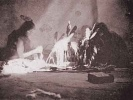

  
[Intangible Textual Heritage](../../../index.md)  [Native
American](../../index)  [Hopi](../index)  [Index](index.md) 
[Previous](toth207)  [Next](toth209.md) 

------------------------------------------------------------------------

[Buy this Book at
Amazon.com](https://www.amazon.com/exec/obidos/ASIN/B002DUCNKA/internetsacredte.md)

------------------------------------------------------------------------

  
*The Traditions of the Hopi*, by H.R. Voth, \[1905\], at Intangible
Textual Heritage

------------------------------------------------------------------------

## 96.--THE BEE AND THE ÁSYA.

Bee and Ásya are both women and have children. They are great friends.
Ásya has peach orchard and relishes peaches very much. She visits Bee,
who feeds her honey. They converse all day and Ásya asks Bee to visit
her in morning. Bee has no wings and walks to friend's house. Ásya gives
her seat and feeds her peaches. She asks Bee if she likes peaches. Bee
suggests she shall make some medicine for peaches, as they are sour.
Ásya consents and Bee puts honey on them, making them sweet. Ásya is
happy and pulls out some feathers for Wings, which she attaches to Bee.
She teaches Bee how to fly and ever since bees can fly.

------------------------------------------------------------------------

[Next: 97.--The Grasshoppers and the Oraíbi Maiden.](toth209.md)
