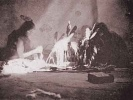

  
[Intangible Textual Heritage](../../../index.md)  [Native
American](../../index)  [Hopi](../index)  [Index](index.md) 
[Previous](toth218)  [Next](toth220.md) 

------------------------------------------------------------------------

[Buy this Book at
Amazon.com](https://www.amazon.com/exec/obidos/ASIN/B002DUCNKA/internetsacredte.md)

------------------------------------------------------------------------

  
*The Traditions of the Hopi*, by H.R. Voth, \[1905\], at Intangible
Textual Heritage

------------------------------------------------------------------------

## 108.--A HOPI RAID ON A NAVAHO DANCE.

Many Navaho go to deep canyon to have Katcina dance. During fifth dance
star falls down in front of head dancer. Navaho are much afraid, jump on
ponies and begin to scatter. Great noise is heard and Oraíbi arrive to
make raid. Great battle ensues. Navaho are driven back out of canyon and
few escape to their homes. This is why Navaho when they dance always
have watchers,

------------------------------------------------------------------------

[Next: 109.--A Raid On the Hopi Villages.](toth220.md)
