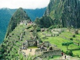

  
[Intangible Textual Heritage](../../../index.md)  [Native
American](../../index)  [Inca](../index)  [Index](index.md) 
[Previous](oll03)  [Next](oll05.md) 

------------------------------------------------------------------------

  
*Apu Ollantay*, by Clements Markham, \[1910\], at Intangible Textual
Heritage

------------------------------------------------------------------------

p. 341

# ACT I

### SCENE I

An open space near the junction of the two torrents of Cuzco, the
Huatanay and Tullumayu or Rodadero, called Pumap Chupan, just outside
the gardens of the Sun. The Temple of the Sun beyond the gardens, and
the Sacsahuaman hill surmounted by the fortress, rising in the distance.
The palace of Colcampata on the hillside.

(*Enter* OLLANTAY L. \[*in a gilded tunic, breeches of llama sinews*,
usutas *or shoes of llama hide, a red mantle of* ccompi *or fine cloth,
and the* chucu *or head-dress of his rank, holding a battle-axe*
(champi) *and club* (macana)\] *and* PIQUI CHAQUI *coming up from the
back* R. \[*in a coarse brown tunic of* auasca *or llama cloth, girdle
used as a sling, and* chucu *or head-dress of a Cuzqueño*\].)

  *Ollantay*. Where, young fleet-foot, hast thou been?  
Hast thou the starry Ñusta seen?  
  *Piqui Chaqui*. The Sun forbids such sacrilege  
'Tis not for me to see the star.  
Dost thou, my master, fear no ill,  
Thine eyes upon the Inca's child?  
  *Ollantay*. In spite of all I swear to love  
That tender dove, that lovely star;  
My heart is as a lamb [1](#fn_5.md) with her,  
And ever will her presence seek.

p. 342

  *Piqui Chaqui*. Such thoughts are prompted by Supay [1](#fn_6.md);  
That evil being possesses thee.  
All round are beauteous girls to choose  
Before old age, and weakness come.  
If the great Inca knew thy plot  
And what thou seekest to attain,  
Thy head would fall by his command,  
Thy body would be quickly burnt.  
  *Ollantay*. Boy, do not dare to cross me thus.  
One more such word and thou shalt die.  
These hands will tear thee limb from limb,  
If still thy councils are so base.  
  *Piqui Chaqui*. Well! treat thy servant as a dog,  
But do not night and day repeat,  
'Piqui Chaqui! swift of foot!  
Go once more to seek the star.'  
  *Ollantay*. Have I not already said  
That e'en if death's fell scythe [2](#fn_7.md) was
here,  
If mountains should oppose my path  
Like two fierce foes [3](#fn_8.md) who block the
way,  
Yet will I fight all these combined  
And risk all else to gain my end,  
And whether it be life or death  
I'll cast myself at Coyllur's feet.  
  *Piqui Chaqui*. Rut if Supay himself should come?  
  *Ollantay*. I'd strike the evil spirit down.

p. 343

  *Piqui Chaqui*. If thou shouldst only see his nose,  
Thou wouldst not speak as thou dost now.  
  *Ollantay*. Now, Piqui Chaqui, speak the truth,  
Seek not evasion or deceit.  
Dost thou not already know,  
Of all the flowers in the field,  
Not one can equal my Princess?  
  *Piqui Chaqui*. Still, my master, thou dost rave.  
I think I never saw thy love.  
Stay! was it her who yesterday  
Came forth with slow and faltering steps  
And sought a solitary [1](#fn_9.md) path [2](#fn_10.md)?  
If so, 'tis true she's like the sun,  
The moon less beauteous than her face. [3](#fn_11.md)  
  *Ollantay*. It surely was my dearest love.  
How beautiful, how bright is she  
This very moment thou must go  
And take my message to the Star.  
  *Piqui Chaqui*. I dare not, master; in the day,  
1 fear to pass the palace gate.  
With all the splendour of the court,  
I could not tell her from the rest.  
  *Ollantay*. Didst thou not say thou sawest her?  
  *Piqui Chaqui*. I said so, but it was not sense.  
A star can only shine at night  
Only at night could I be sure.  
  *Ollantay*. Begone, thou lazy good-for-nought.  
The joyful star that I adore,  
If placed in presence of the Sun,  
Would shine as brightly as before.

p. 344

  *Piqui Chaqui*. Lo! some person hither comes,  
Perhaps an old crone seeking alms;  
Yes! Look! he quite resembles one.  
Lot him the dangerous message take.  
Send it by him, O noble Chief!  
From me they would not hear the tale;  
Thy page is but a humble lad.

(*Enter the* UILLAC UMA, or High Priest of the Sun, *at the back, arms
raised to the Sun. In a grey tunic and black mantle from the shoulders
to the ground, a long knife in his belt, the undress* chucu *on his
head*.)

  *Uillac Uma*. O giver of all warmth and light  
O Sun! I fall and worship thee.  
For thee the victims are prepared,  
A thousand llamas and their lambs  
Are ready for thy festal day.  
The sacred fire'll lap their blood,  
In thy dread presence, mighty one,  
After long fast [1](#fn_12.md) thy victims fall.  
  *Ollantay*. Who comes hither, Piqui Chaqui?  
Yes, 'tis the holy Uillac Uma;  
He brings his tools of augury.  
No puma [2](#fn_13.md) more astute and wise  
I hate that ancient conjurer  
Who prophesies of evil things,  
I feel the evils he foretells;  
'Tis he who ever brings ill-luck.

p. 345

  *Piqui Chaqui*. Silence, master, do not speak,  
The old man doubly is informed;  
Fore-knowing every word you say,  
Already he has guessed it all.

(He lies down on a bank.)

  *Ollantay* (*aside*). He sees me. I must speak to him.

(*The* Uillac Uma *comes forward*.)

O Uillac Uma, Great High Priest,  
I bow before thee with respect  
May the skies be clear for thee,  
And brightest sunshine meet thine eyes.  
  *Uillac Uma*. Brave Ollantay! Princely one!  
May all the teeming land be thine;  
May thy far-reaching arm of might  
Reduce the wide-spread universe.  
  *Ollantay*. Old man! thine aspect causes fear,  
Thy presence here some ill forebodes;  
All round thee dead men's bones appear,  
Baskets, flowers, sacrifice.  
All men when they see thy face  
Are filled with terror and alarm.  
What means it all? why comest thou?  
It wants some months before the least.  
Is it that the Inca is ill?  
Perchance hast thou some thought divined  
Which soon will turn to flowing blood.  
Why comest thou? the Sun's great day,  
The Moon's libations are not yet  
The moon has not yet nearly reached  
The solemn time for sacrifice.  
  *Uillac Uma*. Why dost thou these questions put,  
In tones of anger and reproach?

p. 346

Am I, forsooth, thy humble slave?  
That I know all I'll quickly prove.  
  *Ollantay*. My beating heart is filled with dread,  
Beholding thee so suddenly;  
Perchance thy coming is a sign,  
Of evils overtaking me.  
  *Uillac Uma*. Fear not, Ollantay! not for that,  
The High Priest comes to thee this day.  
It is perhaps for love of thee,  
That, as a straw is blown by wind,  
A friend, this day, encounters thee.  
Speak to me as to a friend,  
Hide nothing from my scrutiny.  
This day I come to offer thee  
A last and most momentous choice  
'Tis nothing less than life or death.  
  *Ollantay*. Then make thy words more clear to me,  
That I may understand the choice  
Till now 'tis but a tangled skein,  
Unravel it that I may know.  
  *Uillac Uma*. 'Tis well. Now listen, warlike. Chief  
My science has enabled me,  
To learn and see all hidden things  
Unknown to other mortal men.  
My power will enable me  
To make of thee a greater prince.  
I brought thee up from tender years,  
And cherished thee with love and care  
I now would guide thee in the right,  
And ward off all that threatens thee.  
As chief of Anti-suyu now,  
The people venerate thy name;  
Thy Sovereign trusts and honours thee,  
E'en to sharing half his realm.  
From all the rest he chose thee out,

p. 347

And placed all power in thy hands;  
He made thy armies great and strong,  
And strengthened thee against thy foes  
How numerous soe'er they be,  
They have been hunted down by thee.  
Are these good reasons for thy wish,  
To wound thy Sovereign to the heart?  
His daughter is beloved by thee;  
Thy passion thou wouldst fain indulge,  
Lawless and forbidden though it be.  
I call upon thee, stop in time,  
Tear this folly from thy heart.  
If thy passion is immense,  
Still let honour hold its place.  
You reel, you stagger on the brink  
I'd snatch thee from the very edge.  
Thou knowest well it cannot be,  
The Inca never would consent.  
If thou didst e'en propose it now,  
He would be overcome with rage;  
From favoured prince and trusted chief,  
Thou wouldst descend to lowest rank.  
  *Ollantay*. How is it that thou canst surely know  
What still is hidden in my heart?  
Her mother only knows my love,  
Yet thou revealest all to me.  
  *Uillac Uma*. I read thy secret on the moon,  
As if upon the Quipu knots;  
And what thou wouldst most surely hide,  
Is plain to me as all the rest.  
  *Ollantay*. In my heart I had divined  
That thou wouldst search me through and through  
Thou knowest all, O Councillor,  
And wilt thou now desert thy son?  
  *Uillac Uma*. How oft we mortals heedless drink,

p. 348

A certain death from golden cup  
Recall to mind how ills befall,  
And that a stubborn heart 's the cause.  
  *Ollantay* (*kneeling*). Plunge that dagger in my breast,  
Thou holdst it ready in thy belt;  
Cut out my sad and broken heart  
I ask the favour at thy feet.  
  *Uillac Uma* (*to* Piqui Chaqui). Gather me that flower, boy.

(Piqui Chaqui *gives him a withered flower and lies down again,
pretending to sleep*.)

(*To* Ollantay). Behold, it is quite dead and dry.  
Once more behold! e'en now it weeps,  
It weeps. The water flows from it.

(*Water flows out of the flower*.)

  *Ollantay*. More easy for the barren rocks  
Or for sand to send forth water,  
Than that I should cease to love  
The fair princess, the joyful star.  
  *Uillac Uma*. Put a seed into the ground,  
It multiplies a hundredfold;  
The more thy crime shall grow and swell,  
The greater far thy sudden fall.  
  *Ollantay*. Once for all, I now confess  
To thee, O great and mighty Priest;  
Now learn my fault. To thee I speak,  
Since thou hast torn it from my heart.  
The lasso to tie me is long,  
'Tis ready to twist round my throat  
Yet its threads are woven with gold,  
It avenges a brilliant crime.  
Cusi Coyllur e'en now is my wife,  
Already we 're bound and are one;

p. 349

My blood now runs in her veins,  
E'en now I am noble as she.  
Her mother has knowledge of all,  
The Queen can attest what I say;  
Let me tell all this to the King,  
I pray for thy help and advice.  
I will speak without fear and with force,  
He may perhaps give way to his rage  
Yet he may consider my youth,  
May remember the battles I've fought;  
The record is carved on my club.

(*Holds up his* macana.)

He may think of his enemies crushed,  
The thousands I've thrown at his feet.  
  *Uillac Uma*. Young Prince! thy words are too bold,  
Thou hast twisted the thread of thy fate--  
Beware, before 'tis too late;  
Disentangle and weave it afresh,  
Go alone to speak to the King,  
Alone bear the blow that you seek;  
Above all let thy words be but few,  
And say them with deepest respect;  
Be it life, be it death that you find,  
I will never forget thee, my son.

\[*Walks up and exit*.

  *Ollantay*. Ollantay, thou art a man,  
No place in thy heart for fear;  
Cusi Coyllur, surround me with light.  
Piqui Chaqui, where art thou?  
  *Piqui Chaqui* (*jumping up*). I was asleep, my master,  
And dreaming of evil things.  
  *Ollantay*. Of what?  
  *Piqui Chaqui*. Of a fox with a rope round its neck.

p. 350

  *Ollantay*. Sure enough, thou art the fox.  
  *Piqui Chaqui*. It is true that my nose is growing finer,  
And my ears a good deal longer.  
  *Ollantay*. Come, lead me to the Coyllur.  
  *Piqui Chaqui*. It is still daylight.

\[*Exeunt*.

------------------------------------------------------------------------

### Footnotes

[341:1](oll04.htm#fr_5.md) *Chita* is the lamb of
the llama. A lamb of two or three months was a favourite pet in the time
of the Incas. It followed its mistress, adorned with a little bell and
ribbons.

[342:1](oll04.htm#fr_6.md) Supay, an evil spirit,
according to some authorities.

[342:2](oll04.htm#fr_7.md) Ichuna, a sickle or
scythe. The expression has been cited by General Mitre and others as an
argument that the drama is modern, because this is a metaphor confined
to the old world. But *ichuna* was in use, in Quichua, in this sense,
before the Spaniards came. The word is from *Ichu*, grass.

[342:3](oll04.htm#fr_8.md) The Peruvians personified
a mountain as two spirits, good and evil. In writing poetically of a
mountain opposing, it would be referred to in the persons of its genii
or spirits, and spoken of as two foes, not one.

[343:1](oll04.htm#fr_9.md) *Rurun*, desert,
solitude.

[343:2](oll04.htm#fr_10.md) *Tasquiy*, to march;
*tasquina*, promenade, path.

[343:3](oll04.htm#fr_11.md) *Cusi Coyllur*, while
daylight lasted, was, in the eyes of Piqui Chaqui, like the sun. A
change takes place at twilight, and at night she is like the moon.

[344:1](oll04.htm#fr_12.md) Fasting was a
preparation for all great religious ceremonies. Victims for sacrifice
underwent a previous fast, which was looked upon in the fight of
purification before being offered to the Deity.

[344:2](oll04.htm#fr_13.md) They gave the
attributes we usually assign to the fox to the puma.

------------------------------------------------------------------------

[Next: Scene 2](oll05.md)

