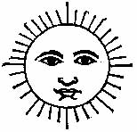

[Sacred-Texts](../../../index.md) [Native
American](../../index) [Inca](../index.md)

------------------------------------------------------------------------

# Narratives of the Rites and Laws of the Yncas

### trans. and ed. by Clements R. Markham

##### \[London, 1873\]

###### {Reduced to HTML by Christopher M. Weimer, March 2003}

------------------------------------------------------------------------

This book is a compendium of translations of four rather disparate
documents relating to pre-conquest Peru. As with most early studies of
Spanish America, they range rather freely between religion, history, and
laws. The fourth in particular is exclusively concerned with laws, while
the third is mythological, and is also interesting because it deals with
an outlying province of the Inca empire. The printed book also contains
a fifty page index of subjects, places, names, and Quechua words which
is not reproduced here.

------------------------------------------------------------------------

•[Title Page.](rly00.md)  
•[CONTENTS.](rly01.md)  
•[INTRODUCTION.](rly02.md)  
•[THE FABLES AND RITES OF THE YNCAS.](rly1.md)  
by Christoval de Molina  
•[AN ACCOUNT OF THE ANTIQUITIES OF PERU.](rly2.md)  
by Juan de Santa Cruz Pachacuti-yamqui Salcamayhua  
•[A NARRATIVE OF THE ERRORS, FALSE GODS, AND OTHER SUPERSTITIONS AND
DIABOLICAL RITES IN WHICH THE INDIANS OF THE PROVINCES OF HUAROCHIRI,
MAMA, AND CHACLLA LIVED IN ANCIENT TIMES, AND IN WHICH THEY EVEN NOW
LIVE, TO THE GREAT PERDITION OF THEIR SOULS.](rly3.md)  
by Dr. Francisco de Avila  
•[REPORT BY POLO DE ONDEGARDO.](rly4.md)  
