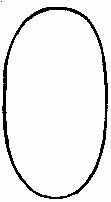
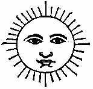
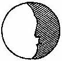
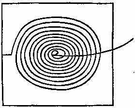

[Sacred-Texts](../../../index) [Native
American](../../index) [Inca](../index) [Index](index) [Previous](rly1) [Next](rly3)

------------------------------------------------------------------------

p. 67

## AN ACCOUNT OF THE ANTIQUITIES OF PERU.

------------------------------------------------------------------------

JESUS MARIA.

I, DON JUAN DE
SANTA CRUZ PACHACUTI-YAMQUI SALCAMAYHUA, a Christian by the grace of God our
Lord, am native of the towns of Santiago[1](#page_67_note_1) of Hanalucayhua and
Hurinhuayhuacanchi of Urco-suyu,[2](#page_67_note_2) between Canas and Canches
of Colla-suyu,[3](#page_67_note_3)
legitimate son of Don Diego Felipe Coudorcanqui and of Doña Maria
Huayrotari, legitimate grandson of Don Baltasar Cacyaquivi and of Don
Francisco Yamquihuanacu (whose wives, my grandmothers, are alive), great
grandson of Don Gaspar Apuquiricanqui and of General Don Juan Apu Ynca
Mayhua, great great grandson of Don Bernabe Apu-hilas Urcuni the less,
and of Don Gonzalo Pizarro Tintaya, and of Don Carlos Anco, all once
principal chiefs in the said province, and professed Christians in the
things of our holy Catholic faith. They were the first chiefs who came
to the tambo of Caxamarca to be made Christians,[4](#page_67_note_4) renouncing all the errors,
rites, and ceremonies of the time of heathenry, which were devised by
the ancient enemies of the human race, namely the demons and devils. In
the p. 68 general language they are called
*hapiñuñu*[5](#page_68_note_5)
*achacalla*.[6](#page_68_note_6) When the
first Apostolic Priests entered this most noble province of
Ttahuantin-suyu, inspired by the holy zeal of gaining a soul for God our
Lord, like good fishers, with their loving words, preaching and
catechising on the mystery of our holy Catholic Faith, then my
ancestors, after having been well instructed, were baptized. They
renounced the Devil and all his followers and his false promises, and
all his rites. Thus they became Christians, adopted sons of Jesus Christ
our Lord, and enemies of all the ancient customs and idolatries. As such
they persecuted the wizards, destroyed and pulled down all the *huacas*
and idols, denounced idolaters, and punished those who were their own
servants and vassals throughout all that province. Therefore our Lord
God preserved these my ancestors; and to their grandchildren and
descendants, male and female, He has given his holy benediction. Finally
I am, through the mercy of his divine majesty, and by his divine grace,
a believer in his holy Catholic faith, as I ought to believe. All my
paternal and maternal ancestors were baptized by the mercy of God, and
freed from the servitude of the infernal yoke under which they were
enthralled in the times of idolatry, with great risk and peril, on whose
souls may our Lord have pity; and pardon all the offences committed in
times past by those souls who were made in His image and likeness. I
myself, as the grandchild and legitimate descendant of these ancestors,
have, ever since I have reached manhood, continued firm and established
in the mystery of our holy Catholic faith, exhorting my family to be
good Christians, keeping the ten commandments of the law of God,
believing in our Lord Jesus Christ, in obedience to our holy Mother
Church of Rome. Thus the holy Roman Mother Church believes what I, Don
Juan de Santa Cruz, p. 69 believe, and in her
I desire to live and die in the fear of God three and one, who lives and
reigns for ever without end, as I declare. I believe in God three and
one, who is the powerful God that created heaven and earth and all
things that are therein, the sun, the moon, the stars, the day star,
thunder and lightning, and all the elements. I also believe that he
created Adam, the first man, in his image and likeness, progenitor of
all mankind, whose descendants we, the natives of Ttahuantin-suyu, are,
as well as the other nations throughout the whole world, as well white
as black. I believe that, for their sakes, the living son of God, our
Lord Jesus Christ, by the work of the Holy Ghost, became incarnate in
the womb of the holy Virgin Mary, coming down from heaven alone to free
the human race from the infernal thraldom of the Devil in which they
were kept. I believe that our Lord Christ, living among men during
thirty-three years, and being true God and Man, afterwards suffered
death on the cross at Jerusalem to redeem the human race, and died and
was buried, and entered the infernal regions to free the souls of the
holy fathers. I believe that he rose from the dead on the third day, and
was in the body for forty days, and ascended into Heaven, where he sits
in the great power of the Almighty God, and whence he sent the gift of
the Holy Spirit to his apostles and disciples, that they might be more
powerful in the spiritual things of God. God is the true God above all
other Gods, the powerful God our Creator, and he it is who, by his
order, rules the heavens throughout all ages, as supreme Lord and Judge
and merciful Lord.

 I affirm that I have heard, from a child, the most ancient traditions
and histories, the fables and barbarisms of the heathen times, which are
as follows; according to the constant testimony of the natives touching
the events of past times.

p. 70

 They say that, in the time of *Purun*[7](#page_70_note_7)*-pacha*, all the nations
of Ttahuantin-suyu came from beyond Potosi in four or five armies
arrayed for war. They settled in the different districts as they
advanced. This period was called *Ccallac-pacha*[8](#page_70_note_8) or *Tutayac-pacha*.[9](#page_70_note_9) As each company selected
suitable places for their homes and lands, they called this
*Purunpacharacyaptin*.[1](#page_70_note_1) This period lasted for a
vast number of years. After the country was peopled, there was a great
want of space, and, as the land was insufficient, there were wars and
quarrels, and an the nations occupied themselves in making fortresses,
and every day there were encounters and battles, and there was no rest
from these tumults, insomuch that the people never enjoyed any peace.
Then, in the middle of the night, they heard the *Hapi-ñuños*
disappearing, with mournful complaints, and crying out—"We are
conquered, we are conquered, alas that we should lose our bands!" By
this it must be understood that the devils were conquered by Jesus
Christ our Lord on the cross on Mount Calvary. For in ancient times, in
the days of *Purun-pacha*, they say that the *Hapi-ñuñus* walked visibly
over an the land, and it was unsafe to go out at night, for they
violently carried off men, women, and children, like infernal tyrants
and enemies of the human race as they are.

 Some years after the devils called *Hapi-ñuñus Achacallas* had been
driven out of the land, there arrived, in these kingdoms of
*Ttahuantin-suyu*[2](#page_70_note_2) a
bearded man, of middle p. 71 height, with long
hair, and in a rather long shirt. They say that he was somewhat past his
prime, for he already had grey hairs, and he was lean. He travelled with
his staff, teaching the natives with much love, and calling them all his
sons and daughters. As he went through all the land, he performed many
miracles. The sick were healed by his touch. He spoke all languages
better than the natives. They called him *Tonapa* or *Tarapaca*
(*Tarapaca* means an eagle) *Uiracocharapacha yachipachan* or
*Pachaccan*.[3](#page_71_note_3) This
means the servant, and *Uicchaycamayoc*[4](#page_71_note_4) means a preacher, and
*vicchaycamayoc cunacuycamayoc*.[5](#page_71_note_5) Although he preached the
people did not listen, for they thought little of him. He was called
*Tonapa Uiracocha nipacachan*; but was he not the glorious apostle St.
Thomas?

 They say that this man came to the village of a chief called Apo-tampu
(this Apo-tampu is Paccari-tampu[6](#page_71_note_6)) very tired. It was at a
time when they were celebrating a marriage feast. His doctrines were
listened to by the chief with friendly feelings, but his vassals heard
them unwillingly. From that day the wanderer was a guest of Apo-tampu,
to whom it is said that he gave a stick from his own staff, and through
this Apo-tampu, the people listened with attention to the words of the
stranger, receiving the stick from his hands. Thus they received what he
preached in a stick, marking and scoring on it each chapter of his
precepts. The old men of the days of my father, Don Diego Felipe, used
to say that *Caçi-caçi* were the commandments of God, and especially the
seven precepts; so that they only wanted the names of our Lord God and
of his son Jesus Christ our Lord; and the punishments for those who
broke the commandments p. 72 were severe. This
worthy, named *Thonapa*, is said to have visited all the provinces of
the Colla-suyu, preaching to the people without cessation, until one day
he entered the town of *Yamquesupa*. There he was treated with great
insolence and contempt, and driven away. They say that he often slept in
the fields, without other covering than the long shirt he wore, a
mantle, and a book. They say that *Thonapa* cursed that village, so that
it was covered with water. The site is now called
*Yamquisupaloiga*.[7](#page_72_note_7) It
is a lake, and nearly all the Indians of that time knew that it was once
a village, and was then a lake. They say that, on a very high hill
called *Cacha-pucara*,[8](#page_72_note_8) there was an idol in the
form of a woman,[9](#page_72_note_9) and
that *Tonapa* was inspired with a great hatred against it, and
afterwards burnt it, and destroyed it with the hill on which it stood.
They say that to this day there are signs of that awful miracle, the
most fearful that was ever heard of in the world.

 On another occasion they say that he began to preach with loving words,
in a town where they were holding a great festival and banquet to
celebrate a wedding, and they would not listen to the preaching of
Tonapa. For this they were cursed and turned into stones, which may be
seen to this day. The same thing happened in Pucara and other
places.[1](#page_72_note_1) They further
say that this *Tonapa*, in his wanderings, came to the mountains of
Caravaya, where he erected a very large cross, and he carried it on his
shoulders to the mountain of *Carapucu*, where he preached in a loud
voice, and shed tears. And they say that a daughter of a chief of that
province was sprinkled on the head with water, and the Indians, seeing
this, understood p. 73 that he was washing his
head. So, afterwards, *Tonapa* was taken prisoner and shorn, near the
great lake of *Carapucu*. The meaning of Carapucu is when a bird called
*pucu-pucu* sings four times, at early dawn.[2](#page_73_note_2) They say that, when day
broke, when Tonapa was a prisoner, a very beautiful youth came to him,
and said:—"Do not fear; for I come to call you in the name of the
matron, who alone watches over you, and who is about to go to the place
of rest." So saying, he touched the cords, by which *Tonapa* was tied
hand and foot, with his fingers. There were many guards, for *Tonapa*
had been condemned to a cruel death. But at dawn, being five in the
morning, he entered the lake with the youth, his mantle bearing him up
on the water and serving in the place of a boat. On his arrival in the
town and province of Carapuco, the chiefs and principal men were
disturbed at having seen their idol thrown down and destroyed. They say
that this idol flew like the wind to a desert place, which was never
visited by men. Here the idol or *huaca* was mourning and lamenting with
its head down; and in this plight it was found by an Indian, whose
report caused the chiefs to be excited at the arrival of *Tonapa*, who
had been imprisoned. They say that *Tonapa* after he had been freed from
the hands of those savages, remained for a long time on a rock called
*Titicaca*, and afterwards he passed by Tiquina to Chacamarca, where he
came to a town called Tiyahuanacu. They say that the people of that town
were engaged in drinking and dancing when *Tonapa* came to preach to
them, and they did not listen to him. Then, out of pure anger, he
denounced them in the language of the land; and, when he departed from
that place, all the people who were dancing were turned into stones, and
they may be seen to this day.[3](#page_73_note_3) *Tonapa* then followed the
course of the river Chacamarca until he came to the sea. This is
reported by those most ancient Yncas.

p. 74

 They say that the staff which *Tonapa* delivered into the hands of
*Apu-tampu* was turned into fine gold on the birth of his son named
Manco Ccapac Ynca, who had seven brothers and sisters. Their names were
*Ayar-cachi*, *Ayar-uchu*, *Aya-raeca*, etc. The said Apu Manco Ccapac,
after the death of his father and mother, named *Apu Tampu Pacha* and
*Mama Achi*, being now an orphan, but grown to man's estate, assembled
his people to see what power he had to prosecute the new conquests which
he meditated. Finding some difficulties, he agreed with his brothers to
seek new lands, taking his rich clothes and arms, and the staff which
had been left by *Tonapa*. This staff was called *Tupac-yauri*.[4](#page_74_note_4) He also had two golden
cups from which *Tonapa* had drunk, called *Tupac-usi*. Thus he set out,
with his brothers, towards the hill over which the sun rose. They say
that, marching in this direction, he arrived at the hill which was the
highest point in that land. Then, over Apu Manco Ccapac arose a very
beautiful rainbow, and over the rainbow appeared another, so that Apu
Manco Ccapac seemed to be in the midst of the rainbows. He exclaimed:
"We have a good sign. We shall have great prosperity and gain many
victories, and we shall obtain all that we desire." After saying this,
he joyfully advanced, singing the song of *Chamay*[5](#page_74_note_5) *huarisca* from mere
delight. Then he descended to Collcapampa with his brothers, and from
the town of Sañuc he saw, afar off, the form of a man. One of his
brothers ran towards it, thinking that it was some Indian. They say that
when he came up to it, he saw one like an Indian, looking most fierce
and cruel with bloodshot eyes. He who went to look at him was the
youngest brother, and when he approached the form raised its head, and
said: "It is well that you have come in search of me; for you will find
p. 75 that I am looking for you, and now you
are in my power." When Manco Ccapac saw that his brother was so long in
returning, be sent one of his sisters to call him. But she also remained
away, and both were kept at the *huaca* of Sañuc. Seeing that both one
and the other did not return, Manco Ccapac went himself in great wrath,
and found them both nearly dead. He asked them why they stayed away so
long, and they answered by complaining of a stone which was between the
two. Then Apu Manco Ccapac struck the stone or *huaca* with much fury,
giving it blows with his *tupac-yauri* on the head. Then words came from
the midst of the stone, as if it was alive, saying, that if he had not
got that staff, it would also do to him as it pleased. "Go on," it
added; "for you have attained to great honour. But these, your brother
and sister, have sinned, and it is therefore right that they should be
where I am," meaning the infernal regions. This is called *pitusiray
sanasiray*, which means one person fastened on the top of another. When
Manco Ccapac saw his brother and sister in such fearful danger, he shed
tears of natural grief and sorrow, and he went thence to the place where
he had first seen the rainbow, the names of which are *cuchi*, and
*turumanya* and *yayacarui*. He bemoaned the loss of his brother and
sister, and exclaimed that he was the most unfortunate of orphans. But
the rainbow strengthened him, and removed all his sorrows and
afflictions.[6](#page_75_note_6)
"*Huaynacaptiy*" or "*Huaynacaptiyllapun chica chiqui unachayamoran
Huanacauri*." From that time the place was called *Huaynacaptiy*. Thence
he went to Collcapampa[7](#page_75_note_7) with the *tupac-yauri* in
his hand, and with a sister named *Ypa mama huaco*, and with another
sister and a brother. They arrived at Collcapampa, where they were for
p. 76 some days. Thence they went to
*Huamantiana*,[8](#page_76_note_8) where
they remained some time, and thence they marched to *Cori-cancha*,[9](#page_76_note_9) where they found a place
suitable for a settlement. There was good water from *Hurinchacan* and
*Hananchacan* (whence the names of Hurin-Cuzco and Hanan-Cuzco), which
are two springs. A rock was called by the natives (who are the
*Allcayriesas*, the *Cullinchinas*, and the *Cayaucachis*) by the name
of *Cuzco-cara-urumi*, whence the place came to be called Cuzco-pampa
and Cuzco-llacta; and the Yncas were afterwards called Cuzco-Ccapac and
Cuzco-Ynca. This Ynca Apu Manco Ccapac married one of his own sisters
named Mama Ocllo, and this marriage was celebrated that they might have
no equal, and that they might not lose the caste. Then they began to
enact good laws for the government of their people, conquering many
provinces and nations of those that were disobedient. The
*Ttahuantin-suyus*[1](#page_76_note_1)
came with a good grace and with rich presents. The tidings of a new Ynca
had spread widely. Some were joyful, others were afflicted; when they
heard that the Ynca was the most powerful chief, the most valiant, and
the most fortunate in arms, that his captains and men of valour were
better armed than other men; and that all his affairs were prosperous.

|                                                                                                                                                                             |               |                                                                                                                                                                                                                                                                                   |
|-----------------------------------------------------------------------------------------------------------------------------------------------------------------------------|:-------------:|-----------------------------------------------------------------------------------------------------------------------------------------------------------------------------------------------------------------------------------------------------------------------------------|
|  This Ynca ordered the smiths to make a flat plate of fine gold; which signified that there was a Creator of heaven and earth; and it was of this shape. He caused it to be |  | fixed in a great house called *Ccuricancha pachaya-chachipac huasin*.[2](#page_76_note_2) This Ynca Manco Ccapac was an enemy to the huacas,[3](#page_76_note_3) and, as such, he destroyed the Curaca Pinao Ccapac |
| p. 77 with all his idols. He also conquered Tocay Ccapac, a great idolater.                                                                       |               |                                                                                                                                                                                                                                                                                   |

 Afterwards he ordered works to be executed at the place of his birth;
consisting of a masonry wall with three windows, which were emblems of
the house of his fathers whence he descended. The first window was
called *Tampu-toco*,[4](#page_77_note_4)
the second *Maras*[5](#page_77_note_5)*-toco*, and the third
*Sutic*[6](#page_77_note_6)*-toco*:
referring to his uncles and paternal and maternal grandparents.

 These two trees typified his father and mother *Apu-tampu* and
*Apachamama-achi*, and he ordered that they should be adorned with roots
of gold and silver, and with golden fruit. Hence they were called
*Ccurichachac collquechachac tampu-yracan*, which means that the two
trees typified the parents, and that the Yncas proceeded from them, like
fruit from the trees, and that the two trees were as the roots and stems
of the Yncas. All these things were executed to record their greatness.

 He ordered that the dresses of each village should be different, that
the people might be known, for down to this time there were no means of
knowing to what village or tribe an Indian belonged. He also ordered,
with a view to each tribe being clearly distinguished, that they should
choose whence they were descended and from whence they came, and, as the
Indians generally were very dull and stupid, p.
78 some chose, for their *pacarisca*[7](#page_78_note_7) or *pacarimusca*, a lake,
others a spring, others a rock, others the hills or ravines; but every
lineage selected some object for its *pacarisca*. The devils, or
*hapi-ñuñus*, deceived those stupid people with little difficulty,
entering into the false *pacariscas*, and thence uttering deceitful
promises. Every day these *pacariscas* continued to increase, the origin
or *pacarinim* being the *Pacari-tampu*. All the provinces and tribes
said *Pacariscanchic huccsiscanchic umachun chicpa-pacariscan*.

 The leading cause of the invention of the *pacarinim*, was, that the
Ynca Manco Ccapac was often at a loss to know to what village an Indian
belonged. This Ynca also ordered the heads of infants to be pressed,
that they might grow up foolish and without energy; for he thought that
Indians with large round heads, being audacious in any enterprise, might
also be disobedient.

 His legitimate son was Sinchi Ruca Ynca, and he inherited all the
dominions of his father. The other younger sons, whether legitimate or
illegitimate, were called *Chima-panaca-ayllu*.

 Sinchi Ruca Ynca began to rule over all the territory of his father,
and was a great patron of agriculture, of weaving cloth, and of mining.
He was not much addicted to warlike affairs, for, being a very proud
man, and of haughty disposition, he seldom went abroad. All the
provinces from Chacamarca and Angaraes sent him presents. When he
desired to make conquests be sent his captains and their men. In each
ravine they had to take stones to make *usnus*, which are certain stones
arranged in heaps. They say that an Indian wizard appeared to one of the
officers of war, and told him that the heaps must becalled *apachitas*.
A rite was established, which was that every passer by should bring a
great stone; and the wizard also told the officer of the p. 79 Ynca that all the soldiers must throw their
coca pallets on the heap as they passed, saying:—*Saycoyñiycaypitac
quipasiyon coyñiypashinatac*. From that time they began to bring stones
and to throw coca, because the wizard had so ordered it.[8](#page_79_note_8)

 They say that when the Ynca Manco Ccapac was very old, he went down on
his knees, and prayed for the prosperity of his son in these words:—

 

 *A Uiracochantic çicapac caycaricachun cay
raimicachun ñeca apa hinamtima chiccha camac maypin canqui
manachurycayquiman hanampichun hurimpichun quinrayñimpichun capac
usnoyqui hay-ñillalay, hanan cochaman tarayac hurincocha, tiyancay,
camacpacha runarallpac, apoyunay, quicuna camman allcañancyran riaiy-tam
munayqui ricaptiy yachaptiy unanchaptiy hamuttaptiy ricunan-quim
yacharanquira, yntic quillaca punchaoca, tutaca, pocoyca, chiraoca,
manamyancacho, camachiscan purin unanchascaman tupus-camanmi chayan,
maycanmi, ttopayaricta apachinarcanqui hay-ñillaray uyarillaray
manaracpas, saycaptiy rañuptiy.*

 

 After this he always remembered *Tonapa*, saying:—

 

 *Runa rallcapacpalhacan yananssi cahuac, ari,
chayariyuya llanay coscocapac churatamuquiy apo, Tarapaca Tonapa pacta
varoytiypas capacparatamus cayquicta concaraca rañoytayri yuyayronayta
callpanchan quistacmi payllanquitacmi recsichillaran quimampichun carcan
achus, camchomcanquiman papi-ñuñu llasac atic manchachic risci ayman
yacha llayman, allpamantaca maquiylluttaquey riculla raypancanqueña
allparnumachun cani.*

 

 Having said this he watched to see if he might have a sign from the
Creator. He offered a very white lamb upon an altar, which sacrifice is
called *arpay*. When no answer was given, he ordered the most beautiful
of his sons, aged about eight years, to be offered up, cutting off his
head, and sprinkling the blood over the fire, that the smoke might reach
the Maker of heaven and earth. To all these offerings no answer was ever
given in Coricancha.

p. 80

 Afterwards, in the visit of *Itaripanaca* to the people, he admitted a
great number of youths aged from seventeen to eighteen, among the number
of men and soldiers, giving them white breeches. He marked out a line to
a high and very distant hill, called *Huanacauri*, and he ordered to be
placed on the hill a falcon, a humming bird, a vulture, an ostrich
(*suri*), a vicuña, an *anatuya* (fox), a serpent, a toad. It was
announced that these birds and animals had been placed there that these
boys and youths might run to them and show the qualities of their
swiftness or sluggishness. The swift received as rewards the
*huarachicuy* and *ccamantiras* (*ccamantira* are the small bright
feathers that birds have under the beak), and the sluggish were given
black breeches. After the breeches and other clothes had been
distributed, the youths were made to sit down with the men, and from
that time they were called men, and their parents came to them with many
presents as a reward for their good deeds. Manco Ccapac, seeing that the
fathers and mothers of the youths were so well satisfied, ordered them
to be given to eat and drink plentifully, that they might remain his
vassals, and the vassals of his son, Sinchi Ruca. Besides this he
ordered that the girls of sixteen years should comb and plait their
hair. This is called *quicuchicuy* (when they plait the hair to come
forth from among young girls). Then he ordered them to be shod with
*llanquisi*, which are a kind of shoes. All this was done in order that
henceforth they might be known as women or *tasqui huarmi*. Afterwards
all the young men of thirty years were ordered to take wives, arms being
given to the men, cooking and spinning gear to the women. This was
called *huarmi hapiypacha carichasquiy pacha*. Then certain men of holy
lives were selected, as priests, to call upon the name of the Creator of
heaven and earth, and to these chosen men the Ynca spoke as follows:—

p. 81

 

 *Cusisimirac cusi callurac cayhuacyanquital
sasicuspa suyanqui, ychastalpas cusinchicpi quillpunchicpi maymantapas
runahualpac apu, ticcicapac uyari sunquichay nisunqui camtaca, mayñic
mantapas hinatac viñaypas caycama yocllamunqui.*

 

 These chosen men always held the office of priests during the life of
Manco Ccapac.

 On the death of the old Ynca, the sovereignty descended to his son
Sinchi Rocca Ynca, who was a very proud man. In his time it fell out
that there were youths and maidens who loved each other excessively,
and, in answer to questions put to them by the Ynca, they publicly
confessed that they could not live apart. It was found that these lovers
had certain small stones, perfectly round, and they said that these
stones were called *soncoapa chinacoc huacca chinacoc*. They say that a
poor boy in rags, a shepherd (*llama-michec*), entered the house of the
Ynca Sinchi Rocca, and that a virgin who was very dear to the Ynca went
away with that boy. A search was made until they were found, and orders
were given that they should be tortured. The girl confessed that the
*llama-michec* had stolen away her love, after having made a
*huacanqui*[9](#page_81_note_9) to
appear, given to him by a demon. The boy had made a pact with the devil
in a certain cave; but the Ynca did not understand that this was the
work of the old enemy, and that he had succeeded with the boy and girl
because they had become his subjects, and held the *huacanquis* in their
hands. They say that from that time many huacas appeared on the hills
and in the streams without shame, and it was ordered that there should
be sacrifices in each village.

 In those days they began to sacrifice with human blood, white lambs,
guinea pigs, coca, shells, grease and *sancu*.[1](#page_81_note_1) This unfortunate Sinchi
Rocca passed all his time in sensuality, and he ordered search to be
made for *chutarpu* p. 82 and *huanarpu*,[2](#page_82_note_2) to make fornication a
custom, and thus there were so many *huacanquis* that the Indians gave
them as presents.

 They say that this ill-fated Ynca had a son named Ynca Lloque Yupanqui,
whom he left as his successor when he died. This heir was a great
proficient at fasting, and had never chosen to know a woman till he was
very old. He prohibited fornication and drunkenness, and was a great
patron of agriculture. He did not undertake conquests like his
grandfather, though occasionally he assembled an army, in order to
strike terror among his enemies. They also say that he ordered all his
men to pull out their beards and appear without hair.[3](#page_82_note_3) He also ordered that all
the people in his dominions should flatten the heads of their children,
so that they might be long and sloping from the front; and this was done
to make them obedient. He also commanded houses to be made for the
virgins, and these houses were divided into four classes:—*yurac-aclla*,
*huayru-aclla*, *pacu-aclla*, and *yana-aclla*.[4](#page_82_note_4) The first for the Creator,
called Uiracocha-pacha-yachachi; the *huayru-aclla* for the virgins of
the Ynca, the *pacu-aclla* for the women of the *Apu-curacas*,[5](#page_82_note_5) and the *yana-aclla* for
the common people. Many youths were also reared who were not to know
women, who afterwards became soldiers.

 They say that when the Ynca Lloque Yupanqui was very old, he had a son
by a woman named Mama Tancarayacchi Chimpu Cuca, daughter of a *huaca*
in the village of Tancar. She bore the Ynca Mayta Ccapac[6](#page_82_note_6) at the end of a year, and
p. 83 they say that he cried out many times
while he was yet in the womb of his mother. A few months after his birth
he began to talk, and at ten years of age he fought valiantly and
defeated his enemies, He governed very well, making moral laws, and
forbidding evil customs. They say that this Ynca Mayta Ccapac foretold
the coming of the holy gospel. While he was a boy he ordered all the
*huacas* and idols to be brought to the city of Cuzco, promising to hold
a great festival; but he caused trouble to the worshippers of these
*huacas* by setting them on fire. They say that many escaped in the form
of fire and wind, and as birds. There were *Aysso-uilca*,
*Chinchay-cocha*, and the *huaca* of the Cañaris, and *Uilcañota*,
*Putina*, *Coropuna*, *Antapuca*, *Choquiracra*, and *Chuquipillu*.[7](#page_83_note_7)

 They say that this Ynca was a great enemy of the idols, and as such he
ordered his people to pay no honours to the sun and moon, declaring that
the sun and moon and all the elements were made for the service of men.
He was also a severe judge of those who practised forbidden things, such
as enchanters, *canchus*, *umus*,[8](#page_83_note_8) *layccas*,[9](#page_83_note_9) *huaca-muchas*,[1](#page_83_note_1) and those who worked on
the chief day of the festival of *Ccapac-raymi*. He gave thanks on that
day to the Creator *Tica-ccapac* (called also *Caprichay*), and
chastised those who were undutiful to himself or to their parents,
liars, adulterers, fornicators, evil livers, thieves, murderers,
drunkards. He commanded that there should be no unjust wars, and that
all men should be employed in tilling the ground and building. He caused
landmarks to be set up in every village, and those who moved them were
punished. In his reign there was universal peace.

p. 84

 They say that, in appearance, this Ynca was more noble than the others.
He caused the plate to be renewed, which his great-grandfather had put
up, fixing it afresh in the place where it had been before. He rebuilt
the house of Ccuricancha; and they say that he caused things to be
placed round the plate, which I have shown, that it may be seen what
these heathens thought. The Ynca also instituted new songs, and caused
very large drums to be made for the feast of Ccapac Raymi. But he only
held this feast in honour of the Lord and Creator, despising all the
created things, even the highest, such as men, and the sun and moon.
Here I will show how they were depicted until the arrival of the holy
gospel, except that then the plate was missing, because Huascar Ynca had
removed it, and had substituted another round plate, like the sun with
rays. Nevertheless, some say that they were placed on each side of the
plate of Mayta Ccapac.

 Although Huascar Ynca had placed an image of the sun in the place where
that of the Creator had been, yet it shall not be omitted here; for
there was an image of the sun and moon on either side of it.

<table data-align="center">
<colgroup>
<col style="width: 33%" />
<col style="width: 33%" />
<col style="width: 33%" />
</colgroup>
<tbody>
<tr class="odd">
<td style="text-align: center;" data-valign="center"></td>
<td style="text-align: center;" data-valign="center"></td>
<td style="text-align: center;" data-valign="center"></td>
</tr>
<tr class="even">
<td style="text-align: center;" data-valign="top">Sun.</td>
<td style="text-align: center;">  
Plate of fine gold; image of the Creator and of the 
true Sun of the Sun, called Uiracocha-pachaya- 
chachic.</td>
<td style="text-align: center;" data-valign="top">Moon.</td>
</tr>
</tbody>
</table>

 They say that a Spaniard gambled for this plate of gold in Cuzco,[2](#page_84_note_2) as I shall presently
mention in its place, for now I want to proceed with the lives of other
Yncas.

{See [here](pl1) for the
picture facing page 84. There is no description or explanation of it
given in the text}

p. 85

 They say that Mayta Ccapac Ynca was very wise, that he knew all the
medicines, and could foresee future events. On occasion of the Ccapac
Raymi, in honour of Uiracocha Pachayachachi, they held a solemn
festival, which lasted for a whole month. The Ynca said many times, in
the evenings after the days of festivity, that the feast will soon be
over, and then comes death, as the night follows the day, and as sleep
is the image of death. The festival, he would say, is the type of the
true festival, and fortunate are those reasoning creatures who shall
attain to the true feast of eternity, and know the name of the Creator;
for men do not die like beasts. In consequence of these reflections he
kept a fast in *Toco-cachi*,[3](#page_85_note_3) with great mourning, only
eating one row of grains from a mazorca of maize, each day, and so he
passed a whole month.

 This Mayta Ccapac had a son named Ccapac Yupanqui[4](#page_85_note_4) by Mama Tancapay-yacchi.
He had another son *Apu Urco Huaman Ynti Cunti Mayta*, and another *Unco
Huaranca*. Their descendants multiplied so as to form the *Usca Mayta
Ayllu* and *Huañayñin Ayllu*;[5](#page_85_note_5) though Ccapac Yupanqui was
the heir, who was most successful in arms.

 After the death of Mayta Ccapac, many great Curacas and chiefs of this
kingdom submitted to his son Ccapac Yupanqui. They say that, in his
time, they invented the sacrifices of *capaucha-cocuy*, burying virgin
boys with silver and gold; and of the *arpac* with human blood, or with
white lambs called *uracarpaña*, *cuyes*,[6](#page_85_note_6) and grease. It happened
one day that the same Ynca Ccapac Yupanqui wished to witness how the
*huacas* conversed with their friends, so he entered the place selected,
which was in a village of the p. 86 Andes
called Capacuyo. When the young Ynca entered among these idolaters, he
asked why they closed the doors and windows so as to leave them in the
dark, and they all replied that in this way they could make the *huaca*
come, who was the enemy to the name of God Almighty, and that there must
be silence. When they had made an end of calling the Devil, he entered
with a rush of wind that made them all in a cold sweat of horror. Then
the young Ynca ordered the doors and windows to be opened, that he might
know the shape of that thing for which they had waited with such
veneration. But as soon as it was light the Devil hid its face, and knew
not how to answer. The dauntless Ynca Ccapac Yupanqui said—"Tell me what
you are called"; and, with much shame, it replied that its name was
*Cana-chuap yauirca*. The Ynca then said—"Why are you so frightened and
ashamed? If you can grant children, long life, good fortune, *coycollas*
and *huacanquis*, why do you stand there like a criminal without raising
your eyes? I tell you that you are some false deceiver; for if you were
powerful you would not be afraid nor hang down your head. I now feel
that there is another Creator of all things, as my father Mayta Ccapac
Ynca has told me." The figure of this devil was ugly, with a foul smell,
and coarse matted hair. It fled out of the house, raising shouts like
thunder; and they say that from that time all the *huacas* feared the
Yncas; and the Yncas also used the *yacarcay*, in the name of the
Creator, as follows:—

 

 *Hurinapachap hicrinpachap, cochamantarayocpa
camaquimpa tocuya pacopa sinchiñauiyocpa manchaysimiyocpa caycasicachun
cayhuarmicachun ñispacamacpa sutinrammica machiyqui pincanqui
maycanmicanqui y mactamñinqui rimayñi.*

 

 With these words the Yncas made all the *huacas* tremble; although they
had not left off performing *capacochacocuy*. If these Yncas had heard
the gospel, with what love and joy would they have believed in God! They
say that this Ynca p. 87 Ccapac Yupanqui had a
son, by his wife *Mama Corillpay-cahua*, named Ynca Ruca, at whose birth
there was much festivity. But the Ynca did not entirely separate himself
from idolaters, as he allowed the *huacas* of each village to be
worshipped. It is said that the Ynca sent men to search for the place
called Titicaca, where the great *Tonapa* had arrived, and that they
brought water thence to pour over the infant Ynca Ruca, while they
celebrated the praises of *Tonapa*. In the spring on the top of the
rocks, the water was in a basin called *ccapacchama quispisutuc
unu*.[7](#page_87_note_7) Future Yncas
caused this water to be brought in a bowl called *curi-ccacca*,[8](#page_87_note_8) and placed before them in
the middle of the square of Cuzco, called Huacay-pata: Cusi-pata: where
they did honour to the water that had been touched by *Tonapa*.

 In those days the Curacas of Asillu and Hucuru told the Ynca how, in
ancient times, a poor thin old man, with a beard and long hair, had come
to them in a long shirt, and that he was a wise councillor in affairs of
state, and that his name was *Tonapa Vihinquira*. They said that he had
banished all the idols and *hapi-ñuñu* demons to the snowy mountains.
All the Curacas and chroniclers also said that this *Tonapa* had
banished all the *huacas* and idols to the mountains of Asancata,
Quiyancatay, Sallcatay, and Apitosiray. When all the Curacas of the
provinces of Ttahuantin-suyu were assembled in the Huacay-pata, each in
his place, those of the Huancas said that this *Tonapa Varivillca* had
also been in their land, and that he had made a house to live in, and
had banished all the *huacas* and *hapi-ñuñus* in the province of *Hatun
Sausa Huanca* to the snowy mountains in Pariacaca and Vallollo. Before
their banishment these idols had done much harm to the people, menacing
the Curacas to make them offer human sacrifices. The p. 88 Ynca ordered that the house of *Tonapa* should
be preserved. It was at the foot of a small hill near the river as you
enter Xauxa from the Cuzco road, and before coming to it there are two
stones where *Tonapa* had turned a female *huaca* into stone for having
fornicated with a man of the Huancas. It was called
*Atapymapuranutapya*, and afterwards, in the time of Huayna Ccapac Ynca,
the two stones declared to the people that they were *huacanqui
coycoylla*. In those days there were also *huacanquis* in the wilderness
of Xauxa, and before coming to Pachacamac, and in a nest of the
*suyuntuy* (turkey buzzard) and stones in Chincha-yunca.

 The Ynca Ccapac Yupanqui commenced the building of the fortress of
Sacsahuaman. He extended his territory to Vilcañota, where he found a
*huaca* called *Rurucachi*, and in returning he found another *huaca* in
the village of Huaruc called *Uiracochamparaca* besides the *huacas* of
Yanacocha, Yacachacota, Yayanacota de Lanquisupa, Achuy Tupiya, and
Atantacopap. Ccapac Yupanqui exclaimed:—"How many false gods are there
in the land, to my sorrow and the misfortune of my vassals! When shall
these evils be remedied?" But he returned to Cuzco without doing more
harm to the *huacas*; for in those days there were very few Apu Curacas
who had not their *huacas*, and they were all deceived by false gods.

 When the Ynca died, he was succeeded by his son the Ynca Ruca, who
received the *tupac-yauri*, *tupac-cusi*, and *tupac-pichuc-llautu*.
This Ynca Ruca understood the making of cloth of *cumpis*,[9](#page_88_note_9) and he was a great patron
of dancing, so that in his time nothing was done but dancing, eating,
drinking, and other enjoyment. Idolatrous rites increased, and people
devoted themselves to the worship of *huacas*; for the chiefs and people
always follow the example that is set them by their sovereign.

 They say that the eldest son of this Ynca Ruca was named p. 89 Yahuar-huaccac[1](#page_89_note_1) Ynca Yupanqui. His mother
was Mamicay-chimpu; and at his birth there was a grand feast. The square
and all the streets were filled with arches of feathers, and the house
of Curicancha was entirely covered with rich plumes, both within and
without. They played on eight drums, and sang the *ayma*, *torca*,
*cayo*, and *huallma chamayuricssa*, and *haylli*, and *cachra*, giving
thanks to the Creator, and saying—

 

 *Hananhamuyrac chiccha hurinchiccha apu hinantima
lluttactic-cicapac runahuallpac llaychunca muchay cuscayqui allcañañiy
huan chipicñispa hullpaycuscayqui riacllahuay mayucuna pachacunaripis
cucunari callapallatichinay hanantarac cahariusinay llapan concay-qui
raurac manayllay quihuanpas ynya y cuspalla rochocallasun cusicullasun
ancha hinalla tachca nispañicusun.*

 

 While they were all singing in the Huacay-pata, they say that the
infant wept blood, an unheard of miracle, which caused much alarm, and
hence the name Yahuar-huaccac Ynca. His father the Ynca diligently
searched for some one who could interpret the meaning of this incident.
In those days the *hualla-huisas*, *cunti-huisas*, *cana-huisas* were
great sorcerers; and there assembled such a vast number of *canchus*,
*carcas*, *umus*, *uscatus*, *huisas*, that there was not room for them
all in Cuzco. The Ynca did not like to confide his secrets to so many,
lest the people should lose their veneration for him, so he reprehended
them publicly, saying that there were many wise men but little wisdom,
and he dismissed them; but these enchanters, necromancers, wizards, and
witches returned with more liberty than they had had before, and their
idolatrous practices increased.

 The Ynca Ruca died, and left the sovereignty to his eldest son
Yahuar-huaccac Ynca Yupanqui, who began by being very free and liberal,
but was finally so impoverished that he was obliged to draw tribute from
the provinces, for the expenses of his house. At last the people rose in
rebellion, p. 90 and, seeing this, the Ynca
dissimulated, so that the people became quiet and brought him all kinds
of presents. They say that this Ynca ordered the prisons to be made
outside the town, that he might not see the punishment of criminals. As
he grew old he began to undertake conquests, and ordered dresses to be
made with plumes, and *purapuras* of gold and silver, and of copper for
the soldiers, to put on the breast and shoulders as a protection against
arrows and spears; and he distributed these among his captains and
soldiers.

 This Ynca's eldest son was named Uira-ccocha Ynca Yupanqui, whose
mother was *Mama Chuqui-checya*, a native of Ayamarca, and
great-great-grand-daughter of Tocay Ccapac. In the festival of his birth
they represented plays called *añay saoca*, *hayachuco*, *llama-llama
hañamsi*. The Ynca marched round Cuzco with his army, without making war
upon any enemy. On his death he left the Ynca Uira-ccocha to succeed
him.

 The Ynca Uira-ccocha was married to Mama Runtucay, a native of Anta,
and at the marriage and coronation all the people assembled, and among
them Chuchi-ccapac of the Hatun-Collas, who came in a litter with his
guards and servants, and with his idol or *huaca* richly adorned; and he
often disputed with the Ynca, saying:—

 

 *Cam Cuzco-Ccapac ñuca Colla-Ccapac hupyasumicusu
rimasu amapirima ñuca collque tiya cam chuqui tiya. Cam
Uiracochanpa-chayachi mucha. Nuca Ynti-mucha.*[2](#page_90_note_2)

 

 At last the Ynca, being affable and friendly, assented; for he is said
to have been too gentle. His chief employment was the building of
houses, and of the fortress on the Sacsahuaman, and to cultivate and
plant quiscuar and molli trees; but he neglected all warlike pursuits.
He had a natural p. 91 son named Ynca Urcu, to
whom he renounced the kingdom during his life time. This Ynca Urcu
undertook the conquest of Colla-suyu with a great army. Before setting
out he sent a haughty demand for tribute, but all the tribes, which had
not acknowledged him as their lord, refused compliance. Ynca Urcu then
set out with a powerful army, and undertook the conquest without
securing the loyalty of the intervening tribes. He passed through the
country of the Caviñas, taking with him the statue of Manco-Ccapac, to
secure good fortune for himself. But he was defeated and killed at
Huana-calla, by the hand of Yamqui Pachacuti, the chief of
Huayra-Cancha. Then the Hanco-allos and Chancas besieged the city of
Cuzco, which roused the Ynca Uira-ccocha Yupanqui from his careless
ease. He knew not what course to pursue, and applied to the Hanco-allos
and Chancas. Eventually he came out to arrange a peace, to Yuncay-pampa.
Then his legitimate son, named Ynca Yupanqui, whom his father detested,
was afflicted at the sight of his capital encompassed by an enemy. His
heart was emboldened and he took the road to Cuzco, but before he
arrived at Callachaca, as he travelled along the road alone, he saw a
very fair and beautiful youth on the top of a rock, who said: "O son, I
promise, in the name of the Creator, on whom you have called in your
troubles, that he has heard you, and will give you the victory over your
enemies. Fight then without fear." He then disappeared, and the prince
felt at once emboldened and capable of command. On reaching his palace,
he cried out, saying:—"*Cuzco Ccapac pac churacllay yana pahuay may
pimcanqui*." Then he entered the house of arms, and took out all the
offensive and defensive weapons. At that juncture twenty *Orejones*
arrived, his relations, sent by his father. He armed all the men and
women and, entering the temple, he took the *tupac-yauri*[3](#page_91_note_3) and *ccapac unancha*,[4](#page_91_note_4) and unfurled the p. 92 standard of the Yncas. The city became a
fortress, and the enemy commenced the attack, but the prince had
forgotten the *tupac-yauri*. At the first encounter, the prince Ynca
Yupanqui was knocked down by a stone from a sling, and remained half
insensible. Then he heard a voice from heaven saying that he had not got
the sceptre of *tupac-yauri*. So he went back to the temple and took the
sceptre, and returned to the battle, encouraging the captains and
soldiers to fight. Meanwhile an old Ynca, a near relation of the
prince's father, named Tupac Ranchiri, who was a priest of the
Ccuricancha, set some stones in a row, and fastened shields and clubs to
them, so that they might look at a distance, like rows of soldiers
sitting down. The prince, looking out for succour from his father
Uira-ccocha Yupanqui Ynca, saw these rows from a distance, and cried out
to the supposed soldiers to rise, as his men were on the point of
yielding. The Chancas continued the attack with increased fury, and then
the prince saw that the stones had become men, and they rose up and
fought with desperate courage and skill, assaulting the Anco-allos and
Chancas; so the prince gained a victory, and followed the enemy to
*Quizachilla*, where he beheaded the chiefs of the hostile army, named
*Tomay-huaraca*, *Asto-huaraca*, and *Huasco-Tornay Rimac*. He thus
gained a great victory;[5](#page_92_note_5) and they say that a widow
named *Chanan Coricoca* fought valiantly in the battle like a soldier.
The prince sent presents of the heads of the Chancas and Anco-Allos to
his father. But the Ynca Uira-ccocha Ynca Yupanqui was ashamed to return
to Cuzco, and lived at Puna-marca until his death. The young prince Ynca
Yupanqui assembled more troops, and followed the Anco-Allos and Chancas,
overtaking them at the river Apurimac, where the flying enemy killed one
of the bravest of the Ynca captains, named Vilcaquiri, by hurling a
stone upon him. p. 93 He exclaimed to the
prince, "Is it possible that I must die without having fought or gained
any glory?" They hollowed out the trunk of a tree, and buried the body
in the tree, and the fruit of that tree yields a medicine called
*villca*, which is good for all heated and feverish humours.[6](#page_93_note_6)

 The Ynca Yupanqui followed the enemy as far as Anda-huayllas; and, on
his return to Cuzco, he undertook the conquest of Colla-suyu; and other
provinces submitted peaceably. Among them was that of the famous chief
Yamqui-Pachacuti, whom the prince thanked for the death of Ynca Urcu,
his brother. And the prince took his name and added it to his own, which
became Pachacuti Ynca Yupanqui. He conquered all the land of the
Colla-suyu, and invaded the provinces of the Chayas and Caravayas, where
he destroyed a famous idol. He subdued the Chayas and Ollacheas, and,
leaving a garrison in Ayapata,[7](#page_93_note_7) he returned to Cuzco. He
next marched to the country of the Chancas with fifty thousand men; and
at Vilcas-huaman he found seven *huacas* in the form of very great
Curacas, black, and very ugly. They were called *Ayssa-vilca*,
*Pariacaca*, *Chinchacocha*, *Huallallu Chuquiracra*; and two others of
the Cañaris. The prince took them and sent them to Cuzco, to work at the
Sacsahuaman fortress, and also afterwards to labour at the look-out
towers on the sea-shore, at Chincha and Pachacamac. Then Pachacuti Ynca
Yupanqui conquered the provinces of the Angaraes, Chilqui-urpus,
Rucanas, and Soras. He received news that the Huancas were preparing for
war at Taya-cassa; so he encamped at Paucaray and Rumi-huasi, where he
formed three armies, which were to invade the valley of
Hatun-Huanca-Sausa simultaneously. They advanced from Paucaray, but the
enemy p. 94 submitted, and brought in
provisions, and presents of maidens. The Ynca was pleased at the
peaceful submission of these people, and he promised to confirm their
three Curacas in their lordships, conferring upon them the additional
title of *Apu*; and he ordered one of them to be given shoes of gold. He
then entered the valley of Sausa in pursuit of his enemy Anco-allo,
passing by Tarma, Colla-pampa, Huanucu, and Huamalies, and Cassamarca,
until he reached a province where the people feasted on their dead. He
continued to advance until he came to the province of the Cañaris, which
was full of sorcerers and *huacas*. Thence he marched to Huancavillca;
but the Anco-allos entered the forests, leaving their idol behind
them.[8](#page_94_note_8)

 The Ynca Pachacuti obtained great sums of gold, silver, and *umiña*
(emeralds); and he came to an island of the Yuncas, where there were
many pearls called *churup-mamam*, and many more *umiñas*. Thence he
marched to the country of Chimu, where was Chimu Ccapac, the chief of
the Yuncas, who submitted and did all that was required of him. The
Curaca of Cassamarca, named *Pisar-Ccapac*, did the same. The Ynca then
marched along the coast to Rimac-yuncas, where he found many small
villages, each with its *huaca*. Here he found *Chuspi-huaca*, and
*Puma-huaca*, and a great devil called *Aissa-villca*. He then advanced,
by Pachacamac, to Chincha, where he found another *huaca* and devil.
Returning to Pachacamac, he rested there for some days. At that time
there was hail and thunder, which terrified the Yuncas. The Ynca did not
demand tribute here, as he had done in the other provinces.

 He then pursued his way without stopping, by Mama and Chaclla to Xauxa,
and went thence to Huancavilca, where he found two natural springs
flowing with chicha, at a time when an his soldiers were suffering from
thirst. The p. 95 natives presented him with
*ychma* (colour), and the Yauyus brought him gold and silver. He next
came to Huamañin, near Villcas, where he had first seen the seven evil
*huacas*. In Puma-cancha,[9](#page_95_note_9) a very hot place before
coming to Villcas, his eldest legitimate son was born, named Amaru
Yupanqui, and he rested there for some days. Here the news arrived of a
miracle at Cuzco. A *yauirca* or *amaru*, a ferocious creature, half a
league long and two *brazas* and a half wide, with ears, eye-teeth, and
a beard, had come forth from the mountain of Pachatusan, and entered the
lake of Quichuipay. Then two *sacacas* (comets) of fire came out of
Ausancata, and went towards Arequipa; and another went towards some
snowy mountains near Huamanca. They were described as animals with
wings, ears, a tail, and four legs, with many spikes on their backs; and
from a distance they appeared to be made of fire. So Pachacuti Ynca
Yupanqui set out for Cuzco, where he found that his father, Uiraccocha
Ynca Yupanqui, was now very old and infirm.

 Then were celebrated the festivals of his return, and of the Ccapac
Raymi of Pachayachachi, with great rejoicing. The Curacas and Mitmays of
Caravaya brought a *chuqui-chinchay*, which is an animal of many
colours, said to have been chief of the *uturuncus*.[1](#page_95_note_1) This Ynca caused all the
deformed and idiotic persons to be employed in making clothes. He was
very fortunate in arms. When his father died, the mourning was vicuña
wool of a white colour; and the soldiers were ordered to carry the body
of the old man, with his arms and insignia, through the city, singing a
war-song and bearing their shields and clubs, their
*llaca-chuquis*,[2](#page_95_note_2)
*chasca-chuquis*, *suruc-chuquis*. The women came forth in another
procession, with their hair shorn, and dressed in black, and their faces
blackened, flogging themselves with p. 96
*quichuas* and *coyas*, *secsec*, *sihuicas*.[3](#page_96_note_3) They say that these women
mourned for a whole week, and sought for the body of the dead Ynca.

 Afterwards Pachacuti undertook the conquest of the Cunti-suyus, and in
the Collao he fell in with the Collas and Camanchacas, who are great
sorcerers. Thence he marched to Arequipa, Chancha, and to the
Chumpivillcas, and thence to Parina-cocha, returning to the city by the
country of the Aymaraes, Chollques, and Papris. At that time they say
that the Capacuyos sent a poor man with *hultis* (clay pots in which
they keep *llipta*), who gave Pachacuti Ynca a blow on the head with the
intention of killing him. The man was tortured, and confessed that he
was a Caviña of the Quiquijanas, and that he had come to kill the Ynca
at the request of the Capacuyos. So the Ynca ordered the province of the
Caviñas to be laid waste; but they said that the fault was not theirs,
but the Capacuyos, whose Curaca was Apu Calama Yanqui, and who numbered
near 20,000 men, besides women and children. They were all put to death.
They say that they tried to murder the Ynca, by advice of their *huaca*,
Canacuay.[4](#page_96_note_4) Then the
Yuca's second son was born, named Tupac Ynca Yupanqui; and the Ynca
undertook the conquest of the Antisuyus with 100,000 men. But the
*huaca* of Canacuay sent forth fire, and stopped the passage with a
fierce serpent which destroyed many people. The Ynca raised his eyes to
heaven and prayed for help with great sorrow, and a furious eagle
descended, and, seizing the head of the serpent, raised it on high and
then hurled it to the ground. In memory of this miracle the Ynca ordered
a snake to be carved in stone on the wall of a terrace in this province,
which was called *Anca-pirca*.

p. 97

 The Ynca returned to Cuzco, and he was very old. News came that a ship
had been seen on the sea; and after another year a youth entered the
city with a great book which he gave to the old Ynca and then
disappeared. The Ynca fasted for six months in Tococachi without
ceasing. Afterwards the Ynca Pachacuti resigned the kingdom to his son
Amaru Tupac Ynca, who would not accept it, but devoted his time to
farming and building. Seeing this, Pachacuti transferred the succession
to his second son, Tupac Ynca Yupanqui, whom all the tribes joyfully
acknowledged. So he was crowned, and the sceptre called *Tupac-yauri*
was delivered to him. He ordered that the soldiers of all the tribes
should assemble in Cuzco, for he had heard that there was a rebellion in
Quito. He marched to conquer the rebels with twenty thousand men; and
another twelve thousand with their wives as garrisons and
*mitimaes*.[5](#page_97_note_5) He
ordered the troops to join him from all parts, he punished the rebels,
removed them from their native land to other parts, and divided the
spoils among his soldiers. He distributed rich dresses of *cumpis* and
*puracahuas* of plumes, shields, *pura-puras* of gold and silver; and to
the officers shirts of gold and silver, and diadems called
*huacra-chucu*.[6](#page_97_note_6) Thus
he arrived at Quito, always gaining the victory, and afterwards he
returned to Tumipampa, after leaving *mitimaes* in Cayambis; but he did
not punish the natives because they made very humble excuses and were
pardoned.

 In those days there was a great famine which lasted for seven years,
and during that time the seed produced no fruit. Many died of hunger,
and it is even said that some ate their own children. The Ynca was then
living at Tumipampa. They say that Amaru Tupac Ynca, during those seven
years of famine, obtained large harvests from p.
98 his farms at *Calla-chaca* and *Lucrioc-chullo*, that the dews
always descended upon them at night, and that frost never visited them,
insomuch that the people would have worshipped him by reason of the
miracle; but Amaru Tupac would not consent to this insult to the
Creator. He rather humbled himself, feeding the poor during the seven
years of famine. For his disposition was to be humble and meek to all.
He had filled the *collcas* or granaries with food many months before.
His descendants were the *Ccapac-Ayllu*. At that time Huayna Ccapac Ynca
was born in Tumipampa, a town of the Cañaris, his father being Tupac
Ynca Yupanqui, and his mother Coya Mama Anahuarqui. The Ynca built the
great palace of Tumipampa-Pachacamac; and all the sorcerers were
pardoned in honour of the prince's birth, at the intercession of his
mother, they having been condemned to death. For the Ynca Tupac Yupanqui
had always been a great executor of justice upon *llaycas* and *umus*,
and a destroyer of *huacas*, but not for this did they cease to increase
in number.

 Eventually the Ynca returned to Cuzco, sending a captain in advance,
named Arequi Ruca, with twelve thousand men, by the coast road, that he
might visit the provinces and punish all rebels. The Ynca went direct to
Cuzco, taking with him Cayambis, Cañaris, and Chachapuyas as labourers.
He also took many girls of the Quitus, Quilacus, Quillasencas,
Chachapuyas, Yuncas, Huayllas, and Huancas, as chosen maidens for *Ticci
Ccapac Uiracochan Pachacya-chachi*, called *Yurac-aclla*,
*Huayra-aclla*, *Paco-aclla*, and *Yana-aclla*;[7](#page_98_note_7) and much wealth of gold
and silver and precious stones, and plumes of feathers. He then ordered
that all the provinces from Quitu to Cuzco should make farms and
*collcas* or granaries, roads and bridges and *tampus*;[8](#page_98_note_8) that there should be
*acllas*,[9](#page_98_note_9) in all the
provinces, p. 99 officers of *cumpis*,[1](#page_99_note_1) smiths, *Paucar-camayoc*,
*Pillcu-camayoc*,[2](#page_99_note_2) and
garrisons of soldiers for the security of the land, and
*hampi-camayoc*.[3](#page_99_note_3) The
Ynca also gave orders that every village should supply food for the
poor.

 When the Ynca approached Cuzco, where Pachacuti Ynca Yupanqui had
remained with thirty thousand men of war, the old man came out to meet
him as far as Villca-cunca, with his chiefs or Apu Curacas, in litters;
and the two armies made a most brilliant appearance with their gold and
silver and rich plumes. The two forces imitated skirmishes, and the good
old man, from joy at seeing his son and grandson, made his son a
general, and his grandson master of the camp. He then sent half his army
with Uturuncu achachi[4](#page_99_note_4)
and *caçir ccapac* (this *caçir ccapac* means a vice-general or
viceroy), and with all the Apu Curacas, that they might all be in order
of battle on the Sacsahuaman fortress, to defend the city; that his
grandson, Huayna Ccapac, might have a battle with fifty thousand men all
armed with gold and silver. This was done by way of a representation or
comedy, and those in the fortress were conquered, who were Cayambis and
Pastus, and their heads were cut off (which was done by anointing them
with the blood of llamas) and put upon lances. Then there was a
triumphal march, with the *haylli*,[5](#page_99_note_5) to the Ccuricancha, where
they offered up their prayers to the simple image of the Creator. Then
the captains came forth by the other door to the square of
Huacay-pata-Cusi-pata, with the song of the *quichu*, and the Curacas
sat on their *tiyanas*[6](#page_99_note_6) in their order. Here also
sat Pachacuti Ynca Yupanqui, with his sons Tupac Ynca Yupanqui, and
Amaru Tupac Ynca, all on p. 100 equal
*tiyanas* made of gold, all richly dressed with their
*ccapac-llautus*,[7](#page_100_note_7)
and the old man held the golden sceptre of *tupac yauri*, while his sons
only had *champis*[8](#page_100_note_8)
of gold.

 But the administration of the empire was left to Tupac Ynca Yupanqui,
and his child Huayna Ccapac remained in the Ccuri-cancha without coming
forth during that year. The festival of Ccapac Raymi was kept with great
solemnity by the three ministers of the temple of Ccuricancha,
Apu-Rimac, and Auqui-Challcu-Yupanqui, and Apu-cama; who called the Ynca
their son, and his house was on the site of the present convent of San
Agustin.

 At this time the old Pachacuti Yupanqui died, seeming to fall asleep,
without feeling any pain, at whose death there was much mourning, and
food, wool, and clothing were distributed among the poor, throughout the
kingdom, and many old captains were buried with him, together with all
his pages, whom, it was said, he would require for his service in the
other life. They made them drunk before they were put to death. They say
that this Pachacuti Ynca Yupanqui had great store of gold and silver,
which was kept in a vault, divided into three chambers, in the valley of
Pisac. The body of Pachacuti was placed in the house of the dead bodies
of the other Yncas and their wives, where they are embalmed and arranged
in their order, each in its recess.

 On his death the provinces of the *Puquinas* and *Collas* rebelled,
from Villcañota to Chacamarca, with all the *Urco-suyus* of Achacache,
Huancane, Asillu, and Asancaru, and they made their fortress in
*Llallahua Pucara* with two hundred thousand men; but as this fortress
could not contain them all, those who had least courage went into two
other strongholds in the province. So Tupac Ynca Yupanqui assembled an
army to attack them; and the Hanan-Quichuas and Hurin-Quichuas,
confident in their prowess, p. 101 petitioned
to be allowed to march against the enemy. At last the Ynca yielded to
their importunity, and a very powerful army of twelve thousand Quichuas
marched from Cuzco, full of confidence, well armed, taking with them a
*huaca*, or idol.

 They began to fight in Huarmi-Pucara[9](#page_101_note_9) with the women of the
Quillacas, and the Quichuas were defeated. They retired to the principal
fortress of Llahua-pucara, where they were besieged by the Collas and
entirely cut to pieces. One man escaped, and brought the news to Tupac
Ynca Yupanqui, who mourned for the flower of his army. Then he set out
himself from Cuzco with one hundred and twenty thousand men, and marched
against the Collas, laying siege to the said fortress of
Llallahua-pucara. This siege lasted for three years. Then the Collas
offered up sacrifices to the sun, of children and *cuis*,[1](#page_101_note_1) and from the air there
was an encouraging answer to their *Tayta*[2](#page_101_note_2) (*Tayta* means a
minister of the *huacas*). Then they waged war upon the Ynca without any
fear; but it fell out very differently from what they expected, for the
Ynca attacked these Collas with renewed fury, and there was much
bloodshed. Next day the Collas, to strike terror among the troops of the
Ynca, began to sing and beat drums, after which there was another battle
without any decisive result. On the third day the Ynca and his captains
renewed the assault at sunrise and drove back the Collas. Then
Chuchi-Ccapac and his chiefs escaped to the province of the Lupacas
dressed as women. They were brought before the Ynca in the town of
Cac-yaviri, with the *huaca* of *Ynti* and other *huacas*. Tupac Ynca
Yupanqui ordered the chiefs and the *huacas* to be placed in the centre
of their army of one hundred thousand men, where they were insulted,
and, to increase the affront, he sent for the *huyachucos*,
*suyuntus*,[3](#page_101_note_3)
*llama-llamas*, and *chuñires* p. 102 to
trample upon them, and eventually they were thrown into the lake of
Urcos, while the Collas were brought in triumph to Cuzco. In memory of
these cruel wars of the Collas, the Ynca ordered two darts of gold and
siver to be placed in Villcañota, and he left *mitimaes* and garrisons
of loyal men for the security of the conquered provinces.

 The Ynca then assembled 200,000 men to undertake a new conquest in the
Andes, naming Uturuncu Achachi as general of the army, and Ccapac Huari,
Poqui-llacta, and others of the Chillquis, Papris, and Canas, as
officers. These did good service in the conquest of the provinces of
Mana-resu and Upatari, as far as the confines of Huancavillca on one
side, and to Caravaya on the other, where they met with a province
inhabited entirely by women, called *Huarmi-auca*.[4](#page_102_note_4) They then crossed a
river of great volume; but at first, as no man could pass over, some
audacious monkeys, belonging to a chief of the Manares, went across, and
secured ropes and cables after overcoming great difficulties. This
province is called the Golden, and in it they found a great and rich
land called *Escay-oya*,[5](#page_102_note_5) with a very warlike race
of people who were said to be cannibals; and they make such deadly
poison, that it would seem they have a pact with the devil. They fought
two desperate battles, and in the third they were defeated by the
soldiers of the Ynca, not because they were less brave, but by
superiority of arms and discipline. They say that while these new
provinces were being numbered, and while arrangements were being made
for leaving garrisons, news came that Tupac Ynca Yupanqui had banished a
captain to a province of the Chirihuanas.[6](#page_102_note_6) The captain, Apu
Quillacta, proclaimed this news to his people, and they returned to
their own land, leaving the Ynca army with the general, Uturuncu
Achachi. This was the reason that the Escay-oyas, and Upataxis, and
Manares p. 103 again took up arms, for the
forces of Uturuncu Achachi were reduced; and he returned to Cuzco,
abandoning the conquests made by the labours of three armies and at
great cost of lives. If this had not happened these provinces would now
be subject to the crown of Spain, and their inhabitants would have been
Christians; but our Lord knows it, and has reserved this good work for
another time.

 In those days the Ynca sent Caçir Ccapac as visitor-general to the
land, giving his commission in lines on a painted stick; and before his
departure Colla-chahuay, the Curaca of Tarma, in Chinchaysuyu, was sent
to travel through the country, and eat and drink with all the Curacas,
for this Collcachahuay was the greatest eater and drinker that God had
created in those parts.

 The Ynca was in the fortress of Sacsahuaman with all his officers when
Apu-Quillacta and his twelve thousand men of Colla-suyu returned, and
complained of the ill-treatment of the exiles. The Ynca excused himself,
saying that he knew nothing of it. Then news came that the Chillis were
assembling warriors to attack the Ynca, and he sent a captain against
them with twenty thousand men, and twenty thousand of the Huarmi-aucas.
The two commanders marched as far as the Coquimpus, Chillis, and
Tucumans, who were easily subdued, and a great quantity of very fine
gold was brought back to Cuzco. When the Ynca received this large
quantity of gold, he ordered plates of it to be made to cover the walls
of the Ccuricancha. In the feast of Ccapac-Raymi it was the usual custom
of the Ynca to invite all the people of Ttahuantin-auyu to drink in
their order. The Curacas and common people murmured that there was stint
in the liquor; and when this came to the ear of the Ynca, he ordered
enormous *querus*[7](#page_103_note_7)
for the ensuing year, when portentously large *querus* were given three
times in the day.

p. 104

 At this time there came from the Andes of Upatari three huudred Antis
laden with gold in dust and tubes, and at the moment of their arrival it
began to freeze, and all the crops were frozen to the roots. So, by
advice of the old councillors, the Yncar ordered the three hundred men
to carry their loads of gold to *Pachatusun*, a very high hill, and
there to have them buried. So the unfortunates were killed and buried as
a welcome.

 The Ynca died, being very old, as well as his brother Amaru Tupac Ynca,
who had attained a great age. Both the brothers died in the same year,
leaving Huayna Ccapac Ynca as their heir, and Apu Hualpaya as governor,
for the heir was of tender age. They mourned for the Ynca as they had
done for Pachacuti, forming two armies, one of men and the other of
women, and they buried many *yanas*,[8](#page_104_note_8) *pachacas*,[9](#page_104_note_9) women, and servants, who
were beloved by the Ynca. The barbarous captains thought that their Ynca
would require to be served in the next world by these people. They say
that this governor and coadjutor intended to raise himself to be ruler
of Ttahuantin-suyu, and that he ordered troops to be secretly assembled
from all parts for a given day. They say that this governor began to
worship the sun and moon and thunder; and Huayna Ccapac, being a young
child, also adored them, and all things that were put into the
Ccuricancha by his ancestors, supposing that they were put there to be
worshipped. And they say that the governor assigned estates for these
false gods, and that some evil disposed Curacas executed his orders with
alacrity.

 This Hualpaya was now ready to rebel without the knowledge of the
provinces; and one night a bastard uncle of Huayna Ccapac was lying half
awake and half asleep, very early in the morning, when he saw troops
headed by Hualpaya surrounding the city, and pointing their arrows at
the p. 105 child Huayna Ccapac. This was a
dream; but the uncle jumped up as if it had been true, went to the house
of Cuys Manco, and assembled all the councillors. The governor entered
the chamber where twelve grave councillors were assembled, and asked the
cause. The uncle had told them his dream, and they made him repeat it
three times. Then one ordered the friends of the governor to be seized,
another that fifty men should watch the roads and see if anything
unusual was on foot; and finally, the most trusted favourite of Apu
Hualpaya confessed that many Indians laden with coca were on the roads,
with their arms concealed, ready to rebel. Then the governor, with his
numerous followers, could not be seized by the councillors; so they
assembled five hundred of the most loyal and faithful of the councillors
of Ttahuantin-suyu, who were sworn to defend the royal house, and he
took the *ccapac-uancha*, or standard of the Yncas, out of the temple,
and went to the governor, taking the infant Huayna Ccapac with them.
Hualpaya was well armed, and on the point of coming forth with many
captains, but he was seized with his followers and his head was cut off,
and those who came from the provinces to help him were flogged. Then the
councillors continued to rule the whole realm without a governor.

 After three years they began to prepare for the feast of the
coronation; and they assigned as the wife of Huayna Ccapac his own
sister Ccoya Mama Cusirimay, according to the custom of his ancestors.
They were married on the day of the coronation, when all the walls and
roofs in the city were covered with rich plumes of feathers, and the
streets were paved with golden pebbles. The people were gorgeously
dressed in *cumpis* and plumes. The Ynca came forth from the house of
his grandfather Pachacuti Ynca Yupanqui, followed by all the Apu Curacas
of Colla-suyu and councillors; while Mama Cusirimay came out of the
p. 106 palace of Tupac Ynca Yupanqui,
attended upon by the Apu Curacas of Chinchay-suyu, Cunti-suyu, and
Anti-suyu, with all their Auqui-cuna[1](#page_106_note_1) according to their rank.
They were in litters, and Huayna Ccapac did not hold the *tupac-yauri*,
but only the *champi*. Many attendants of less note surrounded him, all
dressed in shining *churus*[2](#page_106_note_2) and mother-of-pearl, and
well armed with their *purupuras*[3](#page_106_note_3) and *chipanas*[4](#page_106_note_4) of silver. They say that
fifty thousand men guarded the city and the fortress of Sacsahuaman, and
that the festival was a wonderful sight.

 The Ynca and his spouse then entered the temple, each by a separate
door, the temple being that of the Creator *Pachayachachi*.[5](#page_106_note_5) This is the name given
by these heathens, and the High Priest was called *Apu Challcu
Yupanqui*. The sovereign and his wife were shod in *llanques* of gold;
and afterwards they gave him the *chipana* of gold and raised him to the
platform whence he performed these ceremonies, where he said a prayer in
a loud voice, which concluded the proceedings of that day, and they were
considered to be married. Afterwards they delivered to him the
*tupac-yauri*[6](#page_106_note_6) and
the *suntur-paucar*,[7](#page_106_note_7) after three days, and
the *ccapac-llautu*[8](#page_106_note_8)
and the *unincha*[9](#page_106_note_9)
in the same place where they were married, and in continuation of the
same ceremony. They also delivered to him the *ccapac-unancha*[1a](#page_106_note_1a) or royal standard to
be carried before him, and the *huaman-champi*[2a](#page_106_note_2a) of two edges, with
the shields or *huallcancas*,[3a](#page_106_note_3a) *uracahuas*, and
*uma-chucus*.[4a](#page_106_note_4a)
The Ynca took an oath and touched the ground, promising to emulate the
deeds of his forefathers, and to attend to the things of Pachayachachi
and his Ccuri-cancha, p. 107 and to do no
evil to the kingdom of Ttahuantin-suyu, keeping the laws of former
Yncas, and favouring all loyal servants. Then the *Apu Challca Yupanqui*
said a prayer to the Creator, beseeching him to guard and protect the
Ynca with his powerful hand, and to defend him from his enemies. Those
present then shouted out their acclamations. Then they all praised the
Creator called Pachaya-chachi Uiracochan. Then the Ynca went to the
Huacay-pata, where was his *ccapac-usnu*,[5](#page_107_note_5) as in Villcas, and there
each chief, and captain, in his order, promised obedience to the new
sovereign.

 They say that the disposition of Huayna Ccapac was very affable and
knightly, and that Ccoya Mama Cusirimay was beautiful. But before he
married, Huayna Ccapac had a son named Ynti Tupac Cusi Hualpa, whose
mother was Rahua Ocllo; and he was also the father, by a princess named
Tocto Ocllo Cuca, of another son named Tupac Atahualpa. Then the Ynca
had a son by his wife named Ninancuyochi, whose mother, the Ccoya, died
soon afterwards. Then Huayna Ccapac Ynca wished to marry his second
sister, named Mama Cuca, who refused her consent, and he then
ill-treated her and began to use force, but her prayers and menaces made
him desist. Then he went with presents and offerings to the body of his
father, praying him to give her for his wife, but the dead body gave no
answer, while fearful signs appeared in the heavens, portending blood.
This was called *Ccalla-sana*.[6](#page_107_note_6) This made Huayna Ccapac
give up his intention in regard to his sister, so he gave her to a very
old and ugly Curaca who was a great chewer of coca; and he did this, not
for her good, but in order to bring shame upon her. She wept; and
leaving the old man, whose name was *Hacaroca*, she entered the p. 108 house of the *Acllas* as a princess, and
became abbess, never having submitted to the old man. The Ynca Huayna
Ccapac was then married a second time, but not with such ceremonies as
on his union with his first wife, to *Ccoya Chimpu Runtucay*.

 Then he set out for the provinces of Colla-suyu, to order the assembly
of an army to march to Quito. On the road his second wife bore a son,
named Manco Ynca Yupanqui, and they went through all the land, and the
chiefs and army assembled at Puma-cancha to march against Quito and the
Cayambis, for every day news came that these provinces had rebelled.
Then the Ynca distributed clothes and arms and provisions to the
soldiers, and the chiefs took oaths, and the army prepared for the war.
The Ynca named Mihicnaca Mayta as general of the army, and as generals
of the four provinces he nominated four of the oldest and most
experienced chiefs.

 The festival of Ccapac Raymi was celebrated in Villcas, where there was
another plate of gold. Here the chiefs remembered that they had
forgotten the statute of *Huayna Ccapac*, and the Ynca, consenting to
their wishes, sent for it. In those days messengers came from Rimac,
bringing word that, within the Ccuricancha of Pachacamac (the
Ccuricancha was a temple, and there were many in different parts, the
largest being in Cuzco), the *huaca* had said that it desired to see the
Ynca. So he went to visit Pachamac, and the *huaca* spoke to him alone,
saying that he must take riches to Chimu, and honour him more than
Uiracochan Pachayachachi. The Ynca consented, and the wizards rejoiced.
The army reached the town of Tumipampa, where the Ynca ordered water to
be brought from a river by boring through a mountain, and making the
channel enter the city by curves in this way.[7](#page_108_note_7)

 Half the army was employed in building the edifices for a p. 109 Ccuricancha, a wonderful work. Then the Ynca
departed with his army, numbering a million and a half of men, and came
to Picchuya Sicchupuruhuay. All the inhabitants with the Cayambis,
Quillisencas, and Quillacus, fled to fortresses to defend themselves
against the Ynca. The two

armies then began to fight, and much blood was shed. The Colla-suyu
troops had been ordered to take the enemy in the rear, but meanwhile the
Cayambis did great injury to the royal camp, and discovered that the
Colla-suyus were marching very leisurely. So they fell upon them
furiously, and caused great slaughter, so that few escaped in the fine
and powerful army of Colla-suyu. The Ynca felt this misfortune deeply,
for the general of Colla-suyu was one of his wisest councillors. But the
Ynca was to blame for having confided in the promises of the *huaca* at
Pachacamac and other idols. His men were now left starved and in rags,
while the war became more fierce than ever. At last the Ynca sent to
Cuzco for reinforcements; but news came that the Chirihuanus had invaded
his territory, which caused him fresh anxiety. He despatched his most
experienced captains for the conquest of the Chirihuanus, with 20,000
men of the Chinchay-suyus. Thus his army was reduced to 100,000 men, and
with this he continued the war. He sent the Colla-suyu troops over the
mountains to attack the fortress of the Cayambis, while the
Chinchay-suyus marched by the plains. The Ynca himself advanced by the
direct p. 110 road. They fought more
furiously than ever, and the Colla-suyus climbed to the fortresses of
the Cayambis and attacked them fiercely, sparing neither age nor sex.
The Ynca also fought in person, attended by the Mayus, Sancus, and
Quillis-cachis. The enemies were worn out with fatigue; but next day the
battle was renewed, and the Colla-suyus and Chinchay-suyus again
attacked the fortresses, which were steep rocks. The enemy began to fly
to another place, and the Ynca ordered his army to rest for that day.
The enemy took refuge in a stronger fortress, and reinforcements joined
the Ynca's army from Cuzco. The Cayambis fled to the *montañas* of
Otabala,[8](#page_110_note_8) and
assembled on the shores of a lake, where they were surrounded, and there
was great slaughter. The warriors washed their arms in the lake, and
there was a mass of blood in the centre, so the lake was called
*Yahuar-ccocha*.[9](#page_110_note_9)

 Then the Ynca went to Quito to rest, and to establish his government
and laws. He then advanced beyond Pasto, but returned to Quito, where he
solemnized the Ccapac-Raymi. At the hour for eating a messenger arrived
in a black mantle, who reverently kissed the Ynca, and gave him a
*pputi*[1](#page_110_note_1) covered up.
The Ynca told the messenger to open it, but he excused himself, saying,
that the command of the Creator was that the Ynca alone should do so. So
the Ynca opened it, and there came flying out a quantity of things like
butterflies or bits of paper, which spread abroad until they
disappeared. This was the pestilence of *Saram-pion* (?), and in a few
days the general Mihcnaca Mayta died, with many other captains, their
faces being covered with scabs. When the Ynca saw this, he ordered a
house to be built of stone, in which he hid himself, and there died.
After eight days they took out the body quite dried up, and p. 111 embalmed it, and took it to Cuzco on a
litter, richly dressed and armed as if it had been alive.

 A son, named Tupac Atahualpa, was left in Quito, and many chiefs and
captains, called Quis-quis, Challcuchima, Unacchuyllu, Rumi-ñaui,
Ucumari, and many more.

 The body of Huayna Ccapac was conveyed to Cuzco with much ceremony, and
the people made obeisances to it. After it was deposited with the other
bodies of the Yncas, there was general mourning for his death. Then Yuti
Tupac Cusi Huallpa Huascar Ynca made his mother, Rava Ocllo, marry the
dead body, in order that he might become legitimate, and the ministers
of the temple performed the ceremony out of fear. Thus Tupac Cusi
Huallpa took the title of legitimate son of Huayna Ccapac, and called
upon all the chiefs of Ttahuantin-sayu to swear obedience to him, which
was done. He then prepared for his coronation, and induced the great
Curacas to ask the ministers of Ccuri-cancha to deliver to him the
*ccapac llautu*, *suntur-paucar*, *tupac-yauri*, and *ccapac-uncu*.
Great preparations were made for the coronation, and there was a
distribution of rich dresses, plumes, and arms, which was merely done to
gain over the chiefs. At the end of a year he received the
*ccapac-llautu*, with the name of Yuti Cusi Huallpa Huascar Ynca.[2](#page_111_note_2) He married his sisters,
named *Chuqui-huy-pachu-quipa*, and *Ccoya Mama Chuqui huypa chuquipa*.

 Afterwards Tupac Cusi Huallpa took 1200 Chachapuyas and Cañaris for the
servants of the palace, and dismissed p. 112
those of his father. He also began to punish his father's captains with
death because they had left Tupac Atahuallpa and the other captains in
Quito. Then he marched into the provinces of Colla-suyu, and came to
Titicaca, where he ordered a golden image of the sun to be set up. He
worshipped it as Uiracocha Ynti, thus adding the name of Ynti. On his
return to Cuzco he came to Pocana-cancha, where he found all the Apu
Curacas coming in their litters according to the privilege granted by
former Yncas, and Huascar Ynca laughed at this, although he did not take
away the privilege. In this place he ordered the Acllas, of all four
classes, to be brought into the open square, in the middle of all the
Apu Curacas and the whole army. Then he told a hundred Indians of the
Llamallamas and Hayacuchos, while they were performing their dances, to
seize the damsels and ravish them in public. The damsels, when they were
thus treated, cried out and raised their eyes to heaven; and all the
great men of the kingdom resented such conduct, and looked upon this
Huascar Ynca as half a fool, and only treated him with reverence from
fear.

 At that time Tupac Atahuallpa sent to Huascar Ynca, beseeching him to
give him the title and nomination of Governor of the Provinces of Quito,
and the Ynca Huascar granted the request, and gave him the name of
Ynca-ranti.[3](#page_112_note_3) Then
the chief of the Cañaris, named Urco-calla, brought false news to
Huascar Ynca, asking him why he consented that Tupac Atahuallpa should
have the title of Ynca. This enraged the Ynca, and when Tupac Atahuallpa
sent him rich presents he caused them to be burnt, and drums to be made
of the skins of the messengers who brought them, except a few, whom he
sent back to Quito dressed as women, and with very shameful messages to
Auqui Atahuallpa. They were followed by a chief named Huaminca-atoc,
whom p. 113 the Ynca sent against Atahuallpa
with 1200 men, and orders to take him and the other captains prisoners.
This captain rested at Tumipampa. Meanwhile the surviving messengers
arrived at Quito, and reported what had happened to Auqui Tupac
Atahuallpa, who received the news in great sorrow, but in silence. Then
he sent to the captain Huaminca-atoc, asking him to declare for what
purpose he had come with an army; and the captain replied that he would
answer by his deeds. Then Auqui Atahuallpa, with the consent of all his
captains, determined to take up arms, and the people of Quito swore to
obey him. He assumed the title of Ynca, and began to use a litter, and
assembled 13,000 warriors. After a few days the captain Atoc reached
Mullu Hampatu,[4](#page_113_note_4) near
Quito, and Atahuallpa came out against him. There was a battle, in which
Atahuallpa was defeated, and all the Mitimaes[5](#page_113_note_5) were terrified. But he
resolved to attempt further resistance. So he appointed Challcuchima to
be general, and Quis-quis to be master of the camp, who defeated and
captured the captain Atoc and put out his eyes. When Huascar Ynca heard
the news of the disaster he was transported with greater rage, and sent
his brother Huanca Auqui, with 12,000 men, to attack Atahuallpa. He was
ordered to increase his army on the road; and he advanced to Tumipampa,
and thence to Quito. Atahuallpa came out with 16,000 men. In the first
battle Huanca Auqui ordered a retreat to Yana-yacu, where both sides
fought valiantly, and again at Tumipampa; but Huanca Auqui was defeated
between the country of the Cañaris and Chachapuyas. Atahuallpa returned
to Quito, punishing the Cañaris with great cruelty. Thus the army of
Huanca Auqui was defeated in four battles. Challcuchima remained at
Tumipampa, Atahuallpa returned to Quito, and Huanca Auqui conquered the
province of the Pacllas of Chachapuya, in the name of Huascar Ynca. He
fought the p. 114 enemy between Chachapuya
and Caxamarca, and was again defeated, retreating to Huanuco. After many
challenges, the two armies met once more at Bombon, each with 100,000
men. After having been arrayed for the encounter, the soldiers on both
sides ate and drank. The battle lasted for three days, and on the last
day Quis-quis and Challcu-chima, the captains of Atahuallpa, were
victorious, 20,000 having fallen. Huanca Auqui, now almost despairing,
retreated to Xanxa, where he met another fine army which had been sent
from Cuzco to reinforce him; and the captain who commanded angrily
reprehended Huanca Auqui. The defeated general had drinking bouts with
his uncles in the valley of Xauxa, and sent thence to the *huaca* at
Pacha-camac for help, and received a hopeful reply.

 So Huanca Auqui ordered all the Huancas, Yauyus, and Aymaras to come to
the defence of Huascar Ynca, and thus he assembled 200,000 men. The army
of Quis-quis entered the valley of Xauxa, where he rested for some days
and sent to Quito for reinforcements. He also sent to the *huaca* at
Pachacamac, which replied that he would gain the victory. At the same
time Huascar sent for a true answer, and the *huaca* promised him the
victory. He must take heart and assemble all his power, and that then he
would conquer. Then Huascar Ynca sent to all the huacas and idols in the
land, and they all promised that he should gain a victory in Villcas. He
likewise ordered all the *layccus*, *umus*, *canchus*, *vallavicas*,
*contivicas*, *canavicas*, *auzcovicas*, to come and offer up sacrifices
and to divine; and they foretold that the enemy would not advance beyond
Ancoyacu, and that Huascar would gain the victory.

 At that time a captain from Cuzco, with 12,000 men, offered battle to
the enemy on the river of Ancoyacu, and Huanca Auqui refused to send him
any help; yet he detained them for a month; but at last he was defeated,
and all his men were destroyed. This news reached Huascar p. 115 when he was engaged in the *mucha*[6](#page_115_note_6) of the *huacas*. There
were forty *huacas* assembled, and the Ynca began to abuse them with
many insulting words, saying:—

 

 *Llulla vatica hauchha auca supay, chiquiy manta
pallcaymantam chirmayñaymantam camcam Cuzco capacpa aucan-cunacta
muchar-cayque callpaays ayran callpari cuyhuan aspacay niyhuan runa
arpay ñiy huan camcam hillusu huaccunacatacay chapas camcam
acoycunacataca runa huallpaquiypa hahocha aucana catamuscampas
canquichic, chicallatac hinallatac mitaysanay villcaycunapas camcuna
huaca rimachun camca cunactam, ari tonapa tarapaca Uiracochan
Pachayachip yanan ñiscaca chienisus canqui.*

 

 Saying this he took an oath, shaking his mantle and kissing a little
earth; and from that time he became an enemy of the huacas, idols, and
sorcerers. Then he sent messengers throughout the realm of
Ttahuantin-suyu to summon his vassals, as far as Chile, Coquimbo,
Chirihuana, the Andes of Caravaya, the country of the Hatun-runas, who
were giants; and in a few days a countless multitude assembled. The news
soon arrived that Quis-quis and Challcuchima were encamped in
Villcas-huaman, and the Ynca sent orders to Huanca Auqui to attack them;
but he sustained another defeat, and the enemy advanced to Andahuaylas.
Then Huascar Ynca Ynti Cusi Huallpa sent his three millions of men of
war to try what Quis-quis and Challcuchima were made of. The enemy had
at least a million and a half of men, and the captains alone numbered
fifteen hundred; but the army of Huascar contained double the number.

 Huanca Auqui, on coming to Curampa, left a million of men at Huancarama
and Cocha-cassa to keep the enemy in check, while he went to Cuzco to
report to the Ynca the reasons of his reverses; and the two princes made
a brotherly reconciliation. Then the Ynca set out from Cuzco, taking all
the Apu-Curacas and Auquis, and the p. 116
chiefs called Mancop-churin-cuzco, who are knights, and the
Ayllun-cuzcos as body-guards; and as a vanguard he had the Quehuars and
those of Colla-suyu, the Tambos, Mascas, Chillquis, Papris, Quichuas,
Mayus, Sancus, Quillis-cachis; and as supports came the Chachapuyas and
Cañaris. All were in good order, and so the Ynca Huascar reached
Utcu-pampa surrounded by an imperial pomp and majesty never before seen.
Each tribe, with its general, was in battle array from Ollanta-tambo to
beyond Huaca-chaca. The enemy extended from Chuntay-cassa to the river
of Pollcaro; and thus the plains were covered with the men of both
armies.

 On that day the two armies were formed ready for battle, and the Ynca
Huascar ascended a high hill near the Apuri-mac, and beheld, with
feelings of pleasure, the people covering the land like flour; and all
the hills, *huayccus*,[7](#page_116_note_7) and plains glistening
with the gold and silver and bright-coloured plumes of the warriors, so
that there was no spot unoccupied for twelve leagues by six or seven.
Each nation and province had its war songs and musical instruments. On
the next day Huascar Ynca sent messengers to order each company to make
the assault with all possible fury, and the battle then began. They
continued to fight from dawn until dark, and they say that twenty
thousand men were killed. Next day they began again after breakfast, and
a most fierce battle raged until sunset. On the third day it was again
renewed, and at the hour for eating both armies were nearly worn out,
and they rested, and all the plains were covered with dead bodies, and
well irrigated with blood. On the fourth day they began again with still
greater fury; and Quis-quis and Challcuchima, the captains of Atahuallpa
Ynca, retreated to three high hills with only half a million of men.
Here they entrenched themselves, and at dawn next day the men of
Colla-suyu attacked them fiercely, p. 117
while the Ynca ordered the hills to be surrounded and assaulted on all
sides. Then Quis-quis and Challcuchima, having lost many men, collected
the survivors and retreated to the highest of the three hills, which was
covered with grass, with groves of trees at the base. An Indian of the
Canas suggested that the trees and grass should be set on fire, and the
Ynca gave the necessary orders. A high wind arose and burnt the men of
Chincha-suyu, while the troops of the Ynca killed them like flies in
honey. Challcuchima and Quis-quis escaped with only two thousand three
hundred men. They say that rivers of blood flowed from the battle field,
which was covered with dead bodies.

 The two captains, with their surviving followers, fled under cover of
the night, and Huascar Ynca ordered his troops not to continue the
pursuit until the following day; but, by that time, Quis-quis and
Challcuchima had reached the hill of Cochacassa, ten leagues from the
battle field, with only seven hundred men.

 At midnight Challcuchima and Quis-quis lighted a fire on their left
hands with a piece of grease; putting one lump of grease to represent
the camp of Huascar Ynca, and the other for the camp of Atahuallpa. And
the one in the place of Huascar Ynca burnt much more than that in the
place of Atahuallpa, so that the grease of Huascar, burning up so high,
went out very quickly, while that of Atahuallpa went on burning. Then
Challcuchima and Quis-quis sang the *haylli*, and told their men that
all would go well. They set out for Utcu-pampa in search of Huascar
Ynca, and got there at sunset with six hundred and forty men, when the
Ynca was asleep, and took him prisoner, routing the Rucanas[8](#page_117_note_8) who were his bearers,
and so they carried him to Sallcantay. When the army found that Huascar
Ynca was taken they were terrified, and each tribe went off to its own
land. As soon as Quis-quis and Challcuchima p.
118 had got possession of the body of Ynca Huascar, they desired
nothing more. They did not enter the city, but posted their men at
Quepay-pampa, whence they sent orders to all the Apu-curacas and Auquis
to come to them, with the mother of Huascar, the general Huanca Auqui,
and his captains.

 They insulted the Ynca by tying a rope round his neck, and Quis-quis
called him *Cocahacho* and *Sulluya*, which means bastard, eater of
coca, and offered him many other affronts. Then Quis-quis and
Challcuchima abused the mother of the Ynca, saying: "Come here, Mama
Ocllo, you who were the concubine of Huayna Ccapac." When Huascar heard
this, he asked them who they were that they should pass judgment on his
descent; upon which Quis-quis struck him, and gave him *chillca* leaves
instead of coca. When he was thus outraged, Huascar raised his eyes, and
cried out: "O Lord and Creator, how is it possible? Why hast thou sent
me these burdens and troubles." In those days Quis-quis ordered all the
children of Huascar Ynca to be slain, and all his servants, up to
fifteen hundred persons, who were within the palace of Puca-marca.[9](#page_118_note_9)

 Huascar Ynca, his wife and mother, and two children, with Huanca Auqui
and the chief officers and councillors of the Ynca, were sent with a
guard of a hundred men to Atahuallpa. But in a few days the news arrived
that the Spaniards had landed, and there was great dismay. By the advice
of Quis-quis great riches were buried in the earth; and it is also said
that Huascar had previously ordered a chain of gold and three thousand
loads of gold, with as many of silver, to be concealed in Cunti-suyu.
They also hid all the *cumpis* and rich dresses of gold. One named Barco
and Candia arrived at Cuzco without meeting Huascar Ynca, and
Challcuchima was seized on the way to Caxamarca. Francisco Pizarro
captured Atahuallpa in the p. 119 midst of a
vast concourse of Indians, after he had spoken with the friar Vicente de
Valverde, when twelve thousand men were killed. For the people thought
that they were the messengers of Pachayachachic Uiracocha; and when they
fired off their guns, it was supposed to be Uiracocha.

 When Atahuallpa was in prison the cock crowed, und he said that even
the birds knew his name. From that time they called the Spaniards
*Uiracocha*, because they declared to Atahuallpa that they brought the
law of God. Hence they called the Spaniards *Uiracocha*, and the cock
*Atahuallpa*. This Atahuallpa sent messages to Antamarca with orders
that Huascar should be killed; and after he had sent them he began to
pretend to be sad, trying to deceive the captain, Francisco Pizarro. So,
by orders of Atahuallpa, they killed Huascar Ynca in Antamarca, with his
son, wife, and mother, with great cruelty, and the Marquis knew all this
through the complaints of the Curacas. Atahuallpa was baptized and
called Don Francisco, and afterwards he was put to death as a traitor.
Then the captain, Francisco Pizarro, accompanied by the friar Vicente,
set out for Cuzco, taking with him a bastard son of Huayna Ccapac as
Ynca, who died in the valley of Xauxa. The captain Francisco Pizarro
reached the bridge of the Apurimac with sixty or seventy men, where he
was met by Manco Ynca Yupanqui, with all the Curacas, who had come to
offer obedience and become Christians. On reaching Villca-cunca, these
Curacas, out of pure joy and satisfaction, began to make skirmishes. At
Sacsahuana, on the following day, the friar Vicente, with the captain
Francisco Pizarro, said to Manco Ynca Yupanqui that they wished to see
the dresses of Huayna Ccapac Ynca, his father. He showed them, and they
said they must see richer dresses, and the same Pizarro put them on him
in the name of the Emperor. Then they all set out for Cuzco, with Manco
Ynca Yupanqui borne in a litter.

p. 120

 In passing the village of Anta they came upon Quis-quis, the tyrant
captain of Atahuallpa. Then they all entered Cuzco with great pomp and
majesty, and the marquis, with his grey hairs and long beard,
represented the Emperor Charles V, while the friar Vicente, in his
robes, personified his holiness the Pope. The Ynca, in his litter lined
with rich plumes of feathers, his sumptuous clothes, the *suntur-paucar*
in his hand, and the royal insignia of the *ccapac unancha*, was greeted
with great joy by the people. The friar Vicente went straight to the
Ccuricancha, the house erected by the ancient Yncas in honour of the
Creator; and at length the holy evangel entered upon possession of a new
vineyard, which had been so long usurped by the ancient enemies of the
faith. There the friar preached like another Apostle St. Thomas, the
patron of these kingdoms, without ceasing, filled with zeal for the
conversion of souls, baptizing Curacas; and if he had known the language
his labours would have borne still more fruit; but he spoke through an
interpreter. May God be praised for ever and ever.

------------------------------------------------------------------------

[Next](rly3)

------------------------------------------------------------------------

### Footnotes

p. 68

[1](#page_67_fr_1) I do not find this
Santiago in Alcedo.

[2](#page_67_fr_2) Urco-suyu, "the hill
country".

[3](#page_67_fr_3) That is to say, in
the valley of the Vilcamayu, south and east of Cuzco, on the road to the
Collao. The Canas and Canches were tribes on either side of the valley.

[4](#page_67_fr_4) That is, the last
three, his great great grandfathers.

p. 68

[5](#page_68_fr_5) *Hapini* is the verb
"I seize". *Ñuñu* is a woman's bosom.

[6](#page_68_fr_6) *Achalla* is an
exclamation of admiration.

p. 70

[7](#page_70_fr_7) *Purum* means wild,
savage, untamed. *Purum aucca*, unconquered enemy. *Purum soncco*,
hardened heart. *Purum allpa*, fallow land. *Purum-purum*, uninhabited
wilds. *Purum-pacha*, heathen times.

[8](#page_70_fr_8) *Ccallani*, to break
down a wall, to destroy by making holes. *Ccallarichini*, to begin.
*Ccallariynin-manta*, "from the beginning." "*Ccallac-pacha*,"
"beginning of time."

[9](#page_70_fr_9) "Time of night."
Dark Ages.

[1](#page_70_fr_1) *Purun*, "savage."
*Pacha*, "time." *Racya*, "before." *Ntin*, Plural of multitude. "The
people before the savage time."

[2](#page_70_fr_2) The four provinces
in one. The empire.

p. 71

[3](#page_71_fr_3) A steward or head
servant. Chamberlain of the Ynca.

[4](#page_71_fr_4) *Huichay* (not
*Uicchay*) is "up." *Huicharini*, "I ascend." *Camayoc*, "one who has
charge of anything."

[5](#page_71_fr_5) *Cunacuni*, "I
advise or preach."

[6](#page_71_fr_6) The fabled cradle of
the Ynca race, near Cuzco.

p. 72

[7](#page_72_fr_7) I cannot identify
it.

[8](#page_72_fr_8) *Cacha*, in the
valley of the Vilcamayu. *Pucara*, a fortress. See the account of the
famous temple at Cacha in *G. de la Vega*, i, p. 159; ii, p. 69.

[9](#page_72_fr_9) To this idol they
offered human sacrifices.

[1](#page_72_fr_1) See *ante*,
*Molina*, [p. 6](rly1.htm#page_6).

p. 73

[2](#page_73_fr_2) See *Mossi*, p. 207.

[3](#page_73_fr_3) See *ante*,
*Molina*, [p. 6](rly1.htm#page_6).

p. 74

[4](#page_74_fr_4) *Tupac*, royal or
splendid. *Yauri*, a sceptre.

[5](#page_74_fr_5) *Chamani*, "I am
satisfied." *Chamay*, "satisfaction, joy."

p. 75

[6](#page_75_fr_6) Afterwards later
Yncas placed a very well-carved stone in the form of a vulture, which
means the good omen, and which is called *Yncap huaynacanim*, and the
Indians began to treat it with idolatrous worship.

[7](#page_75_fr_7) Or *Collcampata*,
above Cuzco.

p. 76

[8](#page_76_fr_8) Or *Sacsahuaman*,
the site of the fortress of Cuzco. *Huaman*, "a falcon." *Tiana*, "a
throne."

[9](#page_76_fr_9) The site of the
temple of the Sun. *Ccuri*, "gold;" *Cancha*, "a place."

[1](#page_76_fr_1) People of the four
provinces.

[2](#page_76_fr_2) "The golden place,
the house of the teacher of the world."

[3](#page_76_fr_3) Idols.

p. 77

[4](#page_77_fr_4) *Toco*, "a window."

[5](#page_77_fr_5) *Maras*,
"mill-stone."

[6](#page_77_fr_6) *Sutini*, "I name."
*Sutic*, "name."

p. 78

[7](#page_78_fr_7) *Paccari*, "morning,
dawn," *Paccarisca*, "birth, origin," *Paccarimuni*, "I am born,"
*Paccarimusca*, "being born."

p. 79

[8](#page_79_fr_8) The practice is
continued to this day.

p. 81

[9](#page_81_fr_9) *Mossi* (113). Herbs
given by sorcerers, as love philtres.

[1](#page_81_fr_1) Maize pudding.

p. 82

[2](#page_82_fr_2) The *chutarpu* is
the male form of committing fornication, and the *huanarpu* the
opposite.

[3](#page_82_fr_3) The beardless chin
is called *pachacaqui*, and the tweezers with which they pull out the
hairs *canipachi*.

[4](#page_82_fr_4) See *Historia de
Copacabana*, by Ramos. *Aclla*, "chosen, set apart." *Yurac*, "white."
*Yana*, "black."

[5](#page_82_fr_5) Great Lords.

[6](#page_82_fr_6) Mayta Ccapac was so
called because, as a child, he used to say *Maytac* p. 83 *Ccapac*, "O Lord, where art Thou?"
and he repeated this thought by reason of his longing to know his
Creator.

[7](#page_83_fr_7) Names of the
*places* where these Huacas were worshipped.

[8](#page_83_fr_8) Priests.

[9](#page_83_fr_9) Sorcerers.

[1](#page_83_fr_1) Idol worshippers.
*Huaca*, "an idol," and *Muchani*, "I worship."

p. 84

[2](#page_84_fr_2) See *G. de la Vega*,
i, p. 272.

p. 85

[3](#page_85_fr_3) A suburb of Cuzco.
See *G. de la Vega*, ii, p. 249.

[4](#page_85_fr_4) This son of Mayta
Ccapac was called Ccapac Yupanqui because, when he was a child, his
father said, "*Ccapacta tacmi yupanqui*", "Thou also shalt count as one
rich in all virtues."

[5](#page_85_fr_5) See *G. de la Vega*,
ii. p. 531. *Huañayñin* is, I think, a clerical error for *Huahuanina*.

[6](#page_85_fr_6) Guinea pigs.

p. 87

[7](#page_87_fr_7) *Ccapac*, "rich."
*Chama*, "joy." *Quispisutu*, "crystal drops". *Unu*, "water."

[8](#page_87_fr_8) "Golden flock."

p. 88

[9](#page_88_fr_9) Fine cloth. See *G.
de la Vega*, ii, p. 324.

p. 89

[1](#page_89_fr_1) See *G. de la Vega*,
i, pp. 327, 347; ii, 62.

p. 90

[2](#page_90_fr_2) Thou art Lord of
Cuzco. I am Lord of the Collas. I have a silver throne. Thy throne is of
gold. Thou art a worshipper of Uira-ccocha-Pachayachachi. I worship the
Sun.

p. 91

[3](#page_91_fr_3) Sceptre.

[4](#page_91_fr_4) Standard.

p. 92

[5](#page_92_fr_5) This is the same
battle described by *Garcilasso de la Vega*, ii, p. 53.

p. 93

[6](#page_93_fr_6) *Huillca*, a tree,
the fruit of which, like the lupin, is a purgative.—*Mossi*, p. 127.

[7](#page_93_fr_7) Ollachea and Ayapata
are villages to the eastward of the Andes, in Caravaya.

p. 94

[8](#page_94_fr_8) See the account of
the flight of Hanco-hualla (Anco-allo) in *G. de la Vega*, ii, pp. 82
and 329.

p. 95

[9](#page_95_fr_9) The deep hot valley
of the river Pampas.

[1](#page_95_fr_1) Jaguars.

[2](#page_95_fr_2) *Llaca*, a plumed
lance (*Mossi*).

p. 96

[3](#page_96_fr_3) Xhichca of *Mossi*
(148); secsec of *Mossi* (278); sihui of *Mossi* (235). Different kinds
of thorn bushes.

[4](#page_96_fr_4) Name of the mountain
between Paucartampu and the eastern forests.—See *G. de la Vega*, i, p.
330.

p. 97

[5](#page_97_fr_5) Colonists.

[6](#page_97_fr_6) *Huacra*, a horn;
and *chucu* a head-dress. This was the name of a large tribe near
Cassamarca.—See *G. de la Vega*, ii, p. 322.

p. 98

[7](#page_98_fr_7) See [p.
82](#page_82).

[8](#page_98_fr_8) Inns.

[9](#page_98_fr_9) Chosen virgins.

p. 99

[1](#page_99_fr_1) Fine cloth.

[2](#page_99_fr_2) Keepers of plumes
and garlands.

[3](#page_99_fr_3) Doctors. *Hampi*,
medicine.

[4](#page_99_fr_4) Name of a general.
The words mean "Grandfather of a jaguar". But *Achachi* is a grandfather
in the Colla language. In Quichua a grandfather is *Machu*. He was
probably a Colla general.

[5](#page_99_fr_5) Song of triumph.

[6](#page_99_fr_6) Thrones.

p. 100

[7](#page_100_fr_7) Royal fringe.

[8](#page_100_fr_8) Battle-axes.

p. 101

[9](#page_101_fr_9) *Huarmi*, a woman.
*Pucara*, a fortress.

[1](#page_101_fr_1) Guinea pigs.

[2](#page_101_fr_2) *Tayta* means
father, master.

[3](#page_101_fr_3) Turkey buzzards.

p. 102

[4](#page_102_fr_4) *Huarmi*, a woman.
*Auca*, a soldier.

[5](#page_102_fr_5) Illegible in MS.

[6](#page_102_fr_6) This passage is
obscure.

p. 103

[7](#page_103_fr_7) Bowls.

p. 104

[8](#page_104_fr_8) Servants.

[9](#page_104_fr_9) Officers in
command of a hundred men.

p. 106

[1](#page_106_fr_1) *Auqui*, an
unmarried prince. *Cuna*, the plural particle.

[2](#page_106_fr_2) A shell.

[3](#page_106_fr_3) I am uncertain of
the exact meaning. *Puru* is a calabash; also false. *Puru-ccayan*,
mourning.

[4](#page_106_fr_4) A bracelet.

[5](#page_106_fr_5) See [p.
11](rly1.htm#page_11).

[6](#page_106_fr_6) Royal sceptre.

[7](#page_106_fr_7) Royal head-dress.

[8](#page_106_fr_8) Fringe.

[9](#page_106_fr_9) Fillet.

[1a](#page_106_fr_1a) Royal standard.

[2a](#page_106_fr_2a) Club.

[3a](#page_106_fr_3a) Shield.

[4a](#page_106_fr_4a) *Uma*, "head."
*Chucu*, "head-dress."

p. 107

[5](#page_107_fr_5) *Ccapac*, royal.
*Usnu*, a station, land-mark, heap of stones; tribunal or judgment seat.

[6](#page_107_fr_6) *Ccallani*, I
break. *Sanampa*, a sign.

p. 108

[7](#page_108_fr_7) See opposite
{next} page.

p. 110

[8](#page_110_fr_8) Otavalla. See *G.
de la Vega*, ii, p. 350; and *Cieza de Leon*, p. 138.

[9](#page_110_fr_9) See *Cieza de
Leon*, p. 133; and *G. de la Vega*, ii, p. 449.

[1](#page_110_fr_1) *Puti*, a trunk,
parcel.

p. 111

[2](#page_111_fr_2) This Ynca Cusi
Huallpa caused a garden to be made at Sappi, near Cuzco, with many
animals of gold and silver, amongst the trees. Then he caused a very
long chain to be made, of gold, and each link was in the form of a
serpent twined with the tail in the mouth, and adorned with colours like
a serpent's skin. This Ynca was not called Huascar, as some say, on
account of this chain; but because he was born at Huascar-pata, near
Molina. It is a tradition that the chain was thrown into this lake of
Molina (Muyna) when the Spaniards came, and not into that of
Urcos-ccocha.

p. 112

[3](#page_112_fr_3) *Ranti*, a deputy.
*Ynca-ranti*, viceroy.

p. 113

[4](#page_113_fr_4) See *Cieza de
Leon*, p. 153.

[5](#page_113_fr_5) Colonists.

p. 115

[6](#page_115_fr_6) Worship.

p. 116

[7](#page_116_fr_7) Ravines.

p. 117

[8](#page_117_fr_8) See *G. de la
Vega*, i, p. 267; ii, p. 147, 358.

p. 118

[9](#page_118_fr_9) See *G. de la
Vega*, ii, p. 246.

 

 

 

 

 

 

 

 

 

 

 

 

 

 

 
