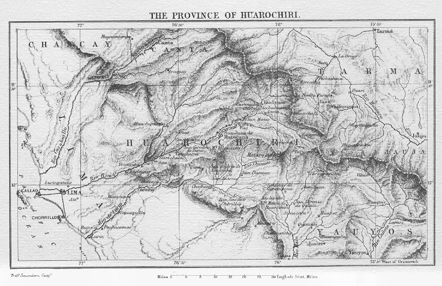

[Sacred-Texts](../../../index) [Native
American](../../index) [Inca](../index) [Index](index) [Previous](rly2) [Next](rly4)

------------------------------------------------------------------------

p. 121

## A NARRATIVE OF THE ERRORS, FALSE GODS, AND OTHER SUPERSTITIONS AND DIABOLICAL RITES IN WHICH THE INDIANS OF THE PRO- VINCES OF HUAROCHIRI, MAMA, AND CHACLLA LIVED IN ANCIENT TIMES, AND IN WHICH THEY EVEN NOW LIVE, TO THE GREAT PERDITION OF THEIR SOULS.

 

COLLECTED

By the Doctor Francisco de Avila, Presbyter (Cura of the parish of  
San Damian in the said province of Huarachiri, and vicar of the three  
above mentioned), from trustworthy persons who, with special
diligence,  
ascertained the whole truth, and that, before God enlightened them,  
they lived in the said errors, and performed these ceremonies. It is
an  
agreeable subject and well worthy to be understood, that the great  
blindness in which those souls walk, who have not the light of faith,  
nor desire to admit it to their understandings, may be known.  
At present nothing more is given than the narrative, but our  
Lord will thus be well served if the said illustrious  
Doctor, God sparing his life, would adorn it with  
reflections and interesting notes.  

In the year 1608.

p. 122

 *Chauca-chiipita* was the name of the Indian we found with the new
shirt; and the cloaks show whether they are of *Masnu-yauri* or
*Carhua-yalli*.

 *Conopa* is the general name for all the small stone idols that we
found.

 *Uncuraya* is the name of the jar with the figure of the Devil. They
used it in the feast of *Massuma*.

 *Chellcascayu* is the idol that we went to search for.

{facing page 123}

p. 123

### CHAPTER I.

> Of the first and most ancient God of these people,
> and how the men of these provinces say that, in ancient times, it was
> a very hot country, and how afterwards some other idols were adopted,
> after the first.

IT is a most ancient tradition that, before
any other event of which there is any memory, there were certain huacas
or idols, which, together with the others of which I shall treat, must
be supposed to have walked in the form of men. These huacas were called
*Yananamca Intanamca*; and in a certain encounter they had with another
huaca called *Huallallo Caruincho*, they were conquered and destroyed by
the said *Huallallo*, who remained as Lord and God of the land. He
ordered that no woman should bring forth more than two children, of
which one was to be sacrificed for him to eat, and the other,—whichever
of the two the parents chose,—might be brought up. It was also a
tradition that, in those days, all who died were brought to life again
on the fifth day, and that what was sown in that land also sprouted,
grew, and ripened on the fifth day; and that all these three provinces
were then a very hot country, which the Indians call *Yunca* or *Ande*;
and they say that these crops were made visible in the deserts and
uninhabited places, such as that of Pariacaca and others; and that in
these Andes there was a great variety of most beautiful and brilliant
birds, such as macaws, parrots, and others. All this, with the people
who then inhabited the land (and who, according to their account, led
very evil lives), and the said idol, came to be driven away to other
Andes by the idol Pariacaca, of whom I shall speak presently, and of the
battle he had with this *Huallallo Carrincho*.

p. 124

 It is also said that there was another idol called *Coniraya*, of which
it is not known certainly whether it existed before or after the rise of
*Pariacaca*. It is, however, certain that it was invoked and reverenced
almost down to the time when the Spaniards arrived in this land. For
when the Indians worshipped it they said, *"Coniraya Uiracocha* (this
name is that which they gave, and still give, to the Spaniards), thou
art Lord of all: thine are the crops, and thine are all the people." In
commencing any arduous or difficult undertaking, they threw a piece of
coca (a well-known leaf) on the ground, as an oblation, and said, "Tell
me, O Lord *Coniraya Uiracocha*, how I am to do this?" The same custom
prevailed among the weavers of cloths, when their work was toilsome and
difficult. This invocation and custom of calling the idol by the name of
Uiracocha certainly prevailed long before there were any tidings of
Spaniards in the country. It is not certain whether *Coniraya* or
*Pariacaca* were first; but as it is more probable that *Coniraya* was
the more ancient, we will first relate his origin and history, and
afterwards that of *Pariacaca*.

------------------------------------------------------------------------

### CHAPTER II.

> In which the account of *Coniraya* is continued,
> and how he became enamoured of the goddess *Cavillaca*, and of other
> things which are worthy to be known,

 They say that in most ancient times the Coniraya Uiracocha appeared in
the form and dress of a very poor Indian clothed in rags, insomuch that
those who knew not who he was reviled him and called him a lousy wretch.
They say that this was the Creator of all things; and that, by his word
of command, he caused the terraces and fields to be formed on the steep
sides of ravines, and the sustaining walls to rise up and supporl them.
He also made the p. 125 irrigating channels
to flow, by merely hurling a hollow cane, such as we call a cane of
Spain; and he went in various directions, arranging many things. His
great knowledge enabled him to invent tricks and deceits touching the
*huacas* and idols in the villages which he visited. At that time they
also say that there was a woman who was a *huaca*. Her name was
Cavillaca, and she was a most beautiful virgin, who was much sought
after by the *huacas*, or principal idols, but she would never show
favour to any of them. Once she sat down to weave a mantle at the foot
of a *lucma* tree, when the wise Coniraya succeeded in approaching her
in the following manner: He turned himself into a very beautiful bird,
and went up into the lucma tree, where he took some of his generative
seed and made it into the likeness of a ripe and luxurious *lucma*,
which he allowed to fall near the beautiful Cavillaca. She took it and
ate it with much delight, and by it she was made pregnant without other
contact with man. When the nine months were completed she conceived and
bore a son, herself remaining a virgin; and she suckled the child at her
own breast for a whole year without knowing whose it was nor how it had
been engendered. At the end of the year, when the child began to crawl,
Cavillaca demanded that the *huacas* and principal idols of the land
should assemble, and that it should be declared whose son was the child.
This news gave them all much satisfaction, and each one adorned himself
in the best manner possible, combing, washing, and dressing in the
richest clothes, each desiring to appear brighter and better than the
rest in the eyes of the beautiful Cavillaca, that so she might select
him for her spouse and husband. Thus there was an assembly of false gods
at Anchicocha, a very cold inhospitable spot between the villages of
Chorrillo and Huarochiri, about half way. When they were all seated in
their order, Cavillaca addressed them as follows: "I have invited you to
assemble p. 126 here, O worthies and
principal persons, that you may know my great sorrow and trouble at
having brought forth this child that I hold in my arms. It is now aged
one year: but I know not, nor can I learn, who was its father. It is
notorious that I have never known man nor lost my virginity. Now that
you are all assembled, it must be revealed who made me pregnant, that I
may know who did this harm to me, and whose son is this child." They
were all silent, looking at each other, and waiting to see who would
claim the child, but no one came forward. They say that, in this
assembly, in the lowest place of all, sat the god Coniraya Uiracocha in
his beggar's rags; and the beautiful Cavillaca scarcely looked at him,
when she addressed the gods; for it never entered into her head that he
was the father. When she found that all were silent, she said:—"As none
of you will speak, I shall let the child go, and doubtless his father
will be the one to whom he crawls, and at whose feet he rests." So
saying, she loosed the child, who crawled away, and, passing by all the
others, he went to where was his father Coniraya in his rags and dirt,
and when the child reached him, it rejoiced and laughed, and rested at
his feet.

 This conduct caused Cavillaca great shame and annoyance, and she
snatched up the child, exclaiming:—"What disgrace is this that has come
upon me, that a lady such as I am should be made pregnant by a poor and
filthy creature." Then she turned her back and fled away towards the
seashore. But Coniraya Uiracocha desired the friendship and favour of
the goddess, so, when he saw her take her flight, he put on magnificent
golden robes, and, leaving the astonished assembly of gods, he ran after
her, crying out:—"O my lady Cavillaca, turn your eyes and see how
handsome and gallant am I," with other loving and courteous words; and
they say that his splendour illuminated the whole country, Yet the
disdainful Cavillaca would not turn her head, but rather increased her
speed, saying:—"I have p. 127 no wish to see
any one, seeing that I have been made pregnant by a creature so vile and
filthy."[1](#page_127_note_1) She
disappeared, and came to the sea coast of Pachacamac, where she entered
the sea with her child, and was turned into a rock. They say that the
two rocks may still be seen, which are mother and child. Coniraya
continued the pursuit, crying out, and saying, "Stop! stop! lady. Turn
round and look! where are you, that I cannot see you?" As he ran, he met
a condor, to whom he said:—"Brother, tell me whether you encountered a
woman with such and such marks?" The condor answered:—"I saw her very
near this place, and if you go a little faster, you will certainly
overtake her." To whom Coniraya, rejoicing at the good news, thns made
reply, blessing the condor, and saying:—"You shall live for ever, and I
give you power to go whithersoever you please, to traverse the
wildernesses and valleys, to search the ravines, to build where you
shall never be disturbed; and I grant you the faculty of eating all
things that you find dead, such as huanacu, llamas, lambs, and even when
they are not dead but merely neglected by their owners, you shall have
power to kill and eat them. I further declare that he who kills you
shall himself be killed."

 Coniraya then continued his journey, and met a small fox of the kind
that emits a strong odour, and asked him the same question touching
Cavillaca. The fox answered that it was in vain for him to run fast, to
seek, or to follow, because the goddess was now far off, and he could
not overtake her. Then Coniraya cursed the fox, saying:—"As a punishment
for the bad news you have given me, I command that you shall never go
abroad but at night, that a bad smell shall always come from you, and
that men shall persecute and hate you."

 The god went on and met a lion which, in reply to his p. 128 question, told him that he was very near the
goddess Cavillaca, and that if he made a little more haste he would
overtake her. This good news pleased the sage, and he blessed the lion,
saying:—"You shall be respected and feared by all, and I assign to you
the office of punisher and executioner of evil doers, you may eat the
llamas of sinners, and after your death you shall still be honoured; for
when they kill you and take your skin they shall do so without cutting
off the head, which they shall preserve, with the teeth, and eyes shall
be put in the sockets so as to appear to be still alive. Your feet shall
remain hanging from the skin with the tail, and, above all, those who
kill you shall wear your head over their own, and your skin shall cover
them. This shall they do at their principal festivals, so that you shall
receive honour from them. I further decree that he who would adorn
himself with your skin, must kill a llama on the occasion, and then
dance and sing with you on his back."

 After having given the lion this blessing, he continued his journey and
met a fox, which said that his running was useless, for that the lady
was far off, and it was impossible to overtake her. In payment for such
news, the wise Coniraya pronounced the following curse:—"I command that
you shall be hunted from afar, and then when the people see you, even at
a great distance, they shall come out and hunt you; and when you die you
shall be of no account, and no one shall take the trouble to use your
skin, or to raise you from the ground."

 He then met a falcon, which said that the lady Cavillaca was very near;
so Coniraya declared that the falcon should be highly esteemed, that in
the morning it should breakfast on the *alquenti*,[2](#page_128_note_2) which is a very delicate
and beautiful little bird living on the honey within the flowers (I do
not know its name in Spanish),[3](#page_128_note_3) and during the day that
it should p. 129 eat any other bird it
choose; and that he who killed it should also kill a llama in its
honour; and that when he came out to sing and dance at the festivals, he
should have the falcon's skin on his head.

 Next he met some parrots that gave him bad news; so he declared that
they should always give out cries and shrieks, and that, as they said
the lady was far off, they should be heard from afar; that when they
wished to feed they should not be safe, for their own cries should
betray them, and that they should be hated by all people.

 Thus he rewarded and granted privileges to all the animals that gave
him news that accorded with his wishes, and cursed all those whose
tidings were not agreeable to him.

 When he reached the sea-shore he found that Cavillaca and her child
were turned into stone; and as he walked along the beach he met two
beautiful young daughters of Pachacamac, who guarded a great serpent,
because their mother was absent, visiting the recently arrived Cavillaca
in the sea. The name of this wife of Pachacamac was *Urxayhuachac*.[4](#page_129_note_4) When Coniraya found
these girls alone without their mother, he did not care for the serpent,
which he could keep quiet by his wisdom; so he had intercourse with the
elder sister, and desired to do the same with the younger, but she flew
away in the shape of a wild pigeon (called by the Indians *urpi*); hence
the mother of these girls was called *Urpi-huachac*, or mother of the
doves.

 In those days it is said that there were no fishes in the sea, but that
this *Urpi-huachac* reared a few in a small pond. Coniraya was enraged
that Urpi-huachac should be absent in the sea, visiting Caviliaca; so he
emptied the fishes out of her pond into the sea, and thence all the
fishes now in the sea have been propagated. Having done this, Coniraya
continued his flight along the coast. When the mother of p. 130 the girls returned they told her what had
happened, and she pursued Coniraya in a great fury, calling out, until
at last he determined to stop and wait for her. Then she addressed him
with loving and tender words, saying,—"Coniraya, do you wish that I
should comb your head and pick out the lice?" So he consented, and
reclined his head on her lap; but while she was pretending to do this,
she was forming a rock over which she might hurl him when he was off his
guard. He knew this through his great wisdom, and told her he must
retire for a few minutes. She agreed to this; and he went back to the
land of Huarochiri, where he wandered about for a long time, playing
tricks both to whole villages and to single men or women. The end of
this *huaca* will be related presently.

 The above traditions are so rooted in the hearts of the people of this
province at the present time that they preserve them most inviolably;
and thus they hold the condors to be sacred, and never kill one,
believing that he who kills one will die himself. I know that there was
a condor in the ravine of San Damian, near the bridge, which was unable
to fly from extreme old age; but there was not an Indian who would touch
it, and it lived there for thirteen or fourteen years. When I had killed
some of these condors, the people asked me how it was that I dared to do
so, but I did not understand why they should ask the question until I
had heard this fable. They also have a great horror of the small fox;
and they do to the lion all that was ordained in the blessing of
Coniraya, bringing out the skin on great occasions, while he who owns it
kills a llama. I have often seen this done in my own parish in
Huarochiri, on occasion of the drinking bouts called
*Huantachinaca*.[5](#page_130_note_5)

 Also as regards the fox, I have seen, in the village of San Juan, near
that of Santa Ana, because one man cried out p.
131 that he saw a fox, the whole village turned out, and ran in
chase of it without knowing where it was, but all following the first,
and I after them to see what was the matter. I have seen this happen
twice in that village, and the same custom prevails in the others.

 As to the falcon, there is scarcely a festival in which one does not
appear on the heads of the dancers and singers; and we all know that
they detest the parrots, which is not wonderful considering the mischief
they do, though their chief reason is to comply with the tradition.

 Who will not grieve at the blindness of these poor people, and at the
small fruit which the preaching of the Catholic truth has borne during
so many years. Yet they can neither plead ignorance, nor can they
complain that they have not been taught. It is true that in some
parishes the priests have been negligent in teaching, but in others it
is not so; and we have seen that the people are as much and more
attached to their errors in those parishes where the preaching has been
attended to, as in those where it has been neglected.

------------------------------------------------------------------------

### CHAPTER III.

> Of an eclipse of the Sun which is said to have
> taken place in ancient times.

 In all the stories and fables of these people I have never been able to
make out which came first, or in what order they should be placed, for
they are all very ancient traditions. They relate that, a long time ago,
the sun disappeared and the world was dark for a space of five days;
that the stones knocked one against the other; and that the mortars,
which they call *mutca*, and the pestles called *marop*, rose against
their masters, who were also attacked by their sheep, both those
fastened in the houses and those in the fields. This p. 132 may have been the eclipse which occurred
when our Redeemer died; but I cannot clearly make this out, for when it
was day in that hemisphere it was night here, so that here the eclipse
would have taken place at night. The rest of the story consists of lies,
for, as these people had no watches, how could they tell that the sun
was absent for five days, seeing that we count days by the absence and
presence of the sun?

------------------------------------------------------------------------

### CHAPTER IV.

> Of a deluge which is said to have taken place;
> with a refutation of all the preceding fables.

 It is necessary to go back a step in this chapter, for this should be
the third, and the preceding chapter the fourth. For what I have to
mention here is a saying of the Indians which is more ancient than the
eclipse. They relate that there was nearly an end to the world, which
happened in the following way: An Indian was tethering his llama in a
place where there was good pasture, and the animal resisted, showing
sorrow and moaning after its manner, which it does by crying *yu’ yu’*.
The master, who happened to be eating a *choclo*, observing this, threw
the core (which they call *coronta*) at the llama, saying, "Fool, why do
you moan and refrain from eating? Have I not put you where there is good
pasture?" The llama thus replied: "Madman! what do you know, and what
can you suppose? Learn that I am not sad without good cause; for within
five days the sea will rise and cover the whole earth, destroying all
there is upon it." The man, wondering that his llama should speak,
answered it by asking whether there was any way by which they could save
themselves. The llama then said that the man must follow it quickly to
the summit of a high mountain p. 133 called
Villca-coto, which is between this parish[6](#page_133_note_6) and San Geronimo de
Surco, taking with him food for five days, and that he might thus be
saved. The man did as he was told, carrying his load on his back and
leading the llama, and he arrived on the summit of the mountain, where
he found many different kinds of birds and animals assembled. Just as he
and his llama reached the top the sea began to rise, and the water
filled the valleys and covered the tops of the hills, except that of
Villca-coto; but the animals were crowded together, for the water rose
so high that some of them could hardly find foothold. Among these was a
fox, whose tail was washed by the waves, which they say is the reason
that the tips of foxes' tails are black. At the end of five days the
waters began to abate, and the sea returned to its former bounds; but
the whole earth was without inhabitants except that solitary man, from
whom, they say, descend all the people who now exist. This is a notable
absurdity, for they do not say that any woman was saved; and they make
out that the man had intercourse with some devil; and, as the
commentator of the books of the city of God (Lib. xv. cap. 23) says,
they glory and rejoice, like some others of those times, at being the
sons of a demon. The Egyptians denied that a man could have connection
with a demon, though they affirmed that it was possible with a female
demon; but the Greeks related stories of many men having been, with this
object, beloved by the Devil, such as Hyacynto, Phæbus, Hypolito, all of
whom the Devil loved.

 According to the most certain and true opinion there could not have
been inhabitants in this land before the universal deluge; for as it is
certain that all men sprang from our father Adam, and that in the period
between Adam and Noah so wide a dispersion could not have taken place,
how is it possible that these Indians can have had p. 134 any knowledge of the deluge? They declare
that, in the days of Coniraya Uiracocha, their country was *yunca*, and
that the crops ripened in five days. This is also impossible, for the
situation of this province is the same as that of all the country which
slopes from the snowy chain of mountains to the sea, from Pasto to
Chile, a distance of more than twelve hundred leagues. If this small
portion was ever *yunca*, the whole of the rest of that region which
slopes towards the sea must also have been *yunca*, which the people
deny; therefore this district cannot have been so. For there cannot have
been a change of climate affecting this small district without breaking
the chain of mountains, and then continuing it again, which is absurd.
How, too, could they know this if, as they say, it was before the
deluge, when there can then have been no inhabitants; and if the deluge,
as is certain, destroyed all, including even the llama on
Vilica-coto?[7](#page_134_note_7)

 It is certain that there were no inhabitants in this land until many
days and years after the deluge; for it was necessary that the
descendants of those who were saved in the ark should spread themselves
to the new world, and it is certain that they cannot have handed down
these fables to their sons. It follows that the Devil, who has been so
great a lord over these people, made them believe in lies, and in the
matter of the deluge told them about the llama that spoke, the fox that
wetted its tail, and the other stories. If any Indian would object that,
if there was no *yunca* in Parracaca, how is it that there are remains
and ruins of farms and cultivation? I reply that, God permitting, the
Devil could easily make those terraces to deceive those who, leaving the
natural light of God, served him.

------------------------------------------------------------------------

p. 135

### CHAPTER V.

> Relates who was Huathiacuri, and howa certain man
> made himself a God, and perished; also of the origin of Pariacaca and
> his brothers.

 We have related the most ancient traditions of these people, and how
they assert that, after the deluge, they were all descended from that
one man. It must now be understood that in the time after the deluge, in
every district, the Indians chose the richest and most valiant man among
them for their leader, and this period they call *Purunpacha*,[8](#page_135_note_8) which means the time
when there was no king. They say that in those days there appeared five
large eggs on a mountain between Huarochiri and Chorrillo, towards the
south, (and this is the origin of *Pariacaca*) called Condorcoto. At
that time there lived a poor and ill-clad Indian named *Huathiacuri*,
who, they say, was a son of Pariacaca, and who learnt many arts from his
father. They say that he was called Huathiacuri because his food was all
*huatyasca*, which means parboiled, not properly cooked, or, as we say
here, roasted "*en barbacoa*." Being poor, he could afford nothing
better. At the same time they say that a very rich and great lord had
his house on Anchicocha, about a league and a half from the place where
the five eggs appeared. His house was very richly and curiously adorned,
for the roof was made of the yellow and red feathers of certain birds,
and the walls were covered with similar and even more curious materials.
This lord had a great number of llamas—some red, others blue and yellow
and of other bright colours, so that, to make mantles, it was
unnecessary to dye the wool, and he had many other kinds of riches. For
these reasons people came to him from all directions to pay their
respects; and he made himself to be very wise, even saying that he was
the God and Creator. But at last p. 136 a
great misfortune befell him, which was that he fell sick of a tedious
and disgusting disease, and everybody wondered that a man who was so
wise and rich, and was a God and Creator, should be so ill and be unable
to cure himself. So they began to murmur against him. During all this
time the pretended God did not fail to seek for remedies, trying various
cures, procuring extraordinary medicines, and sending for all who had
any knowledge of the healing art. But all was of no avail, and there was
no man who understood either the disease or the cure. At this time they
say that Huathiacuri journeyed towards the sea, and slept on that
height, called Latallaco, where the ascent commences in going from Lima
to Cienequilla. While he was there he saw a fox going towards the sea,
and another coming from the coast towards Anchicocha. The one coming
from the sea asked the other whether there was any news, and the other
answered that "all was well except that the rich man was very sick, and
was taking extraordinary pains to get cured, and to assemble learned men
who could tell him the cause of his illness, and that no one understood
it. But," added the fox, "the real cause is that, when his wife was
toasting a little maize, one grain fell on her skirt, as happens every
day. She gave it to a man who ate it, and afterwards she committed
adultery with him. This is the reason that the rich man is sick, and a
serpent is now hovering over his beautiful house to eat it, while a toad
with two heads is waiting under his grinding-stone with the same object.
But no one knows this," concluded the fox; and it then asked the other
fox whether it had any news. The other fox replied that a very beautiful
daughter of a great chief was dying for having had connection with a
man. But this is a long story, which I shall tell presently; and now we
will return to the proceedings of Huathiacuri.

 Having heard what the foxes said, he went to the place where the rich
man was lying sick, and, with much dissimulation, p.
137 he asked a young and beautiful girl (who, with another elder
sister already married, was daughter to the sick God) if any one was
ill. She said, "Yes, my father is sick." He replied: "If you will
consent to show me favour and to love me, I will cure your father." The
name of this girl is not known, although some say that she is the same
who was called *Chaupiñaca*. But she did not wish to consent, so she
went to her father and told him that a dirty ragged man said he could
cure him. Then all the wise men who were assembled laughed heartily,
saying that none of them could effect a cure, and how much less could
this poor wretch succeed. But the sick man, by reason of his earnest
desire to be cured, did not refuse to place himself in the hands of the
stranger, and ordered that he should be called in, whoever he might be.
He entered, and said that he could certainly effect a cure if the sick
man would give his young daughter to him for a wife. The sick man
replied that he would willingly do so; which the husband of his elder
daughter took very ill, holding it to be a shame that his sister-in-law
should be the wife of so poor a man, who would thus appear to be the
equal of himself, being rich and powerful. The contention between these
two will be related presently.

 The wise Huathiacuri commenced the cure by saying—"Do you know that
your wife has committed adultery, and that this is the reason of your
sickness? Do you know that there are two great serpents above your house
waiting to eat you? and that there is a toad with two heads underneath
that grind-stone? Before everything else we must kill those animals, and
then you will begin to recover your health. But, when you are well, you
must worship and reverence my father, who will appear before many days,
for it is quite clear that you are neither God nor Creator. If you were
God you would not be ill, nor would you be in need of a cure." The sick
man and those who stood round were astonished. p.
138 The wife said that the accusation against her was a wicked
lie, and she began to shout with rage and fury. But the sick man was so
desirous to be cured that he ordered search to be made, and they found
the two serpents on the top of the house and killed them. Then the sage
reminded the wife that when she was toasting maize one grain had fallen
on her skirt; that she had given it to a man; and that afterwards she
had committed adultery with him. So she confessed. The sage then caused
the grindstone to be raised, and there hopped from underneath a toad
with two heads, which went to a spring that now flows by Anchicocha,
where they say that it still lives, making those who go to it lose their
way, and become mad, and die. Having done all this, the sick man became
well, and the wise Huathiacuri enjoyed the girl. They say that he
generally went once a day to that mountian of Condorcoto where were the
five eggs, round which a wind blew, and they say that before this there
was no wind. When the sage wanted to go to Condorcoto, the sick man, now
recovered, gave him his daughter to take with him, and there the pair
enjoyed themselves much to their own satisfaction.

 To return to the brother-in-law of the girl, that rich man who, as we
have said, was displeased that she should be given to Huathiacuri,—he
was very angry when he was told that Huathiacuri had enjoyed her, and
declared that he was a poor wretch and not a sage. He resolved to make
others think this. So one day he said to Huathiacuri, "Brother, I am
concerned that you, as my brother-in-law, should be ragged and poor,
when I am so rich and powerful and so honoured by the people. Let us
choose something at which we may compete, that one may overcome the
other." Huathiacuri accepted the challenge. Then he took the road to
Condorcoto, and went to the place where his father Pariacaca was in one
of the eggs, and told him what had taken place. Pariacaca said that it
was well to accept any challenge, p. 139 and
that he should come back and tell him what it was. So with this advice
Huathiacuri returned to the village.

 One day his brother-in-law said—"Now let us see which can vanquish the
other in drinking and dancing on such a day." So Huathiacuri accepted
the challenge, and posted off to his father Pariacaca, who told him to
go to a neighbouring mountain, where he would turn into a dead huanacu.
Next morning a fox with its vixen would come to the place, bringing a
jar of chicha on her back, while the fox would have a flute of many
pipes called *astara*. These would have to approach Pariacaca, because
the object of their coming was to give him drink, and to play and dance
a little; but when they should see the dead huanacu on the road, they
would not wish to lose the opportnnity of filling their stomachs; and
that they would put down the chicha, the drum, and the flute, and would
begin to eat; that then he would come to himself and return to his own
shape, and begin to cry aloud, at which the foxes would take to flight,
and that he would then take the things they had left behind, and might
be sure of victory in the challenge with his brother-in-law.

 All this happened as Pariacaca had said; and Huathiacuri went to the
place where his brother-in-law was drinking to those who stood round
with great quantities of chicha, and was dancing with many of his
friends. His drums were beaten by more than two hundred women. While
this was going on Huathiacuri entered with his wife, dancing with her,
and she charging his cup and playing on a drum. At the first sound of
her drum the whole earth began to shake, as if it was keeping time to
the music, so that they had the advantage of the rich man, for not only
the people but the earth itself danced. Presently they went to the place
where they kept the drinking bouts, and the brother-in-law and all his
friends came to beat Huathiacuri in drinking, thinking p. 140 that it was impossible for him to drink
alone as much as the rich man and all his friends. But they were
deceived, for he drank all they gave him without showing a sign of
having had enough. Then he rose and began to drink to those who were
seated, his wife filling the cups with chicha from the fox's jug. They
laughed, because they thought that before he had given cups to two of
them the jug would be empty; but the chicha never failed, and each man
that drank fell down in a state of intoxication. So in this also he came
out as a conqueror.

 When the brother-in-law saw how badly he came out of this encounter he
determined to try another, which was that each should come dressed in
festive attire, with splendid plumes of various colours. Huathiacuri
accepted this challenge also, and went for help to his father Pariacaca,
who dressed him in a shirt of snow, and so he vanquished his
brother-in-law once more.

 Then the brother-in-law challenged him once more, saying that people
should now see who could enter the public square, with the best
lion-skin on his shoulders, for dancing. Huathiacuri went again to his
father Pariacaca, who sent him to a fountain, where he said he would
find a red lionskin with which to meet the challenge; and when he
entered the square, men saw that there was a rainbow round the lion's
head; so Huathiacuri again obtained a victory.

 Still the conquered brother-in-law was determined to have a final
trial. This was a challenge for each to build a house in the shortest
time and in the best manner. Huathiacuri accepted it; and the rich man
at once began to collect his numerous vassals, and in one day he had
nearly finished the walls, while Huathiacuri, with only his wife to help
him, had scarcely begun the foundations. During the night the work of
the rich man was stopped, but not that of Huathiacuri. For, in perfect
silence, an infinite number of birds, snakes, and lizards completed the
work, so that in p. 141 the morning the house
was finished, and the rich man was vanquished, to the great wonder of
all beholders. Then a great multitude of huanacus and vicuñas came next
day laden with straw for the roof; while llamas came with similar loads
for the rich man's roof. But Huathiacuri ordered an animal that shrieks
loudly, called *oscollo*,[9](#page_141_note_9) to station itself at a
certain point; and it suddenly began to scream in such a way as to
terrify the llamas, which shook off their loads, and all the straw was
lost.

 At the end of this competition Huathiacuri, by advice of his father
Pariacaca, determined to put an end to the affair; so he said to the
rich man, "Brother, now you have seen that I have agreed to everything
that you have proposed. It is reasonable, therefore, that you should now
do the same; and I propose that we should both see who dances best, in a
blue shirt with a white cotton *huara* round the loins. The rich man
accepted the challenge, and, as usual, was the first to appear in the
public square, in the proposed dress. Presently Huathiacuri also
appeared, and, with a sudden shout, he ran into the place where the
other was dancing; and he, alarmed at the cry and the sudden rush, began
to run, insomuch as, to give him more speed, he turned, or was turned by
Huathiacuri, into a deer. In this form he came to Anchicocha, where,
when his wife saw it, she also rose up saying, "Why do I remain here? I
must go after my husband and die with him." So she began to run after
him, and Huathiacuri after both. At last Huathiacuri overtook the wife
in Anchicocha, and said to her, "Traitress! it is by your advice that
your husband has challenged me to so many proofs, and has tried my
patience in so many ways. Now I will pay you for this by turning you
into a stone, with your head on the ground and your fect in the air."
This happened as he said, and the stone is there to this day; and the
Indians go there to p. 142 worship and to
offer coca, and practise other diabolical superstitions. Thus the woman
was stopped; but the deer ran on and disappeared, and it maintained
itself by eating people; but after some time the deer began to be eaten
by men, and not men by deer.

 They say that those five eggs in Condorcoto, one of which contained
Pariacaca, opened, and five falcons issued from them, who were presently
turned into five men, who went about performing wonderful miracles; and
one was that the rich Indian, whom we have mentioned in this chapter as
having pretended to be God, perished, because Pariacaca and the others
raised a great storm and a flood which carried him and his house and
wife and family away into the sea. The site of this man's house is
between two very lofty mountains, the one called *Vicocha*, near the
parish of *Chorrillo*, and the other *Llantapa*, in the parish of *San
Damian*, and between them flows the river of Pachacamac. There was a
sort of bridge, consisting of a great tree called *pullao*, forming a
most beautiful arch from one hill to the other, where a great variety of
parrots and other birds passed to and fro. All this was swept away by
the flood.

------------------------------------------------------------------------

### CHAPTER VI.

 Having come forth from the five eggs with his four brothers, and having
caused the above tempest, Pariacaca aspired to perform great and mighty
deeds throughout the world, though the region he traversed did not
exceed twenty leagues in circuit. Especially he conceived the idea of
encountering the valiant Caruyuchu Huayallo, to whom they sacrificed
children, as we have related in the first chapter. So Pariacaca went in
search of Caruyuchu, of whose end and defeat I shall speak presently;
but first I must relate what happened to Pariacaca on the road.

p. 143

 On his way from Condorcoto to the residence of Caruyuchu, he came to
the place where now stands the village of Santa Maria de Jesus de
Huarochiri, at the bottom of the ravine in which the river flows, and by
which one goes to the parish of Quinti.[1](#page_143_note_1) Here there was a village
called Huagaihusa, where they were celebrating a great festival. It is
to be noted that all this country was then *yunca*, with a hot climate,
according to the false opinion of the Indians. Pariacaca entered the
place, where all the people were drinking, in the dress of a poor man,
and he sat down with the others, but at the end of all, as is the custom
with those who are not invited. But no man drank to him nor gave him to
drink during the whole day. Seeing this, a girl was moved with pity and
compassion, and she said, "How is it that no one gives a drink to this
poor man or takes any notice of him?" and she put a good draught of
chicha into one of those large white calabashes called by the Indians
*putu*, and took it to Pariacaca, who received it with thanks, and told
her she had done a very good deed, and had gained his friendship.
"This," he added, "is worth to you the same as your life, for at the end
of five days wonderful things will happen in this place, and none of the
inhabitants shall remain alive, for their neglect has enraged me. You
must put yourself in safety on that day, with your children, that you
may not share their fate; but if you reveal this secret to any other
inhabitant of the village, your death is also inevitable."

 The woman was thankful at receiving this warning, and on the fifth day
she took good care to go far away from the village with her children,
brothers, and relations; leaving the rest of the inhabitants off their
guard, and still engaged in drinking and feasting. But the enraged
Pariacaca had ascended a high mountain called Matro-coto, which
overhangs the village of Huarochiri, and below which there is p. 144 another mountain peak called Puipu-Huana,
which is on the road from San Damian to Huarochiri. Then an enormous
quantity of rain began to fall, with hail and yellow and white stones,
which carried the village away into the sea, so that no man escaped.
This flood is still a tradition among the people of Huarochiri, and some
high banks were left, which may be seen before arriving at the village.
Having completed this work, Pariacaca, without speaking to anyone in the
other villages, or communicating with them, crossed over to the other
side of the river, where he did what I shall describe in the following
chapter.

------------------------------------------------------------------------

### CHAPTER VII.

> How Pariacaca gave water in abundance to the
> Indians of the Ayllu Copara, for their fields; how he became enamoured
> of Choque Suso, an idol which is still very famous.

 Having crossed the river, Pariacaca travelled over the fields which now
belong to the Ayllu Copara, and which then were in great want of water
for irrigation. They did not then procure it from the river, but from a
spring on the mountain called Sienacaca, which overhangs the village now
called San Lorenzo.[2](#page_144_note_2)
A large dam was built across this spring, and other smaller dams were
thrown across it lower down, by which means the fields were irrigated.
In those days there was a very beautiful girl belonging to the Ayllu
Copara, who, seeing one day that the maize crop was drying up for want
of water, began to weep at the small supply that came from one of the
smaller dams she had opened. Pariacaca happened to be passing by, and,
seeing her, he was captivated by her charms. He went to the dam, and
taking off his *yacolla* or cloak, he used it to stop p. 145 up the drain that the girl had made. He then
went down to where she was trying to irrigate the fields, and she, if
she was afflicted before, was much more so now, when she found that
there was no water flowing at all. Pariacaca asked her, in very loving
and tender words, why she was weeping, and she, without knowing who he
was, thus answered:—"My father, I weep because this crop of maize will
be lost and is drying up for lack of water." He replied that she might
console herself and take no further thought, for that she had gained
what he had lost, namely, his love; and that he would make the dam yield
more than enough water to irrigate her crop. Choque-suso told him first
to produce the water in abundance, and that afterwards she promised
willingly to yield to his wishes. Then he went up to the dam, and, on
opening the channel, such a quantity of water flowed out, that it
sufficed to irrigate the thirsty fields, and to satisfy the damsel. But
when Pariacaca asked her to comply with her promise, she said that there
was plenty of time to think about that. He was eager and ardent in his
love, and he promised her many things, among others to conduct a channel
from the river which should suffice to irrigate all the farms. She
accepted this promise, saying that she must first see the water flowing,
and that afterwards she would let him do what he liked.

 He then examined the country, to see whence he could draw the water;
and he observed that above the site of the present village of San
Lorenzo (in which that Ayllu Copara now resides) a very small rill came
from the ravine of *Coca-challa*, the waters of which did not flow
beyond a dam which had been thrown across it. By opening this dam and
leading the water onwards, it appeared to Pariacaca that it would reach
the farms of the Ayllu Copara, where were the fields of his lady-love.
So he ordered all the birds in those hills and trees to assemble,
together with all the snakes, lizards, bears, lions, and other animals;
and to remove the p. 146 obstruction. This
they did; and he then caused them to widen the channel and to make new
channels until the water reached the farms. There was a discussion as to
who should make the line for the channel, and there were many pretenders
to this duty, who wished to show their skill as well as to gain the
favour of their employer. But the fox managed, by his cunning, to get
the post of engineer; and he carried the line of the canal to the spot
just above the present site of the church of San Lorenzo. Then a
partridge came flying and making a noise like *Pich-pich*, and the
unconscious fox let the water flow off down the hill. So the other
labourers were enraged, and ordered the snake to take the fox's place,
and to proceed with what he had begun. But he did not perform the work
so well as the fox; and the people to this day deplore that the fox
should have been superseded, saying that the channel would have been
higher up and better, if this had not taken place: and because the
course of the channel is broken, just above the church, they say that is
the place where the fox let the water flow off, and which has never
since been repaired.

 Having brought the water to irrigate the farms in the way that is still
working, Pariacaca besought the damsel to keep her promise, and she
consented with a good grace, but proposed that they should go to the
summit of some rocks called *Yanacaca*.[3](#page_146_note_3) This they did, and there
Pariacaca obtained his desires, and she was well repaid for her love
when she knew who he was. She would never let him go anywhere alone, but
always desired to accompany him; and he took her to the head-works of
the irrigating channel, which he had constructed for her love. There she
felt a strong wish to remain, and he again consented, so she was
converted into a stone, while Pariacaca went up the mountains. Thus
Choque Suso was turned into a stone at the head of the channel, which is
called Cocochalla.

p. 147

 Above this channel there is another called *Vim-lompa*,[4](#page_147_note_4) where there is another
stone, into which they say *Coniraya* was turned.

------------------------------------------------------------------------

### CHAPTER VIII.

> How the Indians of the Ayllu of Copara still
> worship Choque Suso and this channel, a fact which I know not only
> from their stories, but also from judicial depositions which I have
> taken on the subject.

 (Here was to be added that which I saw, and the story of the hair of
*Choque Suso*, and the rest of the depositions that were taken,
concerning this irrigating channel.)

 

HERE THE MANUSCRIPT ENDS ABRUPTLY.

------------------------------------------------------------------------

[Next](rly4)

------------------------------------------------------------------------

### Footnotes

p. 127

[1](#page_127_fr_1) They say that the
word she used was *cachca-sapa*, which means "itchy".

p. 128

[2](#page_128_fr_2) *Ccenti*, the
humming bird.

[3](#page_128_fr_3) *Tominejo*.

p. 129

[4](#page_129_fr_4) *Urpi-huachac*.

p. 130

[5](#page_130_fr_5) Or *Ayrihua*. A
harvest dance. The *huantay-sara* was the fertile stalk of maize round
which the dance was performed.

p. 133

[6](#page_133_fr_6) San Damian.

p. 134

[7](#page_134_fr_7) The origin of the
tradition is clear enough. The people of Huarochiri originally came from
the coast, and hence they said that the land of their ancestors was hot.

p. 135

[8](#page_135_fr_8) See [page
70](rly2.htm#page_70).

p. 141

[9](#page_141_fr_9) A wild cat.

p. 143

[1](#page_143_fr_1) San Lorenzo de
Quinti.

p. 144

[2](#page_144_fr_2) San Lorenzo de
Quinti.

p. 146

[3](#page_146_fr_3) *Yana*, black.
*Caca*, a rock.

p. 147

[4](#page_147_fr_4) Corrupt.

 

 

 

 

 

 

 

 

 

 

 

 

 

 

 
