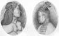

  
[Intangible Textual Heritage](../../../index)  [Native
American](../../index)  [Inuit](../index)  [Index](index) 
[Next](eft01) 

------------------------------------------------------------------------

[Buy this Book at
Amazon.com](https://www.amazon.com/exec/obidos/ASIN/0548624798/internetsacredte)

------------------------------------------------------------------------

  
*Eskimo Folk-Tales*, by Knud Rasmussen, \[1921\], at Intangible Textual
Heritage

------------------------------------------------------------------------

### frontispiece

  [  
Click to enlarge](img/000.jpg)

Man and wife from Angmagsalik.

------------------------------------------------------------------------

[Next: Title Page](eft01)
