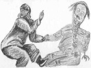

  
[Intangible Textual Heritage](../../../index.md)  [Native
American](../../index)  [Inuit](../index)  [Index](index.md) 
[Previous](eft26)  [Next](eft28.md) 

------------------------------------------------------------------------

[Buy this Book at
Amazon.com](https://www.amazon.com/exec/obidos/ASIN/0548624798/internetsacredte.md)

------------------------------------------------------------------------

  
*Eskimo Folk-Tales*, by Knud Rasmussen, \[1921\], at Intangible Textual
Heritage

------------------------------------------------------------------------

p. 82

### THE MAN WHO BECAME A STAR

THERE was once an old man who stood out on the ice waiting for the seal
to come up to their breathing holes to breathe. But on the shore, just
opposite where he was, a crowd of children were playing in a ravine, and
time after time they frightened away a seal just as he was about to
harpoon it.

 At last the old man grew angry with them for thus spoiling his catch,
and cried out:

 "Close up, Ravine, over those who are spoiling my hunting."

 And at once the hillside closed over those children at play. One of
them, who was carrying a little brother, had her fur coat torn. Then
they all fell to screaming inside the hill, for they could not come out.
And none could bring them food, only water that they were able to pour
down a crack, and this they licked up from the sides.

 At last they all died of hunger.

 And now the neighbours fell upon that old man who had shut up the
children by magic in the hill. He took to flight, and the others ran
after him.

 But all at once he became bright, and rose up to heaven as a great
star. We can see it now, in the west, when the lights begin to return
after the great darkness. But it is low down, and never climbs high in
the sky. And we call it Nâlaussartoq: he who stands and listens.[\*](#page_82_note_*.md)

### Footnotes

p. 82

[\*](#page_82_fr_*.md) The star is that
which we know as Venus. "Listening": perhaps as the old man had stood
listening for the breathing of the seal.

 

 

 

 

 

 

 

 

 

 

 

 

 

 

 

------------------------------------------------------------------------

[Next: THE WOMAN WITH THE IRON TAIL](eft28.md)
