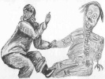

  
[Intangible Textual Heritage](../../../index.md)  [Native
American](../../index)  [Inuit](../index)  [Index](index.md) 
[Previous](eft44)  [Next](eft46.md) 

------------------------------------------------------------------------

[Buy this Book at
Amazon.com](https://www.amazon.com/exec/obidos/ASIN/0548624798/internetsacredte.md)

------------------------------------------------------------------------

  
*Eskimo Folk-Tales*, by Knud Rasmussen, \[1921\], at Intangible Textual
Heritage

------------------------------------------------------------------------

p. 117

### KÂGSSAGSSUK, THE HOMELESS BOY WHO BECAME A STRONG MAN

ONE day, it is said, when the men and women in the place had gone to a
spirit calling, the children were left behind, all in one big house,
where they played, making a great noise.

 A homeless boy named Kâgssagssuk was walking about alone outside, and
it is said that he called to those who were playing inside the house,
and said:

 "You must not make so much noise, or the Great Fire will come."

 The children, who would not believe him, went on with their noisy play,
and at last the Great Fire appeared. Little Kâgssagssuk fled into the
house, and cried:

 "Lift me up. I must have my gloves, and they are up there!"

 So they Iifted him up to the drying frame under the roof.

 And then they heard the Great Fire come hurrying into the house from
without. He had a great live ribbon seal for a whip, and that whip had
long claws. And then he began dragging the children out through the
passage with his great whip, and each time he drew one out, that one was
frizzled up. And at last there were no more.

 But before going away, the Great Fire reached up and touched with his
finger a skin which was hanging on the drying frame.

 As soon as the Great Fire had gone away, little Kâgssagssuk crawled
down from the drying frame and went over to the people who were gathered
in the wizard's house, and told them what had happened. But none
believed what he said.

 "You have killed them yourself," they declared.

 "Very well, then," he said, "if you think so, try to make a noise
yourselves, like the children did."

 And now they began cooking blubber above the entrance to the house, and
when the oil was boiling and bubbling as hard as it could, p. 118 they began making a mighty noise. And true
enough, up came the Great Fire outside.

 But little Kâgssagssuk was not allowed to come into the house, and
therefore he hid himself in the store shed. The Great Fire came into the
house, and brought with it the live ribbon seal for a whip. They heard
it coming in through the passage, and then they poured boiling oil over
it, and his whip being thus destroyed, the Great Fire went away.

 But from that time onward, all the people of the village were unkind to
little Kâgssagssuk, and that although he had told the truth. Up to that
time he had lived in the house of Umerdlugtoq, who was a great man, but
now he was forced to stay outside always, and they would not let him
come in. If he ventured to step in, though it were for no more than to
dry his boots, Umerdlugtoq, that great man, would lift him up by the
nostrils, and cast him over the high threshold again.

 And little Kâgssagssuk had two grandmothers; the one of these beat him
as often as she could, even if he only lay out in the passage. But his
other grandmother took pity on him, because he was the son of her
daughter, who had been a woman like herself, and therefore she dried his
clothes for him.

 When, once in a while, that unfortunate boy did come in, Umerdlugtoq's
folk would give him some tough walrus hide to eat, wishing only to give
him something which they knew was too tough for him. And when they did
so, he would take a little piece of stone and put it between his teeth,
to help him, and when he had finished, put it back in his breeches,
where he always kept it. When he was hungry, he would sometimes eat of
the dogs' leavings on the ground outside, finding there walrus hide
which even the dogs refused to eat.

 He slept among the dogs, and warmed himself up on the roof, in the warm
air from the smoke hole. But whenever Umerdlugtoq saw him warming
himself there, he would haul him down by the nostrils.

 Thus a long time passed, and it had been dark in the winter, and was
beginning to grow light near the coming of spring. And now little
Kâgssagssuk began to go wandering about the country. Once when he was
out, he met a big man, a giant, who was cutting up his catch, and on
seeing him, Kâgssagssuk cried out in a loud voice:

p. 119

 "Ho, you man there, give me a piece of that meat!"

 But although he shouted as loudly as he could, that giant could not
hear him. At last a little sound reached the big man's ears, and then he
said:

 "Bring me luck, bring me luck!"

 And he threw down a little piece of meat on the ground, believing it
was one of the dead who thus asked.

 But little Kâgssagssuk, who, young as he was, had already some helping
spirits, made that little piece of meat to be a big piece, just as the
dead can do, and ate as much as he could, and when he could eat no more,
there was still so much left that he could hardly drag it away to hide
it.

 Some time after this, little Kâgssagssuk said to his mother's mother:

 "I have by chance become possessed of much meat, and my thoughts will
not leave it. I will therefore go out and look to it."

 So he went off to the place where he had hidden it, and lo! it was not
there. And he fell to weeping, and while he stood there weeping, the
giant came up.

 "What are you weeping for?"

 "I cannot find the meat which I had hidden in a store-place here."

 "Ho," said the giant, "I took that meat. I thought it had belonged to
another one."

 And then he said again: "Now let us play together." For he felt kindly
towards the boy, and had pity on him.

 And they two went off together. When they came to a big stone, the
giant said: "Now let us push this stone." And they began pushing at the
big stone until they twirled it round. At first, when little Kâgssagssuk
tried, he simply fell backwards.

 "Now once more. Make haste, make haste, once more. And there again,
there is a bigger one."

 And at last little Kâgssagssuk ceased to fall over backwards, and was
able instead to move the stones and twirl them round. And each time he
tried with a larger stone than before, and when he had succeeded with
that, a larger one still. And so he kept on. And at last he could make
even the biggest stones twirl round in the air, and the stone said
"*leu-leu-leu-leu*" in the air.

p. 120

 Then said the giant at last, seeing that they were equal in strength:

 "Now you have become a strong man. But since it was by my fault that
you lost that piece of meat, I will by magic means cause bears to come
down to your village. Three bears there will be, and they will come
right down to the village."

 Then little Kâgssagssuk went home, and having returned home, went up to
warm himself as usual at the smoke hole. Then came the master of that
house, as usual, and hauled him down by the nostrils. And afterwards,
when he went to lie down among the dogs, his wicked grandmother beat him
and them together, as was her custom. Altogether as if there were no
strong man in the village at all.

 But in the night, when all were asleep, he went down to one of the
umiaks, which was frozen fast, and hauled it free.

 Next morning when the men awoke, there was a great to-do.

 "*Hau!* That umiak has been hauled out of the ice!"

 "*Hau!* There must be a strong man among us!"

 "Who can it be that is so strong?"

 "Here is the mighty one, without a doubt," said Umerdlugtoq, pointing
to little Kâgssagssuk. But this he said only in mockery. And a little
time after this, the people about the village began to call out that
three bears were in sight—exactly as the giant had said. Kâgssagssuk was
inside, drying his boots. And while all the others were shouting eagerly
about the place, he said humbly:

 "If only I could borrow a pair of indoor boots from some one."

 And at last, as he could get no others, he was obliged to take his
grandmother's boots and put them on.

 Then he went out, and ran off over the hard-trodden snow outside the
houses, treading with such force that it seemed as if the footmarks were
made in soft snow. And thus he went off to meet the bears.

 "*Hau!* Look at Kâgssagssuk. Did you ever see . . ."

 "What is come to Kâgssagssuk; what can it be?"

 Umerdlugtoq was greatly excited, and so astonished that his eyes would
not leave the boy. But little Kâgssagssuk grasped the p. 121 biggest of the bears—a mother with two
half-grown cubs—grasped that bear with his naked fists, and wrung its
neck, so that it fell down dead. Then he took those cubs by the back of
the neck and hammered their skulls together until they too were dead.

 Then little Kâgssagssuk went back homeward with the biggest bear over
his shoulders, and one cub under each arm, as if they had been no more
than hares. Thus he brought them up to the house, and skinned them; then
he set about building a fireplace large enough to put a man in. For he
was now going to cook bears' meat for his grandmother, on a big flat
stone.

 Umerdlugtoq, that great man, now made haste to get away, taking his
wives with him.

 And Kâgssagssuk took that old grandmother who was wont to beat him, and
cast her on the fire, and she burned all up till only her stomach was
left. His other grandmother was about to run away, but he held her back,
and said:

 "I shall now be kind to you, for you always used to dry my boots."

 Now when Kâgssagssuk had made a meal of the bears' meat, he set off in
chase of those who had fled away. Umerdlugtoq had halted upon the top of
a high hill, just on the edge of a precipice, and had pitched their tent
close to the edge.

 Up came Kâgssagssuk behind him, caught him by the nostrils and held him
out over the edge, and shook him so violently that his nostrils burst.
And there stood Umerdlugtoq holding his nose. But Kâgssagssuk said to
him:

 "Do not fear; I am not going to kill you. For you never used to kill
me."

 And then little Kâgssagssuk went into the tent, and called out to him:

 "Hi, come and look! I am in here with your wives!"

 For in the old days, Umerdlugtoq had dared him even to look at them.

 And having thus taken due vengeance, Kâgssagssuk went back to his
village, and took vengeance there on all those who had ever ill-treated
him. And some time after, he went away to the southward, and lived with
the people there.

p. 122

 It is also told that he got himself a kayak there, and went out hunting
with the other men. But being so strong, he soon became filled with the
desire to be feared, and began catching hold of children and crushing
them. And therefore his fellow-villagers harpooned him one day when he
was out in his kayak.

 All this we have heard tell of Kâgssagssuk.

------------------------------------------------------------------------

[Next: QASIAGSSAQ, THE GREAT LIAR](eft46.md)
